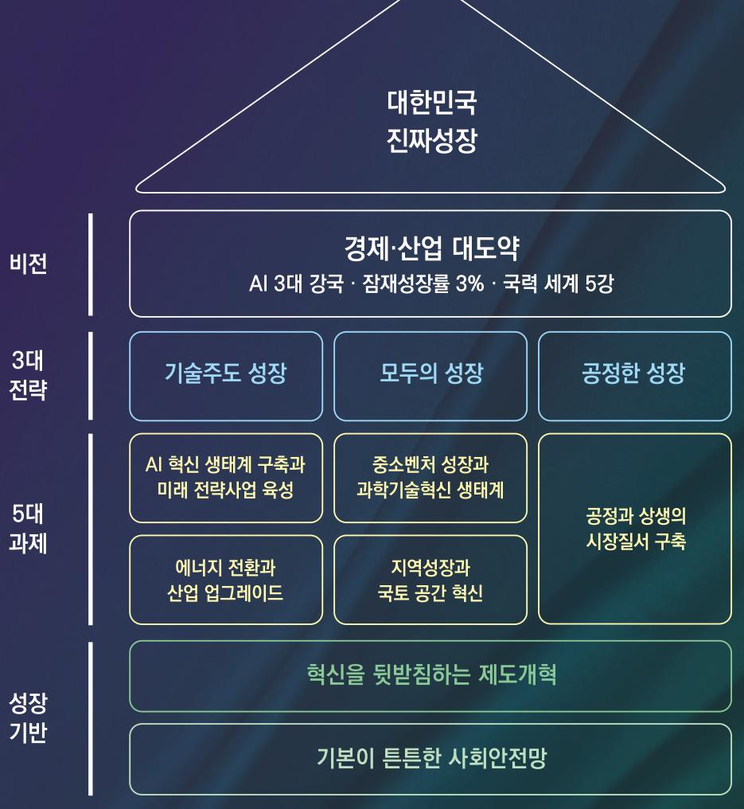
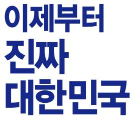

제21대 대통령선거 더불어민주당 정책공약집

# 이제부터 진짜 대한민국 회복·성장·행복으로 국민통합

**1. '진짜성장' 개념도**

# 2. '진짜성장' 전략

### 성장 브랜드 : 대한민국 진짜성장

- 인위적 경기부양이나 모방을 통한 가짜성장, 반짝성장이 아니라 체질개선과 창조를 기반으로 성장잠재력을 업그레이드하는 지속적 성장
- 일부만이 혁신하고 소수가 과실을 차지하는 성장이 아니라 국민 모두가 혁신과 가치 창출에 참여하고 과실을 더불어 함께 누리는 체감형 성장

### 비전 : 경제 · 산업 대도약

- AI 3대 강국 · 잠재(진짜)성장률 3% · 국력 5강 - 현재: AI 7위권, 잠재성장률 2% 이하, 국력: 6~12위

### 3대 전략 : 기술주도 성장, 모두의 성장, 공정한 성장

- 기술주도 성장(기업영역)
	- A부터 F까지 미래를 선도할 전략산업을 키우고, 글로벌(G) 산업경쟁력을 업그레이드하는 산업 대도약
	- 기술패권 경쟁에 대응하여 산업·수출 경쟁력과 성장동력을 강화
	- 급격한 통상환경 변화에 신속하게 대응할 수 있도록 산업의 탄력성을 강화
- 모두의 성장 : 대기업, 특정지역만이 성장하는 것이 아니라, 중소벤처, 비수도권, 소상공인·자영업자, 근로자 등 국민 모두가 역량을 키워 모두가 참여하는 성장
- 공정한 성장 : 지대추구와 갑의 횡포를 극복하고 공정한 시장 질서로 모두가 더불어 상생하는 성장 => 성장 유인의 제고

**대한민국 진짜성장 5대 과제**
1.  1대 과제: AI 3대 강국 진입과 미래전략산업 육성
2.  2대 과제: 에너지 전환과 산업 업그레이드
3.  3대 과제: 중소벤처 및 과학기술 혁신 생태계 확립
4.  4대 과제: 지역성장과 국토공간 혁신
5.  5대 과제: 공정과 상생의 시장질서 구축

---

**자동 변환 문서 유의사항:**

이 문서는 PDF에서 자동으로 변환된 마크다운 파일입니다. 변환 과정에서 다음과 같은 한계점이 있을 수 있습니다:

*   **내용 누락 또는 오류**: 원본 PDF의 복잡한 레이아웃, 이미지 내 텍스트, 특수 서식 등은 정확하게 변환되지 않거나 누락될 수 있습니다.
*   **서식 불일치**: 글꼴, 색상, 정확한 위치 등 시각적인 요소는 원본과 다를 수 있습니다.
*   **표 및 목록 변환 오류**: 복잡한 표나 다단계 목록의 구조가 깨지거나 내용이 부정확할 수 있습니다.

따라서 이 문서는 참고용으로 활용하시되, 중요한 내용은 원본 PDF 문서를 반드시 함께 확인하시기 바랍니다.
