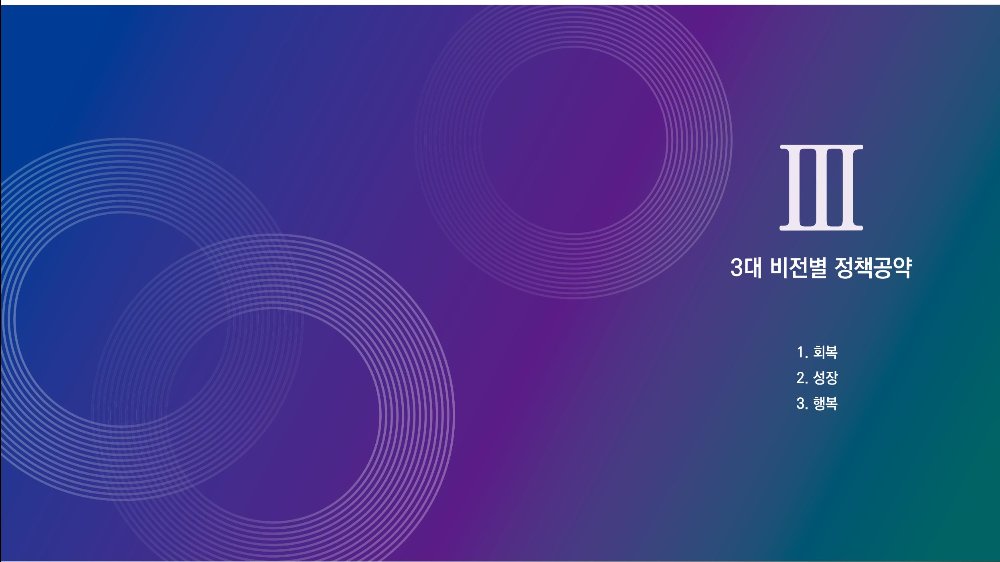
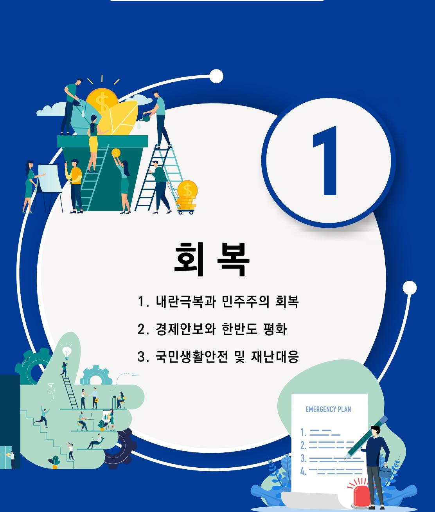

제21대 대통령선거 더불어민주당 정책공약집

# 이제부터 진짜 대한민국 회복·성장·행복으로 국민

## 더이상 불법계엄이 발생하지 않도록 대통령의 계엄권한에 대한 민주적 통제방안을 마련하겠습니다

### 내란극복과 민주주의 회복 03

## 국민을 위한 군으로 만들겠습니다

#### - 계엄법을 개정하여 계엄선포 시 국회의 기능 보장

- 국회에 대한 계엄선포 통고 절차 구체화
- 계엄 시 국회 활동 방해 금지 및 국회의원의 국회 본회의 참여 보장
- 국회의 계엄해제 요구 불이행시 계엄해제 간주, 계엄관련 사항의 국회보고 등

#### - 계엄사령관의 권한 명확화

- 비상계엄 시 거주·이전의 자유 보장
- 계엄포고령에 대한 국회의 사후승인

#### - 비상계엄 하의 군사재판권 축소

- 비상계엄 하에서 인정되는 군사재판권의 대상 축소
- 계엄해제 후 재판관할 이전의 예외 삭제 등

#### - 국방 문민화 추진

- 국방부장관 문민화 등
- 국방부 및 방위사업청 문민화 점진적 확대
- 구 정보기관 개혁
	- 12.3 내란혐의종사자 엄벌
	- 12.3 내란 관여 부대의 임무와 역할 재편
	- 부당명령 거부권 법제화

#### - 육 해 공군 참모총장 인사청문회 도입

#### - 각군 이기주의 극복 및 합동성 강화

- 단계별 군 교육기관 통합 추진
- 민주주의와 헌법 수호에 대한 장병교육 강화

## 직접민주주의 강화와 국민대표의 윤리성 강화로 책임정치를 구현하겠습니다

#### - 국회경비대의 국회 직속화 및 경비능력 강화

- 국회가 행정권력에 의해 침탈당하지 않도록 국회경비대 독립

#### - 국회의원의 윤리성 통제 강화

- 국회유리특위 상설화 및 유리조사국 설립 추진
- 국회의원 징계에 벌과금 신설
- 국회의원 국민소환제 도입을 통해 국회에 대한 민주적 통제 강화

#### - 주민소환 요건 개선 등을 통한 직접민주주의 확대

- 주민소환투표권자 연령을 18세로 하향 조정, 전자서명에 의한 주민소환투표청구 근거 마련
- 주민소환투표 청구요건 및 확정·개표 요건 완화

#### 내란극복과 민주주의 회복 05

- 5.18 민주화운동 정신 헌법전문 수록
- 국민의 기본권 확대·강화
- 직접민주주의 강화 등을 통한 민주주의 회복
- 대통령 4년 연임제로 책임정치 강화 및 국정운영의 안정 도모
- 계엄선포 및 재의요구권 요건 강화 등 제왕적 대통령의 권한 분산

## 위기의 민주주의, 개헌으로 지키겠습니다

## 검찰개혁을 완성하겠습니다

#### - 수사·기소를 분리하고 수사기관 전문성 확보

- 수사과정에서 당사자들의 인권보호를 위해 수사절차법 제정
	- 압수·수색영장 사전심문제 도입
	- 수사준칙(대통령령) 상향입법화
	- 피의사실공표죄 강화
	- 수사기관의 증거조작 등에 대한 처벌 강화 및 공소시효 특례 규정
- 검사의 기소권남용에 대한 사법통제 실질화
- 경력법조인 중에서만 검사를 선발하도록 법조일원화 확대
- 검사 징계 파면 제도 도입
- 신속한 재판을 받을 권리의 실질적 보장
	- 재판연구원 선발 규모 확대 및 재판연구원의 1심 재판부 배치
	- 형사재판에서 간이공판 절차 적용범위 확대
	- 온라인재판 제도 도입
- 법관평가제도 개선
	- 법관에 대한 근무평정, 중간평가를 관리하기 위한 법관평가위원회 설치
- 국민의 사법참여 확대
	- 판사가 임의로 국민참여재판을 배제하는 것을 방지하기 위해 국민참여재판 배제 요건 강화

사법개혁을 완수하겠습니다

- 국민참여재판 대상 재판 확대
- 국민의 사법서비스 접근성 제고
	- 공개변론 중계 의무화 단계적 추진
	- 하급심 판결문에 대해서도 공개범위 확대
- 상고심에 대한 국민의 신뢰도 제고
	- 대법관 증원
	- 전원합의체 변론 공개 확대

## 반부패 개혁으로 국민 눈높이에 맞는 공직문화를 조성하겠습니다

#### 권력자를 비롯한 공직자의 부정 부패행위에 보다 엄격하게 대응

- 고위공직자 배우자의 부정 금품 수수 처벌 강화
- 청탁금지법, 공익시고자보호법 등의 벌금 형량 강화
- 공직자의 민간기업 등에 대한 부정청탁 금지 제도 법제화

#### 공직자의 이해충돌 방지 제도 강화로 사적 이익추구 차단

- 대통령의 사적이해관계자와 관련된 사건에 대한 직무 회피 규정 명확화
- 공직자와 그 가족의 사적이해관계에 있는 법인·단체 범위를 현행 '재직여부' 기준에서 '실질적 영향력 행사 여부(지분보유 등)' 기준으로 확대
- 주식매각 또는 백지신탁 거부·이해충돌 직무 강행 시, 즉각 직무배제 및 벌칙 도입 등 공직자의 의도적 이해충돌방지 의무 회피 행위 처벌 강화
- 공익신고 절차 간소화 및 공익신고자 보호 강화
- 공직 후보자 국민추천제 활성화

#### - 고위공직자 부동산·주식 등 거래내역신고제 도입 추진

## 방송의 공공성 회복과 공적책무 이행을 통해 국민의 방송으로 나아가겠습니다

- 공영방송의 정치적 독립성 보장을 위한 법·제도 개선
	- 시청자 중심의 공영방송 경영진 구조 및 선임 방식 개선
	- 공영방송 이사 및 사장의 자격요건 강화
	- 공영방송 임원의 직무상 독립과 정치 중립 의무 강화
- 공영방송 재원구조 개편, 공영방송 수신료 배분 체계 개선

#### - 공영방송의 공적기능과 역할을 명확화

- 공영방송의 정의 및 책무 등의 명확화 및 개별 공영방송법 정비
- 공영방송에 대한 협약제도 도입을 통해 공영방송의 공적책무 이행 촉진
- 보도전문채널, 종합편성방송 등 방송의 공익성 강화
- 공적 지분 보유 또는 공적 자금 지원 언론사의 정치적 독립성·중립성 강화
- 보도전문채널의 거버넌스 개선을 통한 공공성 강화

#### - 방송의 보도·제작·편성의 자율성 확보

- 노·사 동수로 추천하는 편성위원회 설치 법제화
- 편성위원회 심의 의결 권한의 명문화

## AI 시대, 신뢰할 수 있는 미디어 이용환경을 만들겠습니다

#### - 방송미디어의 자율 심의 기능 강화 및 신뢰성 회복

- 방송미디어 자율의 허위조작정보 심의 기능 강화
- 방송미디어 사업자의 보도 윤리 지침 준수 및 설명책임 강화

#### - 극우·선동·혐오·차별 등 반헌법적, 반사회적 콘텐츠에 대한 플랫폼 책임성 강화

- 필터버블 및 분극화 현상 완화를 위한 알고리즘 투명성 제고
- 알고리즘에 대한 이용자 선택 권리 보장

#### - AI시대 미디어 이용환경 조성을 위한 미디어 교육 강화

- 미디어 무해력(리터러시) 역량 제고를 위한 교육 과정 마련
- 미디어 창작자에 대한 창작 윤리 및 법률 교육 지원·확대
- 찾아가는 미디어 무해력(리터러시) 교육 확대. 지역 미디어 센터 확대 및 시설 확충

#### - 방송통신심의위원회의 독립성과 정치적 중립성 강화

- 불합리한 위원회 위원 구성 및 제도 전면 개편
- 법률상 제한 이외 회의록 공개 의무화
- 정치적 악용 차단 위해 방송심의규정 중 '공정성' 부분 전면 개정

#### 내란극복과 민주주의 회복 11

## 시민·경제금융·노동교육을 활성화하겠습니다

#### - 학교 정규교육 내 시민·경제교육·노동교육 활성화

- 초·중·고등학교에서 경제교육에 대해 체계적으로 연계된 교육과정을 마련하고 관련 교사 연수 확대
- 독일의 보이텔스바흐 합의에 준하는 정치교육 원칙에 대한 사회적 합의 도출
- 학교 내에서 합의된 원칙에 따른 정치교육을 허용, 우리 사회에 당면한 현상과 문제에 대한 토론 교육을 활성화
- 민주주의 인권 환경 교육 활성화

#### - 헌법교육 강화로 민주시민 육성

- 체험·토론형 헌법교육 프로그램 및 모의의회·모의헌법재판 프로그램 확대 지원
- 시도교육청과 연계한 헌법교육 교사연수 및 지원 확대

#### - 생애주기별 맞춤형 금융·노동교육 추진

- 찾아가는 금융·노동교육 확대 등 대학진학, 출산, 퇴직 등 생애주기에 따라 필요한 교육을 언제든 쉽게 받을 수 있는 기반 마련
- 노인대학, 노인복지관 등과 연계하여 금융기관의 시니어 디지털 금융 교육 활성화
- 금융기관 정년퇴직 직원을 활용하여 교육 서비스 확대(현재 금융기관이 정년퇴직 직원 재고용 시 급여 일부를 정부가 지원)

#### - 교원의 정치적 기본권 확대

- 근무시간 외 직무와 무관한 범위 내에서 교원의 정치 활동 보장 추진

#### 내란극복과 민주주의 회복 12

## 민주주의 회복을 위한 '역사바로세우기' 교육을 강화하겠습니다

#### - 학교 역사교육 강화

- 역사적 사실에 기반한 균형 잡힌 교육으로 민주주의와 시민의식 함양 - 허위정보·가짜뉴스 대응을 위한 미디어 문해력(리터러시) 교육 확대

#### - 삭감된 역사·영토·인권 연구 예산 복원

- 역사 관련 국제 홍보(PR) 사업 우선 지원
- 강제동원·일본군 '위안부' 관련 자료 구축 확대

#### - 역사연구기관 운영의 정상화 추진

- 연구기관의 학문적 독립성과 정치적 중립성, 공공성 회복

## 방송영상미디어 생태계 변화에 부응하는 법제와 기구를 개선하겠습니다

#### - 분산되어 있는 방송영상미디어 관련 거버넌스 및 법제의 통합 개선

- 미디어 환경 변화에 대응하는 범제와 거버넌스 논의 위한 '미디어 혁신 범국민 협의체(가칭)' 마련
- 방송통신위원회의 정상화와 전문역량 강화 위한 방송통신위원회설치법 전면 개정

내란극복과 민주주의 회복 14

## 변호사의 공공성을 강화하고 사법제도를 인권 친화적으로 개선하겠습니다

- 국선변호사 보수체계 제도화
- '주식회사 등의 외부감사에 관한 법률'상 표준감사시간 도출체계 참고
- 변호사 징계권한을 별도 독립위원회에 부여
- 변호사 비밀유지권 법제화
- 의뢰인과 변호사 사이 비밀리에 이뤄진 의사교환 등의 공개를 거부할 권리 명문화

#### - 국선변호인의 조력 범위 확대

- 형사사건은 수사단계부터 국선변호인 조력
- 소송구조결정을 받은 민사사건에 한해 민사 국선변호인 시범 도입
- 사법절차의 공정성 확대
	- 진술녹취제도, 문서제출명령제도 도입
	- 사건피해자의 진술권 강화
	- 대법원 양형위원회에 시민참여 확대
	- 영장단계에서 조건부 석방제 도입

#### 3대 비전별 정책공약 - 회복 49

일본군'위안부'피해자의 존엄을 지키고
역사인식 제고를 위해 노력하겠습니다

- 일본군 '위안부' 피해자의 존엄과 명예회복
	- 피해자에 대한 인권침해와 명예훼손 행위 금지 명시 및 처벌 근거 마련
- 일본군 '위안부' 피해자를 기리는 조형물 또는 상징물 공공조형물 지정 관리 확대
- 화해치유재단 해산 이후 완전한 청산절차 추진 - 일본 출연금 잔여재산 문제 조속한 해결
- 국가차원의 일본군 '위안부' 기록물 유네스코 세계기록유산 등재 추진
- 여성인권과 평화재단(가칭) 설치 추진
	- 일본구 '위안부' 문제 해결을 위한 자료 조사 및 연구, 전시 여성인권 문제를 위한 국제적 연대 등 종합적 추진체계 설립

내란극복과 민주주의 회복 14

#### - 인권친화적 감사 체계 구축

- 감사원 감사 과정에 변호사 참여권 보장
- 감사원 감사에 대한 이의 제기 신청제 도입
- 디지털 저장매체 포렌식에 선별추출원칙 도입

#### - 국민눈높이에 맞게 법제도 개선

- 독립몰수제 도입 검토
- 자산·소득 비례 범칙금제 시범 도입(버스전용차선 위반)
- 벌금의 피해자에 대한 직접 지원 비율 상향
- 사면심사의 합리성·객관성 강화(사면심사위원회 권한 강화)

### 내란극복과 민주주의 회복 15

## 절차적 민주주의를 강화하여 공공기관 정책 결정의 공정성을 확보하겠습니다

#### - 공공기관 운영위원회 구성 및 운영의 전문성·민주성 제고

- 공공기관 운영위원회 위원 구성·회의 시 민간위원 2/3 이상을 포함하도록 하여 정부의 일방통행식 의사결정 방지
- 운영위원회 개의 전 충분한 시일 확보를 통해 안건의 졸속 의결 방지하고 관계기관 및 이해당사자 의견 공청회 도입
- 기재부장관 추천 운영위원 구성 시 법에 열거된 분야 반드시 1인 이상 포함하여 구성하도록 의무화
- \* 현행(공운법 제9조제1항): ①기재부장관(위원장), 차관급(②국무조정실, ③기재부, ④행안부, ⑤권익위, 6인사혁신처, ⑦주무기관), 기재부장관 추천(법조계·경제계·언론계·학계·노동계 등 다양한 분야 11인 이내)

내란극복과 민주주의 회복 17

## 재정 집행의 투명성을 높여 국민의 신뢰를 얻겠습니다

- 회계·기금 간 자금 전입·전출 제한
- 재정 집행 시 회계·기금 간 자금 전입·전출 요건 강화 통해 재정 집행의 예측 가능성 제고

#### - 예비비 편성 및 지출 심의 강화

- 예비비 편성 기준을 구체화하여 과도한 예비비 편성 지양
- 예비비 사용 국회 보고 강화를 통해 방만한 예비비 사용 지양하고 집행의 투명성 제고

#### - 국유재산 처분 시 사전 검토 및 국회 심의 강화

- 고액·대규모 국유재산 매각·교환 시 정부 심의 강화 및 국회 보고 의무화를 통해 미래세대를 위한 우량 자산 및 기회 제공

## 경제·재정정책 수행의 효율성·효과성을 높일 수 있도록 개편하겠습니다

#### 경제정책 수립 및 운영에 집중할 수 있도록 기획재정부 조직 개편

- 경제정책 수립 시 광범위한 의견 수렴을 통해 민주성을 강화하되 정책 수립의 계획성과 전문성을 높여 정책 효율성을 높이도록 제도 개선
- 예산 편성 시 정부 개별 부처의 자율성과 책임성을 강화하는 방향으로 개선

#### - 예산안 국회 심의 실효성 제고

- 정부 예산안 편성 시 제반 정보 제공을 통해 국회 예산 심의 내실화
- 예산안 증액 심의 시 정부 동의 범위 및 요건 명확화

### 내란극복과 민주주의 회복 19

## 공공기관의 재무관리 강화를 통해 재무건전성을 확보하겠습니다

- 공공기관 중장기 재무관리계획 관리 강화
- 정부의 공공기관 중장기 재무관리계획에 공공기관 기능 재조정, 대주주 변경, 보유 주식 처분 계획 관련 사항 등을 포함하여 국회에 보고

#### - 공공기관 경영평가 내용 국회 보고

- 주요 공공기관 재무성과관리 결과 및 분석 내용 국회 보고

#### - 공공기관의 공공성 관련 재무성과 분석 강화

- 구분회계 적용 대상 공공기관을 확대하여 책임경영 확립 및 방만 경영 방지
- \* 구분회계는 자산, 부채와 수익, 비용을 독립적으로 식별할 수 있는 사업단위별로 재무상태 및 경영 성과에 대한 재무제표를 작성하는 것으로, ① 기관 '고유사업' ② 정부 '정책사업' ③ 법령에 의한 '대행·위탁사업'으로 구분. 현행 법령 상 구분회계 도입 기관은 중장기재무계획 수립 기관 및 공공기관 운영위원회 지정기관

## 공공기관 경영 및 정책 추진의 일관성과 책임성을 강화하겠습니다

#### 주요 공공기관 기관장·임원 임기를 임명 대통령의 임기와 일치

- 정부와 공공기관의 정책 정합성을 높이기 위해 주요 공공기관 기관장 및 임원의 임기 상한 (연임 포함)을 임명 시의 대통령 잔여 임기 내로 제한
- 공공기관 임원 보수 결정 시 기본연봉에 경영성과를 반영하여 경영의 책임성 강화

#### 내란극복과 민주주의 회복 21

## 잘못된 AI 디지털교과서 정책을 바로잡고, 미래교육 기반을 제대로 구축하겠습니다

#### - AI 디지털교과서 정책 전면 개편

- 윤석열 정부의 성급한 AI 디지털교과서 도입으로 발생한 교육현장의 혼란 해소
- AI 디지털교과서는 '교육자료'로 규정하고, 학교 자율선택권 보장
- 다양한 온라인 학습 콘텐츠(코스웨어) 활용을 위한 공공 플랫폼 구축

#### - 교육행정과 교수·학습을 연계하는 통합 교육플랫폼 구축

- 학생 개인별 클라우드 계정을 제공해 학습이력 축적
- 초·중등학교, 고등교육 및 평생교육까지 활용 가능한 학습관리시스템(LMS) 구축

#### - 교육데이터와 AI를 활용한 미래교육 시스템 기반 마련

- 데이터 기반의 교육정책 수립 체계 마련
- 교원의 행정부담 완화를 위한 유사·반복 업무의 AI 활용 추진

## 대통령 경호기능의 공적 위상을 정상화 하고 대통령 친인척 등에 대한 감찰기능을 강화하겠습니다

### 내란극복과 민주주의 회복 23

## 국가인권위원회를 정상화하겠습니다

#### - 대통령 경호지원인력(군, 경찰) 감축

- 군과 경찰 본연의 임무인 국방과 민생치안에 환원

#### - 경호처장에 대한 민주적 통제 강화

- 경호처장을 국회 인사청문회 대상으로 변경
- 경호처장의 국정감사 출석 의무화
- 경호처 전 직원의 정치적 중립 의무화
- 경호처 내부감사관에 외부인사 임명

#### - 대통령실 특별감찰관 즉각 임명 및 실질적 권한 보장
- 인권위원장, 상임위원 선출 시 국민적 후보추천위원회 구성 - 시민사회대표 참여 보장
- 인권위원장, 국가인권위원에 대한 견제장치 도입
- 국가인권위원장 임명 시 국회 동의 의무화
- 국가인권위원의 의무 및 징계 규칙 신설
- 국가인권위원의 결격사유 강화
- 국가인권위원회 지역사무소 설치의 법적 근거 마련

## 감사원의 정치적 중립성 및 독립성을 강화하겠습니다

- 감사원 인사위원회 심의 기능 강화 및 외부위원의 당연직화
- 감사위원회 의결사항 공개 및 감사위원회 의결사항으로 감사개시, 고발여부 등 포함
- 감사원 감찰관을 외부인사로 임명

#### 내란극복과 민주주의 회복 25

## 국가교육위원회의 교육정책에 대한 사회적 합의 기능을 복원하겠습니다

- 다양성과 공정성을 갖춘 위원 구성으로 사회적 합의 기능 복원
	- 국가교육위원회의 집행기능과 사무범위를 고려하여 정원과 조직을 합리적으로 확충
	- 국가교육위원회 위원의 전문성과 대표성을 강화
- 교육정책 결정 과정에 대한 시민 참여 확대
- 연 1회 이상 대국민 보고회 개최 정례화
- 숙의 기반의 '(가칭)국민참여배심위원회' 등 시민참여 기반 제도화
- 회의록 및 관련 자료의 공개 의무화를 통한 정책 투명성과 정보 접근성 강화
- 학생 학부모 교원이 함께하는 교육협의체를 실질적으로 운영하고 참여 기회를 확대
- 중장기 교육계획 수립과 여야 합의 절차 마련으로 주요 교육정책의 일관성을 유지할 수 있는 제도적 기반 마련

#### - 국가교육위원회 위원장(장관급) 인사청문회 도입

- 후보자에 대한 인사 검증을 강화하고 위원회의 정치적 중립성을 확보

경찰의 정치적 중립성 확보 및 민주적 통제를 위해 경찰국을 폐지하고 경찰위원회를 실질화하겠습니다

내란극복과 민주주의 회복 27

과거사 진상규명과 명예회복을 위한 입법에 최선을 다하겠습니다

경찰국 폐지를 통한 경찰의 정치적 중립성 확보
- 국가경찰위원회 실질화를 통한 경찰에 대한 민주적 통제 강화
- 민주정부와 함께 3기 '진실·화해를 위한 과거사정리위원회'의 신속한 출범
- 노근리 사건, 여수·순천 사건, 간토대학살 사건의 진상규명과 진정한 명예회복

## 국제적 통상환경 변화에 적극 대응하는 경제외교를 추진하겠습니다

#### - 통상환경의 변화와 경제안보의 중요성에 대응하는 경제외교 역량 강화

- G20, G7등 적극 참여 등을 통해 글로벌 현안에 적극 대응
- 2025 경주 APEC 성공적 개최를 통한 외교역량 강화 및 국제 위상 제고
- 보호무역주의와 자국우선주의에 대응하는 다자간 무역협정체제 구축 추진
- 경제안보 총괄 및 조정 기능 강화를 위한 컨트롤타워 구축

#### - 공급망 안정화 등 경제안보 증진을 위한 주요국과의 연대 강화

- 주요국과의 양자, 소다자 경제안보 대화 등 협의체 적극 참여
- 인도-태평양경제프레임워크(IPEF) 공급망 강화 등을 통한 역내 안정적 공급망 구축

#### - 신흥기술, 첨단기술 부야 중심의 과학기술외교 강화

- 주요국간 핵심·신흥기술 협력 논의 주도
- 인공지능(AI), 우주, 양자기술(퀀텀) 등 세계적인 선도기술 지원과 국제사회 논의 적극 참여

#### - 국익과 기업 이익을 아우르는 상시 민관 공동 대응체계 마련

- 관계부처 장관 및 경제 4단체 대표 포함 가칭 '경제안보 점검회의' 정례화

#### 우리 기업의 수출, 수주 지원을 위한 재외공관의 전진기지화

## 우리의 외교영역을 확대하고 다변화하겠습니다

### - 신남방, 신북방 정책의 계승 발전과 글로벌 사우스와의 권역별 협력 심화

- 아세안, 중앙아시아, 인도, 중동, 오세아니아까지 확장하여 지역협력 강화
- 전략적 가치가 상승하는 인도와의 특별 동반자 관계 심화
- 글로벌 사우스 국가와의 협력으로 미중 전략 경쟁 하에서 전략적 자율성을 증대하고 수출시장 다변화

#### - EU 및 유럽지역과의 실질협력 강화

- 개방적 글로벌 통상 체계 확립을 위한 협력 모색
- 기후위기, 사이버안보, 인도주의, 인권 등 글로벌 이슈 부야 협력 강화
- 첨단 과학기술, 공급망, 방산, 인프라, 인적교류 등 실질 협력 확대

## 급변하는 통상환경에 대한 전략적 대응과 무역구조 혁신으로 수출 1조 달러 시대를 준비하겠습니다

#### - 수출시장·수출품목 다변화 지속 추진

- 특정국가에 대한 높은 수출의존도를 낮추기 위한 수출시장 다변화
- 신성장·고부가 유망 전략품목에 대한 지원으로 중장기 수출 경쟁력 확보 및 미래 시장수요 창출
- 수출 경쟁력을 갖춘 서비스업을 제조업 수준으로 지원
- 기술·부가가치 중심의 무역구조 전환 및 소비재 등의 수출 확대
- 신흥 수출시장 개척, 수출기업에 대한 무역금융 확대

#### 기후위기에 따른 글로벌 환경무역 대응역량 강화

- 탄소국경조정(CBAM)·RE100·ESG경영 등 환경무역장벽에 대한 선제 대응으로 우리 기업의 수출 경쟁력 강화 및 미래 일자리 창출
- 철강 등 탄소다배출 업종 및 중소·중견기업의 글로벌 탄소규제 대응역량 강화

#### - 글로벌 역량을 보유한 내수 강소·중견기업의 수출기업화 추진

- 내수 강소·중견기업의 글로벌 전문기업으로의 성장 지원
- 수출 중소 중견기업의 해외기술규제 대응 강화로 수출애로 최소화
- 수출의 저변 확대를 위한 중소·중견기업의 수출역량 강화
- 전문무역상사('24년 기준, 601개사 지정)를 통한 수출초보기업 역량 강화
- 국익 최우선·극대화와 산업 경쟁력을 제고하는 전략적 통상정책 추진
	- 통상과 무역으로 얻은 성과가 모든 국민에게 골고루 돌아가는 국익 최우선의 통상
	- 첨단·주력산업의 글로벌 경쟁력 강화로 일자리를 만드는 통상 추진
	- 디지털 경제 주도권 확보로 우리 사업 및 기업의 미래 경쟁력 강화
	- 국내산업 보호장치 마련을 전제로 양자·다자간 FTA 지속 확대로 경제영토 확장
	- 대미투자 기업의 피해 최소화를 위한 전방위적 총력 지원

#### - 핵심소재·연료광물의 공급망(GVC) 안정화를 위한 통상협력 강화

- 첨단전략산업·핵심광물보유국들과 양자·다자간 협력 강화
- 핵심광물안보파트너십(MSP) 적극 활용
- 아프리카 글로벌사우스, 자워보유국 등과의 수출 투자 공급망 핵심광물 다변화

## 주력 제조업 경쟁력을 강화할 수 있도록 '전략산업 국내생산 촉진세제'를 도입하겠습니다

#### 기존의 '통합투자세액공제'와 별도로 국가전략기술급 및 신성장·원천기술급 첨단제품에 대해서는 '전략산업 국내생산 촉진세제' 신설

- 국내에서 최종제조한 제품을 국내 최종소비자에게 판매하는 경우 국내생산량·국내판매량에 비례하여 법인세 공제혜택 부여
- 특히, 국가대항전화 되고 있는 전략산업 보호를 위해 필요시 일정요건 하에서 전략산업 국내생산 촉진세제에 따른 세액공제액의 일부를 현금 환급도 검토

경제안보와 한반도 평화 05

세관 인적 물적 역량 확충
포착할 수 있는 공급망 조기경보시스템 고도화
재산범죄(사기·배임·횡령) 등 관련범죄 수사 강화

## 국내 수출산업 보호를 위한 무역안보 단속체계를 확립하겠습니다

K-브랜드 가치를 저해하는 국산 둔갑 우회수출, 국가 핵심기술 유출 단속 강화를 위해
- 요소수 사태와 같은 공급망 위기 재발을 원천차단하기 위하여 위기징후를 선제적으로
무역거래를 악용한 수출입기업의 자본시장 교란행위(허위수출, 수출입 가격조작) 및

## 전략물자 국적선박 확보를 통해 물류 안보를 실현하겠습니다

#### 핵심에너지 운송에 대한 국적선박 이용률 70% 이상 유지

- 원유, LNG, 석탄, 철광석 등 핵심에너지 국적선사 적취율 70% 이상 유지
- '핵심에너지 수급관리 및 수송위기 대응' 관련 화주의 의무 및 수급안정 이용 비율 조치 등 법적 근거 마련

#### 핵심에너지 수송 선사 및 선박의 해외 매각 방지 추진

- 핵심에너지의 수송 선사 및 전략물자 선박의 해외매각 방지를 위한 법적 근거 마련
- 국가필수선박의 지정 및 운영 등을 위하여 해외 매각 금지조항 규정 신설

#### - 핵심에너지 수송 선사의 경쟁력강화를 위한 대량화주의 해운업 진입 방지

## 해양전문인력을 육성하고 지원하겠습니다.

- 한국해기사 직업매력도 제고를 위한 교육 및 처우개선
	- 해양계 교육기관, 해사고교, 해양대학교, 해양수산연수원의 해기사 양성 프로그램 확대 및 지원 강화
	- 내·외항 선원소득 비과세범위 확대 추진
- 북극항로 대비 극지해기사 전문인력 양성 추진

#### - 우수 외국인 해기사 훈련·양성 시스템 구축 지원 및 장기체류 지원
- 해기사 전문 폴리텍 육성 및 해양교육기관을 통한 우수인력 육성
- 해양금융, 해양경찰, 물류, 관세, 출입국 등 특성화 교육 집중화
- 해외 현지 해기사 양성기관 협력 및 교육 프로그램(K-class) 운영 추진
- 한국 상선대 승선 기간을 국내 체류 기간으로 인정 등 기준 완화
- 해상분야 운송전문인력 비자제도 개선

#### - 승선근무예비역 배정인원 1,000명 유지하여 국적해기사 양성체계 구축

- 해양인력의 역할 및 특수성을 고려하여 정부의 「대체복무제 개선방안」('19.11) 적용에서 승선근무예비역 감축(현행 1,000명→800명) 제외 추진

## 어업협정 이행 강화 및 '불법 중국어선 강력 대응'으로 해양 주권을 수호하겠습니다

#### - 준법조업 확행 및 강화 방안 마련

- 현행 담보금(무허가 최대 3억원) 상향 검토
- 비밀어창 운영(신흥 지능범죄) 등을 통한 조업일지 부실기재 시 담보금 부과기준 신설
- AIS(선박자동식별장치) 변·개조, 표출정보 불법 복제 등 적발 시 국내 담보금 부과기준 신설 추진
- 한 중 양국의 이중 처벌 효과를 담보하는 직접인계인수 확대(자국 어업허가 유무와 상관없이 모든 중대위반어선〈무허가, 영해 침범 및 특정해역 조업, 공무집행 방해〉을 직접인계인수 대상에 포함)

#### - 중국어선 불법조업에 따른 직접 피해어업인 보호대책 마련

- 담보금 재원으로 피해 어업인(어선·어구·시설물 등) 원상회복, 복지 지원(생계비·치료비·교육비) 등 활용

#### 피해예방을 위한 정부차원의 감시·감독 강화 및 외교채널을 통한 대응 강화

- 정부 단속역량 강화(어업지도선·해경 함정·단속장비·단속인력 증원 등)
- 중국 정부 차원의 불법조업 근절대책을 강구하도록 실효적인 외교 노력 강화

#### - 중국 서해 잠정조치수역의 심해 양식 구조물 무단 설치 등 해양 불법 점유 행태에 대한 강력 대응방안 마련

## 국익중심 실용외교로 주변 4국과의 외교관계를 발전시키겠습니다

#### - 한·미 포괄적 전략동맹 강화와 호혜적 관계에 기반한 미래동맹으로 발전

- 호혜적 관계에 기반 한 미간 경제, 군사, 첨단 과학기술 등 전방위 분야에서 협력수준 강화
- 관세, 방위비분담 등 트럼프 행정부 발 현안 타결에 적극 대응
- 군사 및 첨단 과학기술 분야에서 정보공유, 인적교류, 공동연구개발 등 실질협력 지속강화

#### 한 일관계의 미래지향적 발전 도모

- 경제,안보,인적교류 등 미래 지향적 한·일 협력 관계 지속
- 한·미 동맹, 한·미·일 협력 유지·발전을 위해 한·일간 협의·협력 긴밀화
- 과거사 문제 등 민감한 현안 해결 노력 지속

#### 한 중 전략적 협력 동반자 관계의 성숙한 발전 지속

- 다양한 각급별 전략적 소통을 통해 한반도 정세의 안정적 관리
- 한 중 일 3국 협력체제의 정례화를 통한 역내 협력 강화

#### 한 러 관계의 안정적 관리

- 한·러관계 악화를 방지하고, 우리 국민과 기업 권익을 적극 보호
- 러-북 구사협력에 대해 단호히 반대하고, 국제사회와 함께 러시아의 책임있는 행동 촉구

국제적 공헌과 국격에 걸맞는 외교로 G7+ 국가로 도약하겠습니다

- 2025 경주 APEC 정상회의 성공적 개최로 우리의 국제적 위상과 외교력 회복
- 국제사회에서 책임 있는 국가로서의 역할 확대
	- 민주주의 위기를 슬기롭게 극복한 나라로서 국제평화, 안보, 인권, 민주주의 분야 규범 형성 및 가치확사 과정에서 책임있는 역할 확대

#### - 글로벌 기후위기에 적극 대응하는 외교 추진

- 전 지구적 기후위기에 대응하기 위하여 기후협상 및 다양한 협의체에 적극 참여
- 새로운 기후위기대응 산업 육성 추진

#### - 글로벌 협력과 연대를 실현하기 위한 국제개발협력 추진

- 통합적인 국제개발협력 추진체계로 효과성과 책무성 제고
- 최저개발국 지워 확대 등 국제적 위상에 부합하는 국제개별협력 시행
- 빈곤과 불평등 완화, 인권증진, 기후·보건·식량·분쟁 등 인도주의 위기 대응 강화

#### - 국민과 함께하는 적극적인 공공외교로 국가 이미지 제고에 기여

- 하드파워와 K-컬쳐 등 소프트파워, 민주 헌정 위기 극복 등 K-민주주의를 외교 자산으로 활용
- 대상 국가와 지역별 수요에 맞는 문화공공외교 추진
- 우리 외교정책에 대한 이해 제고 및 지지 기반 확대를 위한 정책공공외교 확대
- 디지털, 뉴미디어를 적극 활용하여 수요자 중심의 공공외교 추진

### 경제안보와 한반도 평화 11

## 외교체제를 혁신하여 외교역량을 강화하겠습니다

#### - 대외 정책 결정과 집행 역량을 강화하기 위해 외교·안보 체제 혁신
- 국가안보실의 조직 및 인력구조 혁신으로 전문성과 투명성 제고
외교부 조직, 인사 및 교육훈련 제도를 혁신하고 외교관 전문성과 역량 향상
- 외교관련 여야대표 회동 정례화 등 초당적 의사소통 제도화
- 해외 순방 시 수행단 규모 합리화 등 실용 위주 순방외교 구현

## 재외국민의 권익과 안전을 보호하고, 여권행정서비스 확대로 국민의 편의를 증진하겠습니다

#### - 해외 위난 및 사건사고 예방·대응 체계 선진화

- 재외국민 보호의 인적, 제도적 기반의 지속적인 강화로 촘촘한 재외국민 보호망 구축

#### 재외동포 정체성 함양을 위한 지원 강화와 동포사회와의 연대성 강화

- 한글학교 지원 강화, 차세대 동포 연수 및 장학사업 확대로 차세대 재외동포들의 정체성 강화
- 글로벌 한인 네트워크 강화로 동포사회 상호간 교류를 확대하고, 재외동포 지원의 효율성 제고
- 재외동포 민간외교 활동에 대한 제도적 재정적 지원강화
- 재외동포 차세대 인재 유치·정착 프로그램 확대·강화

#### - 재외동포들에게 편리한 민원서비스 제공

- 재외동포 원스톱 민원서비스 시스템, 온라인 영사민원 시스템 개선을 통한 편의성 제고

#### - 국민편익 증진을 위한 영사서비스와 여권행정서비스 개선

- 사증면제, 우전면허 상호인정 협정 등의 확대로 우리 국민 출입국 및 해외 체류의 편익 증진
- 여권 사무대행기관 확대, 온라인 서비스의 민간개방확대로 여권행정서비스 개선

#### 재외국민 유권자 등록절차 간소화 및 우편투표제 도입 추진, 투표소 설치 확대 및 투표시간 연장 등으로 재외국민 참정권 보장 확대

경제안보와 한반도 평화 13

## 포괄적 · 단계적 비핵화로 평화체제를 향한 실질적 진전을 이루겠습니다

- 한미협의와 한반도 긴장 완화로 북핵 대화 여건 조성 및 북미협상 촉진
	- 남북관계와 북미관계의 선순환적 발전 추진

#### - 단계적·실용적 접근법을 통해 중장기적으로 비핵화 추구

- 우선 북한의 핵 능력 강화를 차단하고(동결), 핵 능력을 감축하며, 궁극적으로 그 위협을 완전히 해소하는 방향으로 추진
- 단계적 합의, 동시행동을 통해 합의 이행 촉진
- 북한 비핵화 진전을 추동하는 한반도 평화구조 구축 프로세스 병행 추구
- 비핵화 및 긴장완화 추진을 위해 남북대화와 북미협상 병행
- 핵협상 진전에 따라 남북미중 4자 협의체 구성하여 한반도 평화협정 논의
- 4자 및 남북미중러일 6자 협력틀 가동으로 한반도 동북아 평화협력 추구

## 한반도 군사적 긴장 완화, 평화 분위기를 조성하겠습니다

- 한반도 비핵화 목표를 견지하고, 우선적으로 남북관계 복원을 추진
	- 북핵문제 해결을 위한 다자대화, 남북대화 추진
- 남북관계를 적대와 대결에서 화해·협력으로 전환 추진
- 남북 간 우발적 충돌방지, 상황 관리를 위해 남북 연락채널 복원
- 9.19 군사합의 복원 등 군사적 긴장완화. 신뢰구축 조치 추진
	- 대북전단, 오물풍선 살포 중단, 대북/대남 방송중단 추진
	- 남북군사공동위원회 구성, 운영 추진

#### - 대북정책, 통일정책에 대한 사회적 대화 활성화

- 통일에 대한 국민인식 변화, 북한의 '적대적 2국가론' 등을 감안하여 '민족공동체 통일방안' 발전안 마련
- 지속가능한 대북정책, 통일정책 추진을 위한 국회와 협력 제고, 대국민 소통, 사회적 대화 기구 구성 추진
- 민주평화통일자문회의의 사회적 대화 역할 강화
- 중장기적으로 한반도 평화경제와 공동 성장의 미래를 준비

경제안보와 한반도 평화 15

## 한미동맹을 기반으로 전방위적 억제능력을 확보하여 전시작전통제권 환수를 추진하겠습니다

- 한국형 미사일 방어체계 고도화로 대북 억제능력 강화
- 굳건한 한미동맹 기반 위에 전시작전권 환수 추진
- 중장기적으로 '우주전략사령부' 창설 추진
- 한국형 탄도미사일 성능 고도화
- 한반도 전역 24시간 감시 '군사' 위성체계 구축
- 남북 양자 및 다자간 군사외교 복원으로 한반도 긴장 완화 및 우발적 충돌 억제

## 여성이 안전한 사회를 만들겠습니다

#### - 친밀한 관계 내에서 발생하는 여성폭력 범죄 대응체계 강화

- 가스라이팅, 스토킹 등 새롭게 등장하는 여성폭력 양상에 대한 제도적 예방조치 강화
- 친밀한 관계 내 여성폭력에 존재하는 처벌공백에 대한 제도적 보완
- 친밀한 관계 내 폭력 가해자에게 접근금지명령, 위치추적 전자장치 부착, 유치장이나 구치소 유치 등 잠정조치 마련
- 피해자 보호명령제도 도입

#### - 디지털성범죄 예방 및 대응 강화

- 디지털성범죄지원센터 인력확충 및 전문성 제고 등 기능 강화
- 불법 촬영물의 삭제, 수사, 법률·의료지원 기능 워스톰 체계 고도화
- 딥페이크 영상 등 허위·조작 콘텐츠 탐지 관련 기술개발(R&D) 지원 확대

#### - 국가 차원의 교제폭력 공식 통계 작성

- 교제폭력, 가정폭력 등 '친밀한 관계' 유형화
- 성폭력, 신체적 폭행, 정서적·물리적 통제 등 사건 유형의 세분화, 성별 등 통계지표 마련
- 교제살인 등 강력범죄화 예방과 차단을 위한 선행 범죄 분석 등 종합적 통계 분석과 대응 마련

#### - 24시간 안전 공중화장실 조성

- 공중화장실 상시형 불법촬영 탐지 시스템 단계적 확대

### - 흉악범죄·이상동기범죄(묻지마범죄) 예방을 위해 범죄경력자 관리 감독 강화

범죄로부터 모두가 안전한 사회를 만들겠습니다

- 재범고위험군에 대한 1:1 전담 보호관찰 인력 증원
- 재범고위험군에 대한 형사사법기관 간 정보공유 강화 등 시스템 구축
- 재범고위험군 출소자에 대한 보호수용 시설 확충 및 사회정착 지원 확대

#### - 청소년 범죄 대응체계 강화

국민생활안전 및 재난대응 02

- 청소년의 재범방지를 위한 정확한 실태조사 및 재범률 조사 실시
- 감호위탁 제도 개선
- 소년범 전담 보호관찰소 운영 및 보호관찰 인력 확충
- 선도조건부 기소유예 활성화

#### - 음주 관련 범죄 근절

- 공공 업무종사자 음주측정 의무화
- 주취 폭력 등 처벌 강화

#### - 첨단 기술 악용 범죄 엄단

- 피싱, 스미싱 등 온라인 사기범 처벌 강화
- AI 등 첨단 기술을 활용한 성범죄, 명예훼손 등 처벌 강화

#### - 범죄예방특별법 제정
- 국가기관, 지자체, 민간자율 범죄예방 자원봉사단체 간의 협력적 네트워크 구축
- 자원봉사단체 지원 등 활성화 근거 마련

## 국민생활안전 및 재난대응 03

통계시스템 마련

## 경찰치안활동을 강화하고 지원하겠습니다

---------------------------------------

- 흉악범죄 통계 작성 및 AI 분석이 가능한 "묻지마 범죄(이상동기 범죄)"예방
- 경찰이 흉악범죄에 적극 대응할 수 있도록 방검복, 호신용 경봉 등 지급 확대
- 경찰의 현장순찰을 강화할 수 있도록 초과근무 예산 확대

## 민생침해범죄·금융범죄를 발본색원하여 금융소비자를 철저히 보호하겠습니다

#### - 민생파괴 금융범죄에 대한 처벌 대폭 강화

- 불특정 다수를 상대로 재산상 피해를 일으키는 민생파괴 금융범죄 근절을 위한 '다중피해금융범죄방지법' 제정
- 보이스피싱·다중사기범죄 등 서민다중피해범죄에 대한 범죄이익 몰수 의무화 - 법원 확정판결 시 범죄행위를 통해 피해자로부터 취득한 재산을 몰수 또는 추징하도록 의무화
- 불법대부업 신고보상금 2배 상향 (현재 2천만 원 이하)

### 불법리딩방 등 지능화·복잡화되는 미등록영업·유사수신행위 등에 대한 규율 강화

- 유튜브·텔레그램 등을 통해 불특정다수를 대상으로 하는 투자자 기만행위 근절
- 사기의심계좌 지급정지 가이드라인 등 실효성 제고방안 마련
- 사기신고 이력 등 의심계좌 정보를 금융회사 간 공유할 수 있는 통합 프로세스 구축

## 반복되는 금융사고 책임 떠넘기기를 근절하겠습니다

- 금융사고 발생 시 책임자 등에 대한 엄정처벌 원칙 견지
	- 금융회사 임원의 책임까지 물을 수 있도록 책무구조도 엄격 적용
	- 대주주 지분매각명령권의 全금융회사 확대 적용 검토
- 금융보안 확보의무 위반 등으로 금융보안사고가 발생할 경우 징벌적 과징금 부과
- 금융기관 경영진을 대상으로 재무제표에 중대한 오류 등이 발견되면 일정 기간 보수를 환수하는 보수환수제 도입

#### - 은행의 단기 실적주의 근절

- 핵심성과지표(KPI) 설계 시 평가항목의 과도한 세분화 및 수익성 편중 문제 해소 - 금융소비자 특성에 따른 고위험·고난도 투자상품의 판매한도 차등화 방안 마련 검토

## 국민의 안전을 보장하고 사회재난에 효과적으로 대응하기 위한 법령을 제정하겠습니다

#### 국민생활안전 및 재난대응 07

## 신속대응을 위해 재난현장 지휘권한을 강화하겠습니다

#### - 생명안전기본법 제정 추진

- 안전에 관한 모든 사람의 권리와 정부의 책무를 법률로 규정

#### - 증가하는 사회재난에 대응하기 위해 사회재난관리 대응 법령 제정

- 사회재난 유형별 책임기관장의 사전 관리방안 마련 및 대응 의무 부여, 정부 부처별 협업체계 구축 방안 등 마련
- 사회재난 발생 시 재난조사·분석 및 재발방지 대책 마련을 위한 사고조사위원회 즉시 설치

#### - 재난현장 지휘권 강화를 통해 대규모 재난에 신속 대응

- 소방수요 및 긴급구조통제단장 역할을 고려하여 소방본부장의 직급을 상향하고. 신속재난 대응을 위한 소방본부장 산하 중간 직제 신설

## 최신 소방장비를 도입하고 화재안전 장비를 확충하겠습니다

- 인명구조 로봇 및 소방작전 드론 등 최첨단 소방장비 도입 개발 보급
- 아파트 등 공동주택에 대한 화재설비 전수 조사 및 보강
	- 소화기·화재감지기·가스누설 경보기·완강기·경량칸막이 등 설비 확충 및 지원
- 노약자 어린이 등 화재 취약계층이 신속히 대피 대응할 수 있도록 경량 소화기 (투척용 소화기) 및 피난유도선 설치 지원
- 전기차 화재 예방 시스템 도입 및 이동식 수조, 질식소화덮개 등 전기차 화재 진압 장비 보유 확대

국민생활안전 및 재난대응 09

## 재난안전산업을 육성하고, 재난 예측 및 감시시스템을 보강하겠습니다.

- 재난안전산업 육성 및 글로벌 경쟁력 강화 - 재난안전제품 기술력 향상 및 수출 지원 확대
- 빅데이터·AI를 기반으로 한 산불·호우·싱크홀 등 재난 예측 및 감시시스템 도입

## 대한민국을 교통안전 선진국으로 만들겠습니다

#### - 보행자 우선의 교통체계 구축으로 어린이, 장애인, 어르신 등 보호의무 확대

- 사람이 우선인 교통약자 보호 강화 (스쿨존에서 통학로로 어린이 보호구역 선택과 집중, 노인 보호구역 정비 및 확대. 마을주민 보호구간 확대 및 아파트단지 등 도로 외 구역 안전 강화 등)
- 오토바이 전후방 번호판제 도입
- 고령운전자 페달 오조작 방지장치 구매시 지원 확대 등 고령운전자 안전 대책 마련
- 안전한 전기차 활성화. 배터리 인증제 활성화 및 전기차 화재예방 진압장비 등 도입 확대
- 공유형 전동킥보드 등의 안전한 관리를 위한 '개인형 이동수단의 안전 및 이용 활성화에 관한 법률'(PM법) 제정
- 항공사고 예방을 위한 항공사 및 공항시설에 대한 항공안전투자 정비 등 점검 강화
	- 항공 및 첨도사고 등 조사의 독립성 담보를 위해 항공철도사고조사위원회 개편
	- 공항시설 내 버드스트라이크 위험요인 제거 및 항공안전 위협요소에 대한 예방활동 강화
	- 보조배터리 화재사고 예방을 위한 사전점검 방안 마련

### 국민생활안전 및 재난대응 11

## 안전한 건설환경을 조성하겠습니다

#### - 건강하고 안전한 건설환경 조성으로 건설산업 활성화 기반 조성

- 건설공사 발주·설계·시공·감리 등 전 과정에서 안전대책 강화
- 지능형 CCTV 등 스마트 안전장비 확대 및 지역건축안전센터 확대 설치
- 건설산업 적정임금제 도입
- 건설근로자 불법고용 방지, 부실시공 사망사고 예방대책 강화
- 누감전 침수방지 등 건축물재난안전 인프라 강화 - IoT등 스마트기술과 로봇, 드론을 활용한 시설물 안전관리 강화

### 반복되는 지하안전사고 예방을 위한 대책 마련 - 싱크홀, 포트홀 등 예방을 위해 전문기관의 지하안전 관리 점검 강화

- 지하공간통합지도 활용 확대 및 위험지역의 건축기준·시공방법 별도 마련

#### - 장애인·노인·임산부 등 이동약자를 위한 무장애도시 조성사업 확대

## 화학물질로부터 안전한 사회를 만들겠습니다

- 가습기살균제참사와 같은 생활 속 화학참사를 ▲조기발견 ▲신속대응 ▲장기치료 할 지원체계마려
- ▲발암물질 ▲생식독성물질 ▲ 환경호르몬 같은 심각한 독성물질의 신속한 퇴출 추진
- 산업단지 주변 발생 악취의 독성물질 함유 확인과 배출물질 관리 감독 강화 추진
- '환경성질환'(現 아토피피부염, 알레르기비염, 천식, 새집증후군)을 확대하여 초기치료 가능하도록 사전예방적 행정 추진
- 불법유통 화학물질 관리 강화 추진
	- 휘발성유기화합물 배출시설에 대한 관리 강화
	- 인체 유해 화학물질 유통 관리 강화

#### 국민생활안전 및 재난대응 13

## 통합기후재난 예보서비스를 제공하여 국민을 보호하겠습니다

- AI 홍수예측시스템 구축 및 서비스 제공 - 258개소 지방하천에 수위관측시설 설치 - 홍수예보 빅데이터를 활용한 AI 홍수예보 확대 추진
- 산사태 사전예측시스템 강화 및 신속한 정보 제공 - 기상청 ↔ 산림청 간 협업으로 산사태 사전 예보 시간 단축
- 지진 감지 후 통보시간 획기적으로 단축 추진

## '환경영향평가제도'를 획기적으로 개선하겠습니다

#### - 환경영향평가 공탁제 도입 추진

- 공탁제 도입으로 평가대행사업자(1종, 2종:생태계조사)간 책임소재 명확화 및 거짓 부실조사 사전예방
- 평가대행사업자 전문화를 통한 신뢰도 제고
- 환경영향평가 대행비 산정 현실화와 부당한 대행비 지급 금지

#### - 환경영향평가에 신기술 도입으로 접근성·신뢰성·객관성 제고

- 디지털트윈, BIM(Building Information Modeling) 등 신기술에 대한 법적 근거 마련

### 국민생활안전 및 재난대응 15

## 교사와 학생이 모두 편안한 학교문화를 만들겠습니다

#### - 교권 보호 강화

- 교권 침해 관련 법령의 실효성 강화 및 학교 현장 안착 지원
- 과도한 민원에 대한 교육활동 보호 강화
- 교사 마음돌봄 휴가 신설

#### - 민주적 학교 운영 기반 마련

- 학부모회의 기능과 권한 강화
- 교사회, 학생회, 학부모회 대표의 학교운영위원회 참여 제도화

#### - 학교 안전 강화

- 체험학습 안전관리 전문화
- 급식 안전 강화를 위한 학교급식 종합대책 마련
- 딥페이크 범죄 집중 모니터링 및 예방중심의 교육 강화
- 외부인 출입 통제 강화, 사각지대 CCTV 설치 확대 등 학교폭력·범죄 안전대책 마련

## 사이버 위협으로부터 안전한 나라를 만들겠습니다

#### - AI 시대, 국가 핵심 인프라 및 개인정보 보호를 위한 사이버 보안 강화

- 망중심에서 데이터 중심의 정보보호체계로 전환 추진
- 민간 자율을 촉진하되, 침해사고 발생 시 명확한 책임 부과
- 정보보호 투자 및 전담인력 규모 등을 투명하게 공개하는 정보보호 공시제도 강화 추진
- 개인정보 유출로 인한 중대 피해 예상시 전국민 대상 즉시 공지 의무화

#### - 범정부 차원 사이버 보안 대응체계 구축

- 국가 사이버보안 대응체계 일워화와 유기적 협력 위한 방안 강구
- 능동적 사이버보안 대응기술 개발 및 정기적 합동훈련을 통한 협력 대응체계의 고도화 및 법제도 마련
- 효과적인 사이버 방어를 위한 법적 · 제도적 기반 마련

#### - 민·관의 (개방적) 협력을 통한 사이버보안 기술·산업 경쟁력 강화

- 사이버 보안기술 다양성 확보 및 핵심기술 국산화 지원
- 민간 주도의 보안제품 표준 및 인증기준 수립을 통한 기술변화 대응력 강화
- 민간 참여 보장을 위한 인증·표준화 위원회 구성 등 추진체계 법제화

#### - 지역 및 중소기업 등 사이버보안 사각지대 해소

- 지역 기업들의 정보보호 투자 확대로 지역의 보안산업과 일자리 창출
- 중소기업 대상 클라우드 기반 구독형 보안서비스(SeCaaS) 시장 확대 지원
- 지역 영세기업 대상 보안 취약점 진단 및 컨설팅 등 확대

#### - 피싱, 스미싱 등 디지털 민생안전 대응 강화

- AI 기술 악용한 신종 보이스피싱 등 적극 대응 및 근절
- 스미싱 근절을 위한 문자중계 통신사업자 대상 정보보호 의무 강화 및 발송자 처벌 강화
- 실생활 속 무분별한 개인정보 유출을 예방하기 위한 '양방향 스마트 안심번호 제도' 활성화
- 주말, 연휴 등 취약 시간 기간 피해 방지 및 실시간 대응체계 구축

---

**자동 변환 문서 유의사항:**

이 문서는 PDF에서 자동으로 변환된 마크다운 파일입니다. 변환 과정에서 다음과 같은 한계점이 있을 수 있습니다:

*   **내용 누락 또는 오류**: 원본 PDF의 복잡한 레이아웃, 이미지 내 텍스트, 특수 서식 등은 정확하게 변환되지 않거나 누락될 수 있습니다.
*   **서식 불일치**: 글꼴, 색상, 정확한 위치 등 시각적인 요소는 원본과 다를 수 있습니다.
*   **표 및 목록 변환 오류**: 복잡한 표나 다단계 목록의 구조가 깨지거나 내용이 부정확할 수 있습니다.

따라서 이 문서는 참고용으로 활용하시되, 중요한 내용은 원본 PDF 문서를 반드시 함께 확인하시기 바랍니다.

