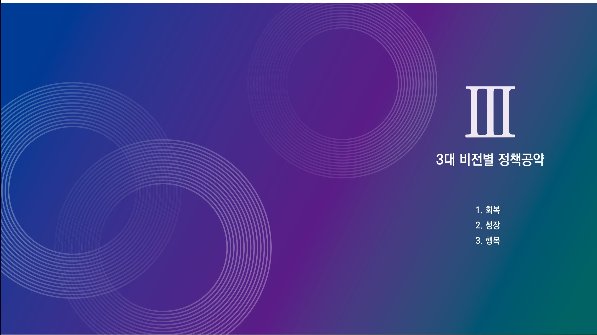
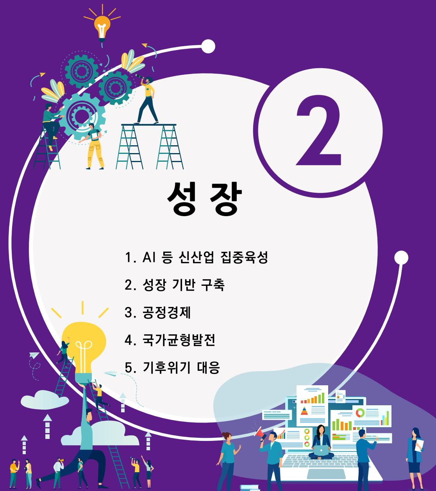

제21대 대통령선거 더불어민주당 정책공약집

# 이제부터 진짜 대한민국 회복·성장·행복으로 국민통합

## 인공지능 대전환(AX)을 통해 AI 3강으로 도약하겠습니다

\* AX : AI Transformation

#### 인공지능 대전환(AX)으로 혁신 생태계 구축 및 일자리 창출

- 제조 AI 등 산업별 융합 촉진, 인공지능 활용 선도사업 추진 및 확산 기반 조성
- 대규모 AI 학습데이터를 활용한 AX 신규 유망 비즈니스 발굴 및 지원

#### - 인공지능 생태계의 핵심기술 및 기반 확보

- 차세대 AI 반도체 개발 지원
- 거대언어모델(LLM)·소규모언어모델 연구개발 및 사업화 지원
- 산업 및 서비스 분야 Physical AI(사람을 닮은 로봇) 산업 육성

#### AloT 클라우드 서비스 활성화

- AloT 기반 신시장 수요 창출이 가능한 핵심 산업 분야 발굴 육성
- 공공 클라우드의 국내 민간 클라우드로 전환 적극 추진
- 중소·벤처기업의 안전하고 경제적인 클라우드 전환 촉진 지원

#### 인공지능 기술 중심의 스타트업 활성화 및 인공지능 활용 격차 해소

- AI 전문인력의 전문기업·연구소기업 설립 시 정책금융 지원
- 'AX 워스톰 바우처'(AI 바우처 + 클라우드 바우처 + AI 창작 도구·서비스 구매 바우처) 도입

#### 아태 지역(APAC) No.1 AI Hub를 구축

- 'K-AI Team Korea' 국가대표 AI 기업 'K-미스트랄' \* 육성 및 민관 합작투자 추진
  \* 정부 지원 하에 민간의 핵심역량을 결집하는 형태(SPC)로 세계 각국의 최고 인재를 영입하여 프랑스의 미스트랄 AI와 같은 대한민국 대표 AI 기업을 육성
- AI 특화 시범도시 'AI Home&City'\* 건설 및 '권역별 특화사업 AI 인프라' 투자 추진
  \* 국민과 외국인이 일정 기간 체류하며 우리나라 AI 기술과 AI 서비스를 일상에서 체험할 수 있는 '소규모 시범 도시'
- 국내 AI 기업의 해외 진출 지워

#### - 글로벌 AI 협력 체계 구축

- 글로벌 AI 공동투자기금으로 AI 3강 기반 조성, 협력국 간 공동 사용 가능한 기술 개발

#### - 세계 최고의 AI 인재 양성체계 마련

- 국가 AI 연구소 육성 및 우수 AI 인재에 대한 파격적 보상체계 마련

### AI 시대, 차세대 첨단기술 개발과 투자를 강화하겠습니다

#### - AI 혁명의 핵심 인프라 기술 지원 강화

- '30년 AI 중심 차세대 네트워크(6G) 상용화 추진('28년 시범서비스)
- AI 네트워크(6G) 핵심기술 확보로 글로벌 장비·단말기 시장 선점 기반 마련
- AI 네트워크(6G) 실현의 핵심기술인 위성통신 기술 개발 적극 추진

#### - 차세대 AI 반도체 기술개발 및 산업생태계 육성

- 저전력·고성능 NPU, PIM 등 차세대 반도체 기술 개발 지원
- 국산 AI 반도체를 중심으로 한 AI 반도체 생태계 조기 확립
- Open-RAN 등 네트워크 고도화 및 장비업체의 글로벌 시장 진출 지원
- 양자정보통신기술(Quantum ICT)의 개발 및 상용화를 위한 R&D 지원 강화
- AI 데이터센터 열관리 기술개발, GPU 클러스터 관리 솔루션 등 요소 기술 육성

### 세계 최강의 AI 인프라를 구축하겠습니다

\* 산업지원용 AI(주요 거점 데이터센터)-AI 서비스 제공기업(소규모 GPU/ NPU 데이터센터)

#### AI 데이터센터를 "차세대 국가 SOC"로 규정하고, 지원 총력 체계 마련

- 최신 GPU를 확보한 AI 데이터센터 건설을 통해 'AI 고속도로' 구축
- 전국 어디서나 AI를 경험할 수 있는 '국가 AI 지도'\* 인프라 구축
  \* 개인화된 AI 서비스(EdgeAI)
- AI 데이터센터를 '국가전략기술 사업화시설'로 지정
- AI 데이터센터 건설을 통한 'AI 고속도로' 구축
- 행정절차 간소화, 인허가 타임아웃제 도입 등 AI 데이터센터 건설 촉진

#### - 국가 인공지능 혁신 거점 육성

- 특화 산업형 AI 집적단지 조성 및 입주기업의 사업화, 인공지능 응용기술 고도화 지원
- 데이터안심구역의 전국 네트워크화를 통해 어디서나 데이터를 융합하고 애플리케이션 프로그래밍 인터페이스(API, Application Programing Interface)를 개발할 수 있는 환경 조성

### 손쉽고 안전한 데이터 활용을 위하여 법·제도를 마련하겠습니다

- '제2차 디지털 뉴딜'로 인공일반지능(Artificial General Intelligence) 학습 데이터 개발 및 확보 지원
	- 정부 주도의 인공지능 학습용 고품질 데이터 집적 클러스터 조성 및 공개 플랫폼 구축
	- 방송사 데이터 구매·가공 후 인공지능 Hub에 공개 등 멀티모달AI 개발 지원
- 기업의 연구·개발 지원을 위한 공공데이터 개방 추진
- 정부의 데이터를 기계가 읽을 수 있는(Machine Readable) 형태로 국민에게 공개
- 데이터 가치평가·품질인증제, 표준계약서, 학습데이터 익명제 도입 등 인공지능 학습용 데이 터 거래 활성화 추진
- 의료, 금융 등 산업별 데이터 결합·활용을 위한 규제 혁신 추진

### AI 등 신산업 집중육성 05

## SW 新강국으로 도약하기 위한 발판을 마련하겠습니다

#### - SW 인재 역량 강화 기반 조성

- SW분야 전공자의 기업 인턴십 확대를 통한 기업-대학 간 교류 활성화
- SW 대학 연구소 및 대학 벤처·스타트업과 해외 우수 기업·연구소간 교류협력 지원

#### 규제 혁신을 통한 SW산업 성장 지원

- SW 수요 예보, 일방적 과업 변경금지, 합리적인 SW 사업 대가 산정 등 공공SW 발주제도 혁신 추진
- 공공SW 개발단가 및 유지보수료 현실화, 국내·외 기업 역차별 개선

#### - IT·SW 新기술 융합 가속화

- 지역 및 중소 IT·SW융합기업의 성장역량 강화를 위한 기술 지원 및 투·융자 확대
- 공개SW(OSS, Open Source Software) 기반 IT·SW융합기술 혁신

#### - 글로벌 리더십 확보를 위한 IT·SW 수출 활성화

- 신흥시장 개척 및 선점을 위한 거브테크(GovTech) 해외수출 강화
- 선진국과의 AI 기술 협력 강화로 IT·SW 수출 경쟁력 강화

### 인공지능 거버넌스 정립을 통해 AI 3강의 기반을 마련하겠습니다

#### - 대통령 직속 기구 '국가인공지능위원회' 역할\* 강화

- \* 기술자, 연구자, 투자기업과 정부의 협력 유도 등 실질적 AI 컨트롤타워 역할 수행
- 대통령실에 'AI정책수석\*' 신설
- \* 국가 최고인공지능책임자(CAIO, Chief Artificial Intelligence Officer) 임명
- 범국가적 인공지능 대전화 전략을 수립·추진하기 위한 'AI 전략기구' 설치

#### 혁신과 국민 안전을 위한 〈인공지능기본법〉 하위법령 조기 마련

### AI 등 신산업 집중육성 07

## 사람 중심의 인공지능 미래교육을 강화하겠습니다

#### 인공지능 시대를 주도할 '미래인재' 양성

- AI 부트캠프(전문인력 집중양성기관) 통한 전문기술인력 양성
- AI, SW, 사이버보안 등 기업 수요 맞춤형 계약학과 확대
- AI 대학원·전문대학원·연구기관 확대 및 AI융복합 학위과정 증설
- AI. SW부야 교육자금 대출 제도(한국식 휴먼 캐피털) 도입

#### - 생애주기별 맞춤형 AI 교육 체계 구축

- 구(軍) AI·SW 부야 전문 복무 확대
- 교육 인증서 발급 및 공공기관·기업에서 채용·승진 시 가점 부여
- 재직자 및 구직자 대상, AI·SW 전문교육 강화로 고급 실무인력 양성
- 비전공자를 위한 AI+X(자신의 전공에서 AI를 활용할 수 있도록 하는 교육) 실시

#### - AI·디지털 인재 역량 강화 기반 조성

- 산업 현장의 숙련된 AI 직무 수행자 활용을 통한 AI·SW 교육 전문강사 보강 및 재직자의 교육 활동 허용기업에 대한 인센티브 부여
- AI SW 부야 경력자와 퇴직자에 대해 최신 기술 재교육 과정 이수 후 전문강사로 활용

#### - AI 해외인재 유치 및 R&D 지원 확대

- 해외 우수인재의 유치를 위한 파격적 인센티브제도 마련
- 출연기관 창업활동 지원을 위한 'AI 스핀오프'\* 제도 활성화
- \* 연구원이 자신이 참여한 연구결과로 창업할 경우, 기술사용료 면제 등 창업을 지원하는 제도

### 교육혁신으로 AI 인재양성 강국으로 도약하겠습니다

#### - 디지털 문해력 강화를 위한 초·중·고 교육혁신

- 한국형 STEAM(과학·기술·공학·예술·수학) 교육 강화로 융합적 사고력 함양
- Al·SW 수업 시수 확대를 통해 컴퓨팅 사고력 및 문제해결 능력 강화(예: 인공지능과 미래사회, 인공지능과 피지컬 컴퓨팅, 수리와 인공지능, 데이터 과학 등)
- 대학·기업 협력을 통한 학교 AI 교육 지원 및 교사 재교육 확대
- AI 분야 진로 탐색 기회 확대

#### 디지털 전환 시대에 부응하는 'AI + X' 대학교육 혁신

- 기초학문과 AI를 융합한 'AI + X' 교육모델 추진
- 프로젝트 기반 온라인 AI 학과 확대 및 기업 협력형 AI 학위과정 개설
- 지역거점 AI 단과대학·전공 신설, 타 전공 대학원의 AI 전환 유도로 석·박사 인력 양성 확대
- 성인 대상 AI·IT 재교육 확대를 위한 비학위 과정 운영 확대

#### - AI 글로벌 경쟁력 강화를 위한 해외 인재 유치

- AI를 비롯한 과학·디지털 기술·공학 등 글로벌 인재 적극 유치
- AI 인재 영입을 위한 대학 및 연구기관 지원 정책 개선

#### - AI 기반 혁신 창업 활성화

- 대학·기업의 AI 혁신 및 창업 프로젝트 추진, 학생의 창업 장려

### 국민 누구나 AI를 쉽고 편리하게 사용할 수 있는 나라를 만들겠습니다

인공지능을 가장 잘 사용하는 국민, 'AI Testbed Korea' 건설

- 전 국민의 AI 친숙도와 활용역량을 높여, 삶의 질 제고 및 AI 신상품 테스트베드 구축

#### - 전 국민 AI 접근권 보장

- 국가대표 LLM을 개발하여 오픈소스로 제공, 민간의 다양한 서비스 출시 유도
- 인공지능 인프라를 구축하여 인공지능 접근권 보장
- 인공지능 소외계층 단계별 맞춤형 교육과 디지털 기기·서비스 지원 확대
- 공공시설과 도심 등 다중 이용 공간에 공공와이파이 확대 및 품질 향상

#### 전 국민 AI 미디어 문해력(리터러시) 역량 강화

- 지역별 생활 SOC를 활용한 'AI 기본역량 센터' 설치 및 AI·SW 교육 훈련을 담당하는 디지털 튜터(digital tutor) 도입

### 제약 · 바이오 산업에 대한 국가 투자와 책임성을 강화하고, 필수의약품의 안정적 공급체계를 마련하겠습니다

#### - 제약·바이오 강국을 위한 국가 투자 확대 및 보상체계 개편

- 전략적 R&D 투자시스템 구축 및 성과도출·공공환원형 지원체계 강화
- 바이오 특화 펀드 등 투자생태계 구축 및 전문인력 집중 육성
- R&D 투자를 견인하기 위한 약가관리제도의 통합 및 예측가능성 확보
- 글로벌 진출 신약개발을 위한 AI·빅데이터 등 신기술 융합 생태계 조성
- 의약품 접근성·혁신성 향상을 위한 위험분담제(RSA) 적용 확대 추진

#### 혁신형 제약기업 지워체계 정비 및 제약기업의 사회적 책임성 강화

- 지속투자와 혁신창출을 고려한 혁신형 제약기업 인증제도 개선
- 제약기업에 대한 R&D 투자비율 연동형 약가보상체계 구축
- 제약기업의 사회적 기여 확대 유도 및 기여 방식의 다양화 지원

#### 필수의약품 수급불안 해소와 공급안정 체계 구축

- 필수 퇴장방지 의약품 생산시설에 대한 지원 및 비축 확대
- 필수 원료의약품 및 백신 국산화·자급화 기술개발 적극 지원
- 국산 워료 사용 완제의약품에 대한 인센티브 확대
- 국가필수의약품 수급 불안정 해소를 위한 공공위탁 생산·유통시스템 구축
- 수급불안 필수의약품에 대한 제한적 성분명 처방 등 대체조제 활성화 추진

#### - 넥스트 팬데믹 대비 위기 대응 인프라 구축 및 국제협력 확대·강화

- mRNA, 합성항원기술 등 차세대 백신 플랫폼 연구개발 지원 확대
- 넥스트 팬데믹 대응 거버넌스 구축 및 감염병 대응체계 고도화
- 감염병 공동연구 확대 및 공중보건위기 대응 국제협력 확대·강화
- 국격에 걸맞는 지속적이고 적절한 보건분야 ODA협력 지원

### 디지털 헬스케어 혁신성장 체계를 구축하고, 전문인력 양성과 신뢰성 확보에 집중하겠습니다

#### - AI 기반 디지털 헬스케어 혁신성장 체계 구축

- 편리하고 안전한 디지털 기반 확충으로 건강정보 자기결정권과 신뢰성 강화
- 보건의료 빅데이터의 표준화·암호화 및 개인정보보호 강화로 안전한 활용 보장
- 공공보건의료데이터 통합관리체계로 상호연계와 공동활용 기반 마련
- 기술개발에서 현장활용까지 의료부야 AI 전문인력 전주기적 투자·양성체계 마련

#### 의과학자와 연구 전문인력 양성을 위한 의과학 융복합 지원체계 구축

- 의사과학자(MD-Ph.D) 양성을 위한 연구지원 체계 구축
- 전국 각지의 의과대학(원)-이공계 대학원 간 공동연구프로그램 수립

#### - 의료기기 산업에 대한 혁신성 제고와 적정보상 체계 마련

- 디지털 헬스 의료기기 산업 육성을 통한 글로벌 진출과 수출 증대 지원
- 의료기기 질 관리체계 정비와 혁신 의료기기에 대한 적정 보상기준 마련

#### 가남제도 등 불공정행위 개서을 통한 의료기기 사업 유통구조 선진화

- 의료기기 구매현황과 불공정거래 등에 대한 실태조사 실시 근거 확립
- 간납업체 불공정행위 금지와 표준계약서 체결 의무화

### AI 등 신산업 집중육성 12

## 글로벌 소프트파워 빅5의 문화강국을 실현하겠습니다

- 국가예산 대비 문화재정의 대폭 확대
- 세계 속의 한류 추진 동력 확보
	- K-이니셔티브 실현을 위한 K컬쳐의 글로벌 브랜드화 추진
	- 해외 한글교육 확대 외 K인문교육 실시(세종학당 88국256개소→400개소)

#### 한류 확대 기반 마련

- K컬쳐의 지구공동체 기여를 위한 "Live Aid K-POP 콘서트(가칭)" 추진
  \* 정부지원의 민간주도 진행, 수익금 전액 세계 구호 자선단체 기부
- 해외 콘텐츠 지원 센터 확대 및 전통 K-Food 지원기관 입주
- 관광시장 연계 한류 페스티벌, K콘텐츠마켓 확대

#### - 문화강국에 부합한 문화 외교 강화

- 개발도상국의 무화개발 무화예술교육 무화유산 조사 보존 지원 확대
- 세계유네스코 등재 유산 추진 확대 및 상호주의에 입각한 문화 외교

### 문화콘텐츠의 국가지원 체계를 확대하겠습니다

#### - 콘텐츠 R&D 지원 강화

- 프로젝트 단위 및 이를 위한 사업자간 투자·출자에 대한 지원까지 확대
- 콘텐츠 신성장 원천기술 지원 분야 확대
  \* AI콘텐츠, 콘텐츠플랫폼, 음악, 출판, 캐릭터, 공연 등으로 확대
- 기획 등 비기술적 R&D, 창작시설, 참여요인(외부인력 협업), R&D 인정 규제적 요소 배제 등 지원 요건 확대

#### - 콘텐츠 정책금융 확대로 혁신 성장 발판 마련

- 문화상품 완성보증제도를 제작 및 기획·개발·국내외 유통으로 확대 및 요건 간소화
- 콘텐츠 이차보전사업 규모 확대
- 정부·지자체 매칭의 지역 고유 특화 콘텐츠 지원
- 문화콘텐츠분야 정부 기술보증 클라우드펀딩 발행 및 기초투자 국비 지원

#### - 콘텐츠분야 세제 지원 확대

- 음악 등 각종 공연콘텐츠 및 웹툰 제작 세액공제 신설
- 출판업 특성을 반영하여 출판콘텐츠 제작 세액공제를 강화
- 25년말 일몰예정인 영상콘텐츠 제작비용 세액공제 연장
- 문화산업기본법 상 분야 플랫폼의 제작 투자 출자로 단계적 확대 검토
- 대·중·소기업 간 문화산업전문회사 및 문화콘텐츠사 출자·투자

#### - 콘텐츠 재투자 목적인 경우 환급형 인센티브 지원 추진

#### - 국내 콘텐츠 플랫폼의 해외 진출, 공동투자 등에 대한 지원 체계 구축

#### - 새로운 콘텐츠 산업 육성을 위한 진흥기구 개편

#### - 저작권 공정환경 구축 및 등록제도 실효성 개선

- 신기술 등 새로운 창작환경에 대한 저작권 보호 방안 마련
- 불법 유통의 신속 차단, 법적 책임성 및 해외 수사 공조 강화

### 한류 문화콘텐츠의 인프라를 구축하겠습니다

#### - 문화콘텐츠(플랫폼)산업을 국가전략산업으로 지원

- 단회성 공모사업을 지양하고 콘텐츠 직접출자·투자, 펀드를 전담하는 공공기반 투자회사 설립 추진

#### - 한류 문화의 국내 인프라 확대

- 5만석 규모의 대형 복합 아레나형 공연장 조성
- 국내외 K-POP 꿈나무를 위한 중·소형 공연장 조성
- '국립영화박물관', '대중문화예술의 전당', '국립무용원' 등 문화 위상에 부합한 공간 마련

#### 한류 콘텐츠의 글로벌 진출을 위한 지원사업 확대

- 글로벌 콘텐츠 수출용 재제작 ·더빙 비용·다국어 번역 등 지원
- 해외 마케팅 프로모션 기회 확대를 위한 지원
- K콘텐츠 플랫폼 글로벌화 기술 자립 지원
- 첨단기술 산업주도형 인력양성 지원

#### - 집약적 콘텐츠 육성 환경 조성을 위한 '한국판 실리콘밸리' 조성

- 자금형 콘텐츠 전문 산업 단지 조성을 위한 민·관·학의 종합 지원 체계 구축

#### - 콘텐츠 주요 진흥 정책 추진

- 게임: 규형 있는 게임문화 조성, 규제개선, 글로벌 진출 지원, 인디게임 활성화
- 미디어: 버츄얼 스튜디오 등 공공 인프라 조성, 생태계 지원 확대
- 영화: 안정적 영화기금 확보, 예술독립영화 지원 확대, 관객 확보 지원
- 웹툰: 웹툰 지원 법제화, 해외플랫폼 구축 현지화 지원, 2차 부가사업 지원
- 음악 공연: 제작 인프라 구축 지원, 규제개선
- 출판·번역: K-BOOK(번역 웹북) 해외진출·디지털 전환 확대

### K-방산, 글로벌 4대강국(G4)으로 만들겠습니다

#### - 국가안보실 내 방위산업담당관 직위를 경제수석실로 이관

- 대통령 주재 방산수출진흥전략회의 정례화
- 국내 조선분야 글로벌 수주 경쟁력 확보를 위한 전담팀 구성
  \* 미국 해군함정 및 해안경비정 신규건조 및 MRO 수주 추진

#### - 국방 R&D 투자 확대로 국방 AI 첨단기술기반 구축

- 국방과학연구소 內 국방인공지능센터 역량 강화
- 국방 AI 기반 구축을 통한 지능형 무기체계 전력화
- 차세대전투기·첨단 항공엔진 독자 개발 등 자주국방력 확보
- 유 무인 복합 전투체계 고도화

#### - 방산 수출기업 지원 확대

- 방산수출기업의 R&D 투자세액 감면 및 방산 지원 정책 펀드 확대로 기업 경쟁력 강화
- 신기술 보유 스타트업 기업 육성 및 방산 병역특례확대
- 방위산업생태계 변화에 대응토록 방위사업청의 역량 강화
	- 소요 및 시험평가 등 복잡한 방위사업추진 체계 간소화
	- 국방과학연구소 원천기술의 민간 이전 확대
	- 업체가 과다한 국내경쟁을 지양하고 수출경쟁력 확보를 위한 사업조정제도 도입
	  \* 중소벤처기업부 사업영역조정과 업무 벤치마킹
	- 방산업체로부터 신개념 무기체계 또는 사업추진전략을 제안받는 'Innovation Mining' 제도 도입
	- 수출품목 개발 등 해외수출 경쟁력 확보를 위한 구매 방식 다변화
	- 방산비리 예방을 위한 방위사업청 내 전력지원체계 재편

### 글로벌 4대 첨단제조 강국 도약을 위해 혁신선도형 첨단산업구조로의 대전환을 추진하겠습니다

#### - 첨단산업 혁신 K-이니셔티브로 경제안보 강화 및 미래성장동력 확보

- 첨단산업의 글로벌 주도권 확보를 위한 '미래 첨단 제조 K-퀀텀점프(대도약) 프로젝트' 추진
  \* 첨단반도체·나노기술, 미래형 모빌리티, 차세대 이차전지, 재생에너지, 차세대 디스플레이, Al(인공지능)· 양자컴퓨터, 첨단바이오·디지털헬스케어, 지능형 로봇, 그린수소, 우주항공산업 등
- 빅테크 강국을 위한 A(AI 인공지능), B(바이오·헬스케어), C(콘텐츠·문화), D(방위·우주항공), E(에너지), F(제조업) 글로벌 기업 육성
- 첨단산업 혁신기반(인력·자금·규제) 지속 개선
- 현장 맞춤형 첨단 인재 양성 시스템 구축 및 산학연 파트너쉽(상호협력·정보공유) 촉진

#### 주력산업의 첨단화로 지속가능한 미래 산업경쟁력 강화

- 철강, 석유화학, 조선 등 주력산업의 구조고도화와 기술융합화 등을 통한 글로벌 경쟁 우위 강화
- 워천기술 확보, 고부가가치화를 통해 주력사업의 성장잠재력 제고
- 글로벌 공급망 재편에 대한 적극 대응으로 첨단산업 주력산업의 혁신역량 제고
- 글로벌 공급과잉에 대한 선제적 사업재편 지원으로 우리경제의 활력 제고
- 중장기 사업별 'K-주력사업 발전비전 및 전략' 수립
  \* 디지털 전화(DX)과 인공지능 전화(AX). 탄소중립 에너지전환 등 미래산업 환경 및 잠재력 제고

#### 반도체, 이차전지 등 초격차 첨단기술 혁신생태계 강화로 미래먹거리 창출

- 시스템반도체 생태계 역량 강화 및 유망 팹리스 성장 지원 강화
- 3대 차세대반도체(전력, 차량용, 저전력 AI반도체) 기술 개발
- 차세대 이차저지의 초격차 기술 경쟁력 확보를 위한 지워 확대
- 초격차 첨단기술 소재부품장비 전문기업(중소·중견기업) 육성
- 첨단기술 보유 글로벌 소부장 기업의 국내 유치로 국내 공급망 강화
- 첨단산업을 위한 사내대학원, 첨단산업 아카데미 등 산업계 주도의 인력양성 제도 활성화 및 지원 강화

#### - 국가첨단전략산업특화단지를 지역혁신 역량의 전초기지로 육성 지원

- 국가첨단전략산업특화단지('24년 기준, 12곳 지정)를 지역 중심의 첨단혁신 거점으로 적극 육성
- 첨단사업 생태계 구축을 위한 15개 국가첨단사업단지 조성을 차질 없이 추진하여 지역의 균형발전 도모
- 대·중소기업 상생에 기반한 첨단전략산업 성장기반 조성으로 지속가능한 혁신선도형 산업생태계 구축

#### 초격차 기술과 공급망 안정화를 위한 소재부품장비 정책 추진으로 지속가능한 첨단산업기술 역량 강화

- 첨단전략산업·주력산업의 핵심 소재부품장비 자립화 및 공급망 위기 선제대응으로 특정 국가의 높은 의존도 축소
- 한국형 마더팩토리 전략으로 소부장 공급망 강화와 산학연 혁신생태계 조성
- 소재부품장비특화단지('24년 기준, 10곳 지정)의 지속적인 맞춤형·패키지 지원으로 글로벌 소부장 클러스터 육성
- 첨단산업 소부장 강소·중견기업에 대한 지원 강화
- 첨단기술 개발을 위한 글로벌 우수기업연구소 발굴·육성

#### 디지털 전환(DX)·인공지능 전환(AX) 가속화로 산업 생태계 혁신 추진

- 빅데이터·AI(인공지능)·디지털트윈 등 디지털 기술\*의 활용 제고로 생산성 향상
  \* 클라우드, 자율주행, 3D프린팅, IoT 및 커넥티드 디바이스 등
- 중소·중견기업의 DX·AX 도입과 가속화를 위한 지원 확대
- DX·AX를 신산업·비즈니스 전반에 통합·적용하여 미래 기업경쟁력 강화
- 산업의 DX·AX 촉진을 위한 법제도 개선 지속 추진으로 신성장동력 확보 및 성장 잠재력 제고
- 신산업·성장동력 발굴·육성을 위한 건전한 산업생태계 기반 조성
	- 신산업 생태계 구축을 위한 기업의 선제적 자발적 사업재편 촉진
	- 규제샌드박스 통해 확인된 실증 성과의 후속 기술개발 및 사업화 지원으로 차세대 신산업
	- 육성 기반 마련
	- 신기술 · 신제품의 사업화 및 시장 창출 지원을 위한 산학연 협력 강화
	- 탄소중립·공급망 안정 등에 대한 산업 체질 개선 지원 강화

### 반도체·이차전지등 첨단전략산업 혁신생태계 조성으로 튼튼한 경제안보 기반을 구축하겠습니다

#### - 종합 반도체 생태계 허브 구축을 위한 시스템반도체 및 첨단패키징 지원 강화

- 2나노 이하 공정 기반 시스템반도체 생태계 조성, 첨단패키징 등 지원 확대
- 판교 K-팹리스 밸리 조성 등 팹리스 기업 육성
- 반도체 소부장 중소기업과 수요 대기업과의 협력 강화
- HBM(고대역폭 메모리) 등 최첨단 메모리로 AI 주도의 반도체 초격차 시대에 대응

#### - 반도체 등 국가첨단전략산업의 국가균형발전 기여 강화

- 기회발전특구, 연구개발특구 등에 국가첨단전략산업의 경쟁력 강화를 위한 역할 분담
- 지역혁신거점인 특화단지, 경제자유구역, 국가·지방 산업단지, 지역 산학연 등 연계 추진으로 시너지 극대화

#### - RE100 반도체 클러스터 조성으로 수출·산업경쟁력 제고

- 용인 첨단 시스템반도체 메가클러스터 조성의 차질 없는 추진
- U형 재생에너지 벨트 조성을 통해 RE100 반도체 클러스터 기반 마련
- 반도체 등 국가첨단전략산업 인프라(전력, 용수, 폐수 등) 지원 강화
- 팹리스·첨단패키징 및 소부장 기업 등 종합 반도체 생태계 강화
	- 첨단반도체 양산연계형 미니팹(테스트베드)의 조기 구축으로 반도체 소부장 기업의 기술경쟁력 확보
	- 글로벌 팹리스 육성 등 R&D 지원 확대로 시스템반도체 인프라 확충
	- 패키징 및 소부장 기업의 글로벌 도약을 위한 연구개발 환경 조성
	- 지역 테스트베드 연계 강화 및 산업계 맞춤형 인력양성

#### - 첨단산업의 지속가능한 성장을 위한 핵심소재·연료광물의 안정적인 공급망 강화

- 이차전지·반도체의 핵심 소재·원료광물의 공급망 다변화를 위한 공급망안정화기금 확대
- 핵심광물 확보를 위한 다자·양자 국제협력 확대로 첨단산업 발전과 친환경 에너지 전환을 위한 기반 마련

#### 3대 비전별 정책공약 - 성장

#### AI 등 신산업 집중육성 18

### 국가첨단전략산업에 대한 자금공급을 확대하여 글로벌 기술경쟁력을 강화하겠습니다

#### - AI 등 국내 첨단전략산업 100조원 집중투자

- 국민·기업·정부·연기금 등 모든 경제주체들이 참여할 수 있는 대규모 국민펀드를 조성하고 정책금융기관 등이 중 후순위로 출자하여 투자리스크를 일정 부분 부담
- 일반국민·기업의 투자금에 대해 소득세·법인세 감면 등 과감한 세제혜택 부여
- 산업생태계 뒷받침을 위한 첨단전략산업기금을 설치하여 대출 보증 투자 등 다양한 방식을 통해 자금 지원

산업은행 수권자본금 증액을 통한 차세대 전략산업 육성 여력 확보

### 2. 성장 기반 구축

1.  안정적 R&D예산 확대 및 혁신성장체제 구축으로 국가연구개발(R&D)의 지속성을 담보하겠습니다
2.  국가 대전환과 과학기술 혁신을 이끌 청년 과학기술 인력에 대한 지원을 대폭 확대하겠습니다
3.  과학기술인들이 연구에 전념할 수 있는 환경을 적극 조성하겠습니다
4.  국가과학기술혁신을 강력히 추진하기 위한 거버넌스를 구축하겠습니다
5.  지역의 R&D 자율성 강화로 지역 과학기술 혁신역량을 획기적으로 증진시키겠습니다
6.  연간 40조원 벤처투자시장 육성으로 글로벌 4대 벤처강국을 만들겠습니다
7.  벤처·스타트업을 지역의 성장엔진으로 만들겠습니다
8.  벤처·스타트업 R&D 예산을 대폭 확대하겠습니다
9.  규제를 개선하고 갈등을 해소하여 스타트업 생태계를 조성하겠습니다
10. 디지털 크리에이터와 스타트업의 혁신성장을 적극 지원하겠습니다
11. 단테크 핀테크 등 혁신분야 유니콘 기업을 적극 육성하겠습니다
12. 글로벌 미디어 강국의 기반을 튼튼히 만들겠습니다
13. 문화예술의 자생력 강화를 위한 지원 체계를 개선하겠습니다
14. AI 등 신성장 분야 청년 창업기업에 대해서는 법인세·소득세 부담을 없애겠습니다
15. 자율주행, 스마트도시, 전기·수소열차 등 국토교통 첨단사업을 대한민국 미래 성장동력으로 만들겠습니다
16. 북극항로 진출 거점을 육성하겠습니다
17. 글로벌 친환경 정책 추진으로 해운 강국을 실현하겠습니다
18. 중소기업의 디지털 전환으로 경쟁력을 강화하고 안전한 일터로 만들겠습니다

#### 3대 비전별 정책공약 - 성장

1.  노후 생산기반을 리모델링하여 젊고 미래지향적인 국토공간으로 탈바꿈시키겠습니다
2.  글로벌 환경에 강한 중소기업 중심의 경제구조를 만들겠습니다
3.  중소기업의 판로 지원, 생산성 향상과 수출증대로 안정적인 경영을 보장하겠습니다
4.  지역경제의 근간인 건설경기를 회복시키겠습니다
5.  사회적 경제 지원으로 풀뿌리 지역경제를 조성하겠습니다
6.  ESG 기업경영이 확산되도록 지원하겠습니다
7.  공공기관의 ESG 경영을 선도하겠습니다
8.  국가재정운용계획의 책임성을 높이겠습니다
9.  국세감면율 법정한도를 준수하겠습니다
10. 재정 성과관리 강화를 통해 재정의 효율성을 확보하겠습니다

#### 성장 기반 구축 01

안정적 R&D예산 확대 및 혁신성장체제 구축으로 국가연구개발(R&D)의 지속성을 담보하겠습니다

- R&D예산, 국가 지출예산 대비 일정 수준 이상으로 안정적 확보
- R&D 사업 심의 범위 확대와 충분한 심의 기간 보장으로 정부R&D예산 심의 기능 강화 및 운영의 투명성 제고
- 정부 R&D성과가 全 산업으로 확산되는 혁신성장 체계 구축을 위한 근거법 마련
- 풀뿌리 기본연구 복원과 대학의 연구기반 확충을 위한 장기적 지원 프로그램 신설
- 기초 원천분야 R&D의 안정적 투자로 혁신성장을 견인할 미래형 창의인재 양성 강화

### 국가 대전환과 과학기술 혁신을 이끌 청년 과학기술 인력에 대한 지원을 대폭 확대하겠습니다

- 국가 미래 성장동력 확보를 위한 과학기술 인재 육성으로 R&D 연구 및 산업 현장의 인적 수요·공급 균형 확보
	- 여러 부처에 산재된 과학기술 인력양성 정책과 지원체계 일원화
	- 과학기술 인력 양성정책을 현장 지역 청년 여성 중심으로 전환하고 지원 확대 추진
- 젊은 신진연구자(신임 전임·비전임 교원 및 비정규직)가 중견연구자로 성장할 수 있도록 관련 예산 확대 등 지원 강화
- 박사후연구원의 법적 지위를 명문화하고 학생연구원 인건비 확대로 청년연구자의 연구 안정성 확보
- R&D성과 활용 및 사업화 촉진을 위해 혁신박스 도입 검토

## 과학기술인들이 연구에 전념할 수 있는 환경을 적극 조성하겠습니다

- 출연연 연구자의 연구역량 극대화를 위한 구조개편 등 혁신방안 마련
	- 국가과학기술연구회 이사회 선임직 이사에 산업현장 전문가 및 연구자 포함토록 하는 등 자율성 강화를 위한 구조 개편 추진
	- 국가과학기술연구회의 출연연 정책, 전략수립 및 연구분야 조정기능 강화
	- 연구기관이 자체적으로 확보한 수입을 적극 활용할 수 있도록 규제 제로(Zero) 추진
	- 연구자의 연구행정 업무 부담 대폭 완화 및 불합리한 관련 제도 개선

### - 경력보유 여성과학기술인 등 미활용 과학기술인 역량 강화와 경력전환을 통한 인재 활용성 극대화

- 여성과학기술인 Staff Scientists 제도 등 추가 도입
  \* Staff Scientists: 연구책임자 밑에 연구장비 운영, 실험실 안전관리, 연구비 관리 등을 전담하여 지원하는 정규직

#### 연구자의 일 가정 양립을 위한 육아휴직 활성화를 위해 육아휴직 평균인원수에 해당하는 대체인력 채용 추진

- 은퇴 고경력 연구자의 풍부한 지식과 경험을 사회적·국제적으로 활용할 수 있도록 정책 지원 확대

### 국가과학기술혁신을 강력히 추진하기 위한 거버넌스를 구축하겠습니다

- 과학기술 전담부처의 자율성과 책임성을 예산 및 성과평가에서 대폭강화
- 과학기술 정책 결정 과정에 민간 전문가의 실질적 참여를 통해 전문성 및 개방성 제고
- 정부 R&D 역량 강화 및 효율화를 위해 부처별 분산R&D체제를 집중체제로 전환
- 국가연구개발사업에 대한 예비타당성 조사제도 폐지하고 R&D 맞춤형 관리체계 구축
	- R&D 사업 기획 완성도 제고와 신속성 강화
- 정부 주도의 국가 연구개발(R&D) 지원 체계를 수요자인 산업계와 연구자 중심의 개방형 R&D 체계로 대전화
	- 과제 기획을 포함한 R&D의 전 과정에 공동으로 참여하는 공공민간 협력형 R&D 대폭 확대
	- 단순한 기술개발 중심의 R&D 사업이 아니라 R&D, 인력양성, 실증, 사업화, 국제협력 등이 유기적으로 연계되도록 구성

#### 과학기술 국제협력 관련 범부처 전략 수립을 위한 법적 기반 마련

#### 성장 기반 구축 05

### 지역의 R&D 자율성 강화로 지역 과학기술 혁신역량을 획기적으로 증진시키겠습니다

- 중앙주도의 연구개발이 지방정부 자율형으로 전환되도록 지방 혁신역량 강화 추진
	- 지역전략산업분야의 연구를 담당할 지방거점대학을 연구단 중심 지원 방식으로 지원 육성하여 우수한 지역R&D인재 양성
	- 메가시티, 혁신도시, 지역 연구기관 클러스터 및 특성화 산업단지와 연계한 R&D 인프라 확충
	- 지역이 자율적으로 수행할 수 있는 블록 펀딩(Block Funding)연구비 지원
- 지방 과학기술협동조합에 대한 사업화 지원을 확대하여 지역 일자리 창출
- 체계적인 지워과 관리를 위해 조합 현황 및 정책 데이터 관리 등을 위한 시스템 구축
- 연구산업 기업 지원으로 연구산업 규모를 대폭 확대해 지역경제의 새로운 성장 동력으로 육성
- 바이오 양자 융합 클러스터, 탄소중립 거점연구 클러스터, 위성정보 활용을 포함한 우주 산업 클러스터 등 초광역 개념의 연구산업진흥정책 추진
- 대학+평생교육+헬스케어가 결합된 연구자 시니어 타운 개념인 한국형 '대학 연계 은퇴자 공동체' (UBRC, University-based Retirement Community)를 과학기술 R&D와 연계하여 지역규형발전 모델로 도입
- 미래혁신인재를 키우는 어린이수학관, 어린이과학관 및 과학ICT체험 프로그램 등 지역기반 과학문화 인프라 지속 확충

### 연간 40조원 벤처투자시장 육성으로 글로벌 4대 벤처강국을 만들겠습니다

- 모태펀드 예산 대폭 확대 및 존속기간 연장과 중소기업 AI 스케일업 펀드 조성
- 글로벌 모태펀드 설립을 통한 글로벌 투자자의 국내 벤처투자 참여 촉진
- 퇴직연금의 벤처투자 허용
	- 위험을 분산할 수 있는 투자방식 등 가이드라인 수립 및 방안 모색
- 연기금 및 연기금투자풀 등의 벤처펀드 출자 확대 유도 방안 마련

#### 기업성장집합투자기구(BDC) 도입

- 비상장 벤처기업에 대한 개인 투자 기회 제공 공모펀드
- 모험자본 생태계 조성 및 투자자에게 다변화된 비상장 혁신기업 투자기회를 제공
- 법인투자자가 민간 벤처모펀드 출자 시 세액공제 확대
	- 민간 벤처모펀드 출자자 유인 → 벤처투자 재원 확대 → 창업·벤처기업 투자금액 증가 → 전략산업 성장 지원 및 고용증가
- M&A 촉진 등을 통한 벤처투자의 회수시장 활성화

## 벤처·스타트업을 지역의 성장엔진으로 만들겠습니다

- 스타트업 지방 비중 대폭 확대로 지역발전 및 지방소멸 대응
- 모태펀드 지방계정 출자 규모 대폭 확대
	- 지역 스타트업 펀드 조성 시 모태펀드에서 인센티브 매칭 대폭 확대
- 지역 특색 및 사업 여거을 고려한 스타트업파크 조성
- 지역 특색과 여건에 적합한 스타트업 육성 및 혁신공간인 스타트업파크 조성
- 팁스(Tips) 프로그램을 지방 스타트업 중심으로 2배 이상 확대
- 비수도권 창업생태계 활성화를 위한 거점별 창업인프라 대폭 강화
- 대학과 지식산업센터 등을 지역 R&D 거점으로 집중 육성
	- 대학 연구장비 활용 산학 공동 R&D 지원 및 인턴십·계약학과 등 입주기업 전용 협력 프로그램 운영

#### - 지역 스타트업 자치제도 운영

- 지역의 특성과 스타트업 생태계를 고려하여 지역 맞춤형 정책 추진
- 지역 주민들이 스타트업 규제 이슈를 해결하기 위한 공론장 역할

#### 비수도권 지역의 엔젤투자허브 구축 확대 등을 통해 지역 혁신 스타트업에 대한 투자 확대

- 지역 단위의 혁신창업생태계를 활성화하고 수도권 편중을 해소
- 지역의 전문가를 전문개인투자자로 육성하여 지역의 유망 스타트업 발굴 및 지원

### 벤처·스타트업 R&D 예산을 대폭 확대하겠습니다

- 윤석열 정부가 일방적으로 삭감한 벤처·스타트업 R&D 예산 확대
- 기술사업화 전용 R&D 예산 대폭 확대
- 여성벤처기업 투자활성화를 위한 벤처펀드 예산 확대
- 소셜벤처 예산 반영 및 지원 추진
- 성장잠재력이 높은 기술기반 스타트업에 대해 벤처지분투자 형식으로 인큐베이팅
	- 인큐베이팅, 멘토링/전문가 지원 성장 가이드 등을 종합적인 서비스 제공
- 시장분석을 통해 성공적 사업화가 가능하도록 R&D 지원체계 개편

규제를 개선하고 갈등을 해소하여 스타트업 생태계를 조성하겠습니다

- 규제혁신 컨트롤타워 역할 강화 및 규제의 불확실성 해소
	- 네거티브 규제 도입 위해 규제의 목적과 범위 재정립, 규제의 내용 명확화, 규제의 효율적 집행, 규제의 모니터링 강화 방안 등 마련
	- 규제 개선에 합의된 사항은 속도감 있는 법률 개정 등 제도 개선 추진

#### - 규제샌드박스 제도 운영 효율화 및 실효성 강화

- 규제샌드박스 적용 확대로 혁신기업의 시장 진출 지원 강화
- 실증특례 승인 이후 상용화로 이어지는 연계 체계 구축 마련

#### - AI를 활용한 규제정보 접근성 제고 및 수요자 중심 규제 발굴 시스템 개선

- 신산업 발굴과 혁신의 기회 확장을 위한 규제 합리화
- 신기술 규제 간소화 체계 구축 추진 : 신속 통합 검토 시스템 구축

#### - 스타트업과 기존 산업 간의 갈등 해결과 사회적 합의 도출

- 정부·국회가 기존 사업갈등 해결을 위한 공론장 마련
- 산업계 및 주요 이해관계자가 참여하는 협의체 구성 지원
- 국민의 적극적인 소통과 협의로 정책 이해도와 투명성 제고

#### - 스타트업과 기존 산업 간 상호 이해와 협력 증진

- 스타트업과 기존 사업의 교류와 소통 활성화 및 협력 사업 지워
- 스타트업과 기존 산업 간 공동 프로그램 등 제도 마련

#### 성장 기반 구축 10

### 디지털 크리에이터와 스타트업의 혁신성장을 적극 지원하겠습니다

#### 크리에이터 미디어 창작 역량 및 지원 강화

- 청년 미디어 창업자 및 크리에이터 양성 위한 맞춤형 교육 지원

#### - 청년을 위한 미디어 창업 허브 조성(Startup Station)

- 청년들이 자유롭게 협업하고 성장할 수 있는 창업 및 창작공간 지원
- 창업 컨설팅, 마케팅, 법률 세무 등 전문가 멘토링 지원

#### - 한류의 강점을 살린 청년 글로벌 시장 진출 도약 지원

- 해외시장 진출을 위해 맞춤형 컨설팅 지원(번역, 더빙 등 재제작 지원 포함)
- 글로벌 기업과의 국제교류 및 국제 행사 참가 지원

#### - 필요 최소규제 방안 마련 통해, 크리에이터 보호 및 공정한 미디어 생태계 조성

- 불공정 계약, 저작권 문제 등을 해결하기 위한 분쟁 해결 지원
- 창작자 및 종사자의 권익을 보호하기 위한 '크리에이터 산업 표준계약서' 마련

### 딥테크·핀테크 등 혁신분야 유니콘 기업을 적극 육성하겠습니다

#### (창업단계) 공공기관·기금 여유자금을 활용하여 혁신벤처기업에 대한 투자 확대 유도

- 연기금투자풀(금융성·사업성기금 중심) 내 현금성 자산 등을 활용해 모험자본 공급
- 민간 매칭형태의 재간접펀드(Fund of Funds)로 운영하여 마중물 기능 강화

#### (성장단계) 기술사업성·역량 등에 기반한 정책보증 지원 강화

- 신용·담보가 부족해도 장기자금을 적시에 확보할 수 있도록 특례보증 확대
- 지식재산(IP) 기반 보증 및 유동화보증(P-CBO) 등 연계 지원

#### (상장단계) 혁신벤처기업 맞춤형 기술특례상장제도 마련

- 첨단기술 특성을 반영한 기술가치평가·상장심사방안 마련
- 상장 전부터 투자하여 상장 이후까지 장기투자하는 코너스톤 제도 도입

#### (지역투자) 지역 벤처생태계 활성화를 위한 (가칭)지역성장펀드 조성

- 정부·금융회사·지자체·지역사회 등이 공동으로 재원 출자
- 지역 벤처기업의 성장단계별 자금지원 강화

#### - 중소·벤처기업 금융 공급 활성화를 위한 다양한 방안 모색

- 중소 금융회사들을 위한 공급망금융 플랫폼 구축 노력
- 초대형투자은행(IB)의 중소벤처기업 투자 확대를 위한 방안 모색

## 글로벌 미디어 강국의 기반을 튼튼히 만들겠습니다

#### - 글로벌 미디어 강국 토대 구축

- 미디어·콘텐츠 산업의 국가전략산업화
- 미디어 R&D 투자 및 제작투자 등에 대한 재정 및 세제지원 확대
- 미디어 산업 발전을 위한 콘트롤 타워 기능 강화
- 국내 미디어 콘텐츠의 해외진출 위한 통상·외교적 지원 강화
- 스마트TV 제조사와 미디어 사업자 간 FAST(광고 기반 무료 스트리밍TV)를 통한 해외진출 협력 강화

#### - K-OTT 콘텐츠 및 플랫폼의 글로벌 경쟁력 지원 강화

- OTT 콘텐츠 제작 정책자금 지워 확대 및 오리지널 콘텐츠 제작 펀드 조성·운용
- OTT 콘텐츠 제작 투자자에 대한 세제 지원 추진
- K-OTT 콘텐츠 및 플랫폼의 해외시장 진출 활성화 정책 적극 추진
- K-OTT 콘텐츠의 IP(지적재산권) 확보 및 국내·외 불법유통 등 저작권 침해 방지

#### - 홈쇼핑 등 미디어 커머스 서비스 활성화 방안 마련

- 소상공인 및 중소기업 특화 데이터홈쇼핑 채널신설 및 기존 홈쇼핑 경쟁력 강화 추진
  \* 소상공인·중소기업에 특화된 데이터홈쇼핑 채널 도입함과 동시에 기존 사업자의 경쟁력 제고 위한 규제 완화 동시 추진

#### - 건전한 중소 제작사 지원 확대

- 중소제작사에 대한 제작비 지워 확대 및 제작투자에 대한 투자자의 리스크 경감
- 지역문화 균형 발전을 위한 지방 외주 독립제작사 지원 강화
- 방송법상 금지행위 중 불공정 거래행위 보호 대상에 제작사를 포함하도록 법 개정

#### 성장 기반 구축 13

### 문화예술의 자생력 강화를 위한 지원 체계를 개선하겠습니다

전국 문화재단, 문예회관, 문화원 등 지방문화예술 단체의 지원 및 역할 강화

#### - 문화예술단체 지원 강화

- 문화예술단체의 보조금 지원 시스템 절차 간소화
  \* 간결한 신청·정산 및 투명한 집행 점검
- 문화예술사업 소액 지원사업의 자부담 의무 폐지 추진

#### - 문화정책의 투명성 및 전문성 강화

- 정보공개 의무화, 민간전문가 참여 확보
- 예술기관 운영의 전문성 강화를 위한 개방형 직위 공모제 강화

#### - 문화국가 발판을 위한 정책 추진 기구 설치·확대

- 현장 문화정책의 반영을 위한 문체부 산하 「국가문화강국위원회」 설치
- 「국가도서관위원회」 및 「장애인문화예술 공공기관」의 위상 강화

### AI 등 신성장 분야 청년 창업기업에 대해서는 법인세·소득세 부담을 없애겠습니다

#### - AI 등 기술 중심 청년 창업기업 세제지원 강화

- 현재 5년 50~100%로 되어 있는 법인세 감면 혜택을 AI 등 기술 중심 청년 창업기업에 대해서는 감면 기간과 한도를 상향
- 현재 중소기업 취업자에 대해 취업 후 3년간 소득세의 70%(청년의 경우 5년간 90%)를 감면(과세기간별로 200만원 한도)하는 것을 AI 등 기술 중심 청년 창업기업에 대해 확대 (감면기간·한도 등)

자율주행, 스마트도시, 전기·수소열차 등 국토교통 첨단사업을 대한민국 미래 성장동력으로 만들겠습니다

- 국토교통분야의 첨단·고부가가치 산업 육성 위한 규제 재설계 및 정부 지원 확대
	- 자율협력주행 조기 상용화 위한 실증 및 상용화 지원 체계 마련
	- 자율주행·스마트도시·4D 지도 등 빅데이터 관련 고부가가치 산업 규제 재검토로 실증화 토대 마련
	- K-UAM 상용화 추진 로드맵 현실화 및 공항셔틀·관광·공공을 중심으로 한 실증화 사업 국가지원 확대
- 교통수단간 네트워크 통합을 통한 물류혁명 구현
- 드론 등 신교통을 이용한 물류체계 구축
- 친환경 대형 수송 모빌리티(전기·수소 선박·열차 등) 실증화 지원 및 수소연료 보조금 등 지원 방안 추진

#### - 항공산업 경쟁력 확보

- 고부가가치의 부품산업, 정비산업, 공항서비스업 등 육성
- K-공항사업 해외 진출 지원 등 글로벌항공 위상 제고

### 북극항로 진출 거점을 육성하겠습니다

#### - 북극항로 개발 거점 육성 지원

- 미래 가능성 주목 및 지속적인 경험 축적 등 진출 기반 강화
- 북극항로 구축 지원을 위한 법률적 근거 마련

### - 국가 차원의 북극항로 컨트롤 타워 및 국제적 협력 네트워크 구축 추진 강화

- 우리 기업의 북극항로 진출 지원 및 시장 환경 분석 등 미래의 북극항로 활성화

#### - 북극항로 안전 운항을 위한 기술 및 항만 인프라 개발 추진

- 극지 운항을 위한 선박 건조 기술 개발 및 항만 인프라 개발 추진

#### - 항만의 효율적 관리 운영 체제 확립으로 북극항로 활성화 추진

- "부울경 및 동남해안" 북극항로 거점 배후단지 조성을 위한 항만재개발 및 관련 연구기관 등 조성 추진
	- 북극항로 개발을 위한 민간 공동협력체계 구축

#### - 조선해양산업 및 선박 관리 등 항만연관산업(MRO) 특화 지원

- 컨테이너 내빙선 건조 기술 고도화 정부 지원 및 극지선박 MRO 전문 기술, 친환경 정비 운영기술 고도화 지원
- 해양수산부 부산 이전 추진

### 글로벌 친환경 정책 추진으로 해운 강국을 실현하겠습니다

- IMO(국제해사기구)의 친환경규제 강화에 대응하여 친환경 선박건조를 위한 국적선사 선박금융 확대
	- 친환경 선박 건조 및 개조 지원금 대폭 확대
	- 한국해양진흥공사 자본금 상향 확충 추진
	- 정책금융기관 통합, 친환경선박 전환 특별선박금융 지원 체제구축
	- 친환경연료 선박 건조시 특별 보조금 도입

#### - 2028년 제4차 UN해양총회 유치

- '우수 선·화주 인증제도' 내항해운 업계 확대 추진
	- 연안해운에 대한 투자 유도를 위해 조세특례제한법 개정으로 선·화주 상생기반 조성에 기여하는 화주 및 환경친화적 선박을 제공하는 선사에 대한 법인세 세제지원 확대 (우수 선·화주 기업 인증 대상 확대)
- 친환경 연료 공급선박 설계 실증, 산업수요 연계 등을 통한 친환경 연료 (전기, 그린 메탄올, 암모니아 등) 공급망 확대
- 국내-해외 및 국내 항만 간 녹색해운항로 신설 및 확대

#### 성장 기반 구축 18

## 중소기업의 디지털 전환으로 경쟁력을 강화하고 안전한 일터로 만들겠습니다

- 중소기업 스마트공장 지원 예산 대폭 확대
	- 스마트 제조혁신 국가 도약을 위한 지능형·자율형 공장 대폭 육성
	- 상생형 스마트공장 참여 대기업과 중소기업에 대한 세제혜택 등 인센티브 지원
	- 스마트공장 공급기업 생태계 구축 및 지원
- 「스마트제조산업 육성법」 제정을 통한 중소기업의 디지털전환 확산 추진
- 스마트공장 지원사업을 확대한 맞춤형 AI 제조혁신 추진
- 탄소중립 팩토리, 안전한 휴먼팩토리 등 스마트공장 3.0 추진
	- 기존 스마트공장을 선진형 스마트공장으로 고도화
	- 마이제조데이터 중심의 중소기업 스마트 제조혁신 생태계 구축

#### 금형·열처리·주조 등 국가핵심 제조뿌리산업 지원 강화

- 뿌리산업 예산 확대 및 에너지비용 지원 추진
- 공정자동화·지능화 등 스마트화 지원, 현장인력 부족 애로 해소

#### 중소기업 산재예방 및 작업장 안전을 위한 투자 세제지원 확대

### 노후 생산기반을 리모델링하여 젊고 미래지향적인 국토공간으로 탈바꿈시키겠습니다

- 디지털 탈탄소 산업환경 조성을 위한 노후 산업단지의 스마트그린 산단화 사업 확대
- 산업단지 리모델링과 단지 내 주거·문화공간 확대로 청년 친화적 무화융합사업단지 조성
- 산업 업그레이드 지역 청년 거주환경 개선
	- 수요자 중심의 문화레저 인프라 조성으로 청년들의 지역 정주환경 개선
- 거점 도시 내 휴 폐업공장 부지 및 도심지역 유휴부지의 고밀도 복합개발을 지원하여 지역 내 혁신거점으로 활용

### 글로벌 환경에 강한 중소기업 중심의 경제구조를 만들겠습니다

- 글로벌 통상환경 변화에 따른 중소기업 지원 강화
- 긴급경영안정자금 및 수출기업 지원을 위한 수출바우처 확대
- K-팝, K-푸드, K-뷰티, 영화, 드라마, 게임, 웹툰 등 K-커텐츠를 활용한 중소기업 수출 참여 프로그램 확대 및 경쟁력 확보 주력
- 중소기업 글로벌화 지원법 제정
- 대상 기업 선정, 자금·인력·조세감면 등 지원방안, 중소기업 글로벌화 실태조사 등
- 중소기업 ESG 경영혁신 촉진을 위한 제도적 기반 마련
	- 중소기업 全분야 ESG 맞춤형 지원 확대
	- ESG 대응력 향상을 위해 「준비→진단→이행」 단계별 지원체계 마련
	  \* 온라인 플랫폼 구축, 맞춤형 컨설팅, 자금·R&D·공정개선 등 지원

#### - 중소기업 탄소중립 지원법 제정

- 탄소중립 추진계획, 온실가스감축목표 및 기반구축, 에너지전환·친환경 설비 교체
- 탄소감축 지원사업, 업종별 공동 R&D, 세제혜택 등 도입

- 중소기업 에너지 저소비 및 고효율기기 교체 지원 사업 확대

### 중소기업의 판로지원, 생산성 향상과 수출증대로 안정적인 경영을 보장하겠습니다

- 윤석열 정부가 삭감한 중소기업 R&D 예산 확대
- 중소기업·소상공인 판로 확대 위한 전용 T-커머스 채널 신설 추진
- 중소·벤처기업의 공공조달시장 혁신제품구매 비중 확대
- 신기술 상품 수출 레퍼런스 확보를 위한 중소·벤처 혁신제품 국내 공공구매 확대

#### - 중소유통업 혁신 촉진법 제정

- 급변하는 유통환경 대응 위한 중소유통업의 디지털전환 등 혁신 촉진으로 경쟁력 강화
- 중소기업 M&A 활성화를 위한 법적 근거 마련으로 중소기업 지속성장 기반 마련
- 중소기업이 중견기업으로 도약할 수 있도록 성장사다리 지원 확대

### 지역경제의 근간인 건설경기를 회복시키겠습니다

- 전문건설업 경쟁력 회복 및 건설사업자 권익 향상
	- 건설공사 업역간 경쟁체제 불공정 개선, 불합리한 직접시공 규제 폐지 등 시공역량 기반의 전문건설업 경쟁력 회복
	- 하도급공사 사업안전보건관리비 계상 의무화, 공공공사 적정공사비 확보방안 마련 등 사회적합의를 통한 경영환경 개선
	- 공공공사 표준하도급계약서 사용 의무화 추진, 건설시장 진입기준 합리적 개선, 건설공사 하도급 적정성 심사기준 개선 등 건설사업자 권익 향상
- 건설경쟁력 강화로 건설강국 중흥
	- 스마트건설기술 인프라 구축 및 건축·주택 등 공공데이터 개방 추진
	- 해외건설 인프라펀드 획기적 확대 등
	- 건설기능인 등급제 활성화

### 사회적 경제 지원으로 풀뿌리 지역경제를 조성하겠습니다

#### - 경제 활성화를 위한 「사회적 경제 기본법」 제정

- 사회적 경제에 대한 통합 조정·지원 체계를 구축하여 사회적 경제 조직 운영의 효율성·효과성을 제고
- 사회적 경제 조직 활성화 통해 수익성과 공공성을 동시에 충족하는 지역경제 육성

#### - 사회적 경제 활성화로 재정 부담 완화 방안 마련

- 사회적 경제에 대한 지원을 통해 지역 구성원 삶의 질 향상
- 효과적 지원 체계 수립을 통해 중앙 및 지방정부의 대규모 재정 부담 완화

#### - 마을기업의 법적 근거 마련을 통한 지역경제 활성화

### ESG 기업경영이 확산되도록 지원하겠습니다

#### 국민펀드 등을 활용하여 탄소감축 및 재생에너지 투자 확대

- 태양광, 해상풍력 등 재생에너지 설비 및 기후기술에 대한 자본 공급 확대
- 중소기업 녹색전환을 위한 전환금융 지원 강화

공적 연기금 및 기관투자자의 스튜어드십 코드 내실화

- 스튜어드십 코드 적용대상·범위 등을 확대하여 책임 있는 투자 유도
- 수탁기관의 스튜어드십 코드 이행결과 공시

- ESG 공시·측정·평가 인프라 제고
- 한국적 상황·사업별 특징 등을 감안한 객관적인 ESG 평가체계 구축
- 무늬만 녹색인 ESG워싱에 대한 규율 강화

- 상장회사의 지속가능경영 보고서 공시 신속 추진

기업의 기후공시를 강화하는 'Say on Climate' 순차 도입
- 기후위기 대응계획, 감축목표, 이행현황 등을 주주총회에서 표결대상 안건으로 상정

### 공공기관의 ESG 경영을 선도하겠습니다

#### 공공기관의 ESG 경영 평가를 강화하여 공공기관 경영의 공공성 강화

- 공공기관 경영평가 시 평가위원의 전문성·독립성을 확보·강화
- 공공기관 맞춤형 경영개선이 이루어질 수 있도록 공공기관 특성에 맞는 합리적인 ESG 평가 체계 도입
- ESG 평가에 공공기관 공통으로 적용될 사안에 대한 최소 통과 기준 도입
  \* ESG는 Environment(친환경), Social(사회적 책임), Governance(지배구조 개선)을 약칭한 것으 로, ESG 경영은 기업의 경영의사결정 시 재무적 요소뿐만 아니라 비재무적 요소인 공익성·공공성을 높이는 ESG를 중요 사항으로 고려하여 반영함으로써 기업의 장기적이고 지속가능한 발전을 도모하 는 것
- 정책금융기관의 ESG 경영 우수 기업 투자 활성화 통한 지속가능한 발전 지원
	- 정책금융기관의 투자, 대출, 보증 시 대상 기업의 ESG 성과 반영하여 우수 기업에 대한 정책금융 비중 확대
- 「기업의 ESG 도입 및 확산 지원 법 (가칭) 제정
	- 기업이 ESG 평가 체계 구축 및 공시하도록 권고하고 컨설팅 지원
	- ESG 평가 우수기업에 대한 정부의 재정적·행정적 지원 및 우대

#### 성장 기반 구축 26

### 국가재정운용계획의 책임성을 높이겠습니다

#### - 재정의 경기변동 안정 기능 강화

- 국가재정운영계획 수립 내용 국회 보고

- 국가재정운용계획 심의 강화
- 예산 증가율 고려 시 잠재경제성장률 및 목표물가상승률을 반영하여 재정의 경제성장 및 안정화 기능을 강화

#### - 정부의 국가재정운용계획 수립과 집행의 구속력 제고

- 국가재정운용계획 수립 시 장기재정 전망에 미치는 영향 반영
- 세입 등 중기재정전망 상 재정운용 계획과 실적 간 과도한 차이 발생 시 원인 소명과 함께 정부의 개선 방안 제출

### 국세감면율 법정한도를 준수하겠습니다

#### - 조세감면 정비로 국세감면 법정한도 준수

- 비과세·감면 정비 대상으로 분류되는 적극적 관리대상 조세특례 항목을 정비해 국세감면 법정한도 준수

#### - 무분별한 조세지출 방지 체계 확립

- 300억원 이상 대규모 조세특례의 경우, 예비타당성 조사 면제 요건 엄격화
- 조세지출 예비타당성 조사를 한 경우 국회에 결과보고 의무화

### 성장 기반 구축 28

## 재정 성과관리 강화를 통해 재정의 효율성을 확보하겠습니다

### - 재정사업의 성과보고서 및 성과계획서의 실효성 확보

- 국회의 재정사업 성과평가 기능을 강화하여 재정사업의 효율성·효과성 제고

### - 행정 효율, 복지 확충, 경제성장·안정에 부합하는 재정 성과관리 체계 구축

- 정부 부처 및 사업별 성과관리에 앞서 종합적이고 목표지향적 성과관리 체계 구축
- 조세지출 성과관리 결과의 구속력 강화

성과부실사업, 중복사업에 대한 관리 강화로 낭비적 집행 방지

- 명확한 성과지표 제시와 함께 동일목적사업 유사사업에 대한 타당성 심사 강화

#### - 예산 및 결산에 성과평가 반영

- 사업별 성과평가 결과를 명확히 하고 반복적 성과 저조 시 사업 타당성 재검토

### 격차 해소와 상생으로 일하고 싶은 중소기업을 만들겠습니다

#### 중소기업 복지플랫폼 예산 확대로 대기업 수준의 복지혜택 제공

- 마일리지 혜택 강화 및 결제수단 확대, 대기업 제품 등 다양한 구매 혜택 강화

- 중소기업 노동자 주택특별공급 지원 확대

#### 중소기업 우수 청년인력 유입과 장기재직을 위한 '청년미래적금' 추진

- 청년-중소기업-정부가 함께 적립하고, 다양한 공제상품 추진

#### - 중소기업 상생금융지수 도입 추진

- 포용·성장·혁신금융 등 중소기업 상생금융지수 도입을 통해 중소기업의 자금난 해소 및 연체율 감소 등 은행권과의 상생체제 구축

- 산업단지 중소기업 청년재직자 교통비 지급 및 통근버스 임차 지원 사업 재추진

#### 공정경제 03

### 기술탈취를 더 이상 용납하지 않겠습니다

"기술을 탈취한 기업은 망한다"는 대원칙으로 입법과 정책 집행 및 사회분위기 조성

- 손해배상 소송 시 법원의 공정위, 중기부에 대한 자료제출 명령권 신설
- 법원이 전문가를 지정하여 현장조사를 통해 증거를 수집하여 피해를 입증

한국형 디스커버리제도(특허침해 입증을 위한 증거수집제도) 도입

- 불공정거래 피해구제기금 조성
	- 불공정거래행위 등으로 손해를 입은 피해자 및 피해기업의 법률자문, 소송 지원, 경영안정자금 등으로 활용
- 불공정거래 피해구제지원 강화로 중소기업의 기술보호 실효성 강화
- 위·수탁거래 불공정행위 조사, 구제 등 피해구제 강화

#### 기술보호 전문가의 단계별 맞춤형 지원으로 기술보호 선도기업 육성

### 온라인 플랫폼법을 제정하겠습니다

#### - 온라인 플랫폼 특성을 반영한 시장 규율 법제 구축

- 플랫폼 입점업체 보호 및 상생협력 강화를 위한 시장 공정화법 도입
- 국내·외 거대 플랫폼의 독점적 지위 남용 및 독과점에 따른 폐해 방지법 도입으로. 시장의 자정기능을 강화·경쟁 촉진을 통해 다양한 산업의 혁신 재창출
- 플랫폼 소비자 피해 방지 및 소비자의 합리적 의사결정 지원을 위한 제도 재정비

### 공정경제 05

## 투명하고 공정한 온라인 플랫폼 시장 구축의 선도국이 되겠습니다

#### - 거대 플랫폼 기업의 이용자 보호 수준 제고

- 가짜뉴스(허위조작정보) 모니터링 및 이용자 신고·처리 제도 도입
- 디지털 서비스 장애 발생 시 조치, 정부 보고, 장애 원인 고지 등 의무화
- 국가적 참사, 사회 재난 피해자에 대한 온라인 명예 보호
- 개인정보 수집·활용에 대한 실태 점검 및 제재 수준 강화

#### - 거대 플랫폼 기업의 사회/경제적 책임 강화

- 일정 기준 이상 플랫폼 기업의 국내 발생 매출액 신고 의무 개선, 공정한 망 이용 계약 제도화

- 인앱결제 강제 금지법 보완 입법으로 앱 마켓 글로벌 형평성 제고
- 외부 결제에 차별적 조건 부과 금지, 타당한 수준의 수수료 책정 의무 등

#### 온라인상 눈속임 상술(다크패턴)로 인한 소비자 피해 방지 강화

### 가맹점주·대리점주·수탁사업자·온라인플랫폼 입점사업자의 협상력을 강화하겠습니다

#### 경제적 약자에 대한 구입 강요. 차별가격 적용 등을 통한 비용 전가 방지

- 가맹점주·대리점주·수탁사업자·온라인플랫폼 입점사업자 등의 단체 등록제와 단체협상권 부여로 합리적인 거래계약 유도
- 열위적 지위에 있는 중소기업들이 거래조건에 관한 협의를 할 수 있도록 협상권 부여

#### 공정경제 07

### 모두가 행복한 배달 문화를 구축하겠습니다

#### - 배달시장의 공정질서 확립을 위한 규율 체계 마련

- 플랫폼 중개수수료율 차별금지 및 수수료 상한제 도입 등 온라인플랫폼 공정화법 제정
- 방통위·공정위로 산재된 플랫폼 자율규제 체계 정비

#### - 배달 종사자 처우 개선, 안전 배달문화 조성

- 배달 종사자에 대한 유상운송보험 가입, 안전교육 의무화 등 사회안전망 조치 강화

#### - 플라스틱 사용 저감대책 마련

- 친환경 포장재 개발 추진, 분리수거제도 개선 등 생활폐기물 대책 집행 강화
- 친환경 포장재 또는 다회용기 사용제도 도입 추진

### 방송·미디어의 경쟁력 강화를 위한 법·제도를 개선하겠습니다

#### - 방송미디어 규제의 형평성 및 규제체계의 선진화

- 방송미디어의 사후 규제체계 및 Negative 규제 중심으로 전환
- '동일서비스 동일규제 원칙'하의 동일·유사 서비스 간 규제 형평성 개선
- 전통적 미디어와 신유형의 미디어 간 규제 역차별 해소
- 신유형의 미디어 플랫폼 및 콘텐츠에 대한 진흥 및 규제의 법적 근거 마련

#### - 방송광고 활성화를 위해 방송 광고제도 혁신

- 방송광고의 프로그램 총량제에서 '일일 총량제'로 전환 또는 양자 병행으로 개선
- 방송광고의 협찬제도 투명화 및 광고 금지·제한 품목 규제 완화 방안 마련
- 미디어랩의 크로스 미디어 광고 판매 허용
- 정부광고의 독점 대행 제도 개선
- 방송광고 결합판매제도의 합리적 재정비 및 대안 마련

방송통신발전기금과 정보통신진흥기금 통합한 '미디어·정보통신 산업 발전을 위한 기금'으로 개편

#### - 유료 방송시장의 공정경쟁 기반 조성

- 유료방송 플랫폼 사업자와 콘텐츠사업자 간 공정·투명한 대가 산정시스템 마련
- 대가 협상은 자율을 원칙으로 하되, 갈등 발생 시 정부의 공정한 조정기능 강화

#### - 방송사업자와 제작자(사)간 공정 거래 질서 확립

- 표준계약서 의무 적용과 불합리한 특약사항 및 권리합의서 작성 금지 법제화
- 프로그램 창작 및 제작기여도에 따른 제작사의 수익권 보장을 위한 법적 기준 마련

## 금융제도 선진화를 통해 금융소비자 보호를 강화하겠습니다

#### - 금융소비자보호 강화를 위한 제도 개선

- 감독범위 확대, 검사기능 부여 등 금융소비자보호기구의 기능·독립성 대폭 강화
- 민간 전문가 중심의 '금융소비자보호 평가위원회'를 신설하여 금융당국을 평가
- 소액부쟁조정에 한해 금융회사가 부쟁조정위원회 결정을 의무적으로 따르도록 하는 편면적 구속력 제도 도입 검토

#### 사회 전반의 투명성 제고를 위한 회계제도 재정비

- 기업회계·비영리회계를 총괄하는 '회계기본법' 제정 추진

#### - 혁신금융서비스 확산을 위한 오픈파이낸스(개방형 금융시스템) 활성화 방안 마련

- 인프라 혁신, 효과적 금융데이터 활용 등을 통한 비용 절감 및 금융소비자 편익 제고

### 공정경제 10

## 먹튀·시세조종을 근절하여 공정한 시장질서를 만들겠습니다

- 상장법인 임직원·주요주주 등이 단기매매차익을 취득한 경우 해당 법인이 매매차익을 반환청구하도록 의무화
- 사기·횡령·배임 등 상장법인 임원의 중요 전과기록 의무공시 단계적 확대

- 주가조작 등 자본시장 불공정행위에 대한 원스트라이크 아웃제 도입
- 금융회사 직원의 직무관련 미공개정보 이용행위 등에 대한 제재 강화
- 사모펀드(PEF)·투자조합 유한책임투자자(LP)에 대한 적격성 심사 강화 검토
- 우회인수 차명 등 목적으로 투자조합을 악용하는 사례 방지
- 한국형 페어펀드(공정배상기금)를 도입하여 투자자 피해구제 강화
	- 자본시장 불공정·불법행위 등에 부과되는 과징금·벌금의 일부를 활용하여 관련 피해자 손실보상에 활용

### 기업지배구조 개선을 통해 일반주주의 권익을 보호하겠습니다

- 주주에 대한 이사의 충실의무를 명문화하여 주주 전체의 이익이 고려될 수 있도록 원칙 제시
- 일정 규모 이상 회사에서 경영진으로부터 독립되어 견제 목소리를 제대로 낼 수 있는 독립이사를 일정 비율 이상 선임하도록 의무화
- 대규모 상장회사 감사위원 분리선출 단계적 확대
- 정관으로 집중투표제 도입을 배제할 수 없도록 관련 규정을 개정하여 대규모 상장회사 집중투표제 활성화
- 대규모 상장회사 전자투표·위임장 의무화 및 권고적 주주제안 도입 유도
- 소수의 지분으로 과도하게 지배력을 확대하는 경제력 집중 우려 해소

#### 공정경제 12

### 자본·손익거래 등을 악용한 지배주주의 사익편취 행위를 근절하겠습니다

- 주권상장법인에 대한 인수 · 합병가액 결정 시 주식가격, 자산가치, 수익가치 등을 고려한 공정가액 적용
- 합병 과정 등에서 일반주주의 정당한 이익이 보호될 수 있도록 이사회 책임 강화
- 물적분할 후 자회사 상장 시 모회사 일반주주에 대한 신주물량 일정 배정 제도화
- 기업인수 시 경영권 프리미엄을 공유하고 소액주주의 회수기회를 보장하기 위한 의무공개매수 도입
- 주권상장법인과 계열사 간 합병 시 일반주주가 법원에 검사인 선임을 청구할 수 있는 합병검사인 제도 도입
- 상장회사 자사주에 대한 원칙적 소각 제도화 검토

#### 부당 내부거래에 대한 감시와 제재 강화

- 일감 몰아주기 및 편법적 경영권 승계를 위한 총수 일가 사익편취 점검 강화
- 규제 회피 목적의 탈법행위에 대해 부당이득에 상응하는 과징금 부과 등 제재 강화

### 수급여건을 개선하고 유동성을 확충하여 주식시장 활력을 되찾겠습니다

#### - 상장기업 특성에 따른 주식시장 재편 및 주주환원 강화

- 시장구조를 경영성과 유동성 기업지배구조 등의 기준에 따라 재편하고 시장 특성에 맞는 상장 유지요건 적용
- 외국인 투자자 유입 확대를 위한 제도 정비 및 MSCI 선진국지수 편입 적극 추진

#### 중소기업퇴직연금기금 확대개편 등 퇴직연금 단계적 대형화를 통한 수익률 제고

- 장기 성장가능성이 있는 다양한 자산에 대한 투자를 점진적으로 확대

#### 상장 첫날부터 급락하는 공모주 잔혹사 해소

- 상장기업 수 확대 중심의 양적 정책에서 시장체질 개선을 위한 질적 정책으로 전환
- 상장 초기 과도한 손실발생 방지를 위해 환매청구권 등 실효성 제고

#### - 코스닥벤처펀드 업그레이드를 통한 신규자금 유입 유도

- 2025년 연말 종료되는 소득공제 혜택 연장
- 코스닥 공모주 및 공모 주식관련사채 우선배정물량 상향조정

#### 공정경제 14

### 대한민국을 디지털자산 허브로 만들겠습니다

#### - 디지털자산 생태계 정비를 통한 산업육성기반 마련

- 가상자산 2단계법(업권법) 제정 및 국가 차원의 산업육성을 위해 혁신로드맵 수립
- 민간 중심의 실증사업 발굴, 규제 간소화 등 블록체인 특구 실효성 제고

#### - 가상자산·연계상품 제도화 및 안전한 투자기회 보장

- 비트코인 등을 기초자산으로 하는 현물ETF 발행·상장·거래 허용
- 통합감시시스템 설치 및 안전성이 담보된 가상자산 발행 조건부 허용 검토
- 가상자산 거래 수수료 인하 유도
- 워화 스테이블코인 발행·유통 등 스테이블코인 활용방안 마련

#### - 토큰증권의 조속한 법제화를 통한 다양한 사업기회 창출

- 국채, 미술품, 특허 등 전통적인 증권으로 거래되지 않던 자산들의 제도권 거래 허용
- 장외유통플랫폼 제도화를 통한 유동성 제고
- 공정한 가치평가 및 회계감사, 권리관계 확인체계 구축 등 투자자 보호 강화

### 청년층의 자산증식을 지원하고 금융접근성을 제고하겠습니다

#### - 청년의 종잣돈 마련을 지원하는 청년미래적금 신설

- 일정소득 이하 청년층이 설정기한(1년 이상 3년 이내) 동안 일정한도 내에서 적금을 납입할 경우 만기시점에 정부가 일정비율(예시 25%) 금액을 매칭형태로 지원
- 중소기업 장기근속 청년에 대해서는 추가 인센티브를 제공하여 대기업과 중소기업 취업 청년 간 소득격차 해소에 기여

#### 모든 청년이 누구나 무료로 재무상담을 받을 수 있는 '모두를 위한 재무상담' 도입

- 기초재무진단 및 전문가 상담 등을 통해 안정적 금융생활을 영위할 수 있는 토대 마련
- 서민금융통합센터 및 은행권 지점 등을 활용하여 청년층의 접근성 제고

#### 공정경제 16

### 국민이 국가재정을 알기 쉽게 하겠습니다

'이·전용, 일반수용비, 관서업무추진비' 등 국민이 이해하기 어려운 재정용어를 알기 쉬운 단어로 전환
부처별 장·차관 등이 정기적으로 국정과제와 중점 예산사업을 국민에게 소개하고 국민의 의견을 듣는 '(가칭)국민과 함께, 재정사업 알림 프로그램' 시행
열린재정 홈페이지에 있는 사업별 설명자료를 국민이 쉽게 이해할 수 있도록 상세하게 작성하고, 국민이 궁금해하는 사업을 쉽게 찾을 수 있도록 사업별 설명자료 내용이 검색되도록 개선

#### 3대 비전별 정책공약 - 성장

### 4. 국가규형발전

1.  5극, 3특 구현으로 국가균형발전과 자치분권을 달성하겠습니다
2.  지역소멸을 방지하기 위한 지역 주도 행정체계 개편을 추진하겠습니다
3.  재정분권 강화를 위해 지방재정을 대폭 확대하겠습니다
4.  지역대표 전략산업 육성과 지역투자 촉진으로 지역경제에 활력을 불어넣겠습니다
5.  지방성장거점 완성으로 균형발전 완성하겠습니다
6.  청년·지역 중심의 고용(일자리) 정책으로 혁신하겠습니다
7.  '서울대 10개 만들기'로 국가균형발전을 이끌겠습니다
8.  지역 실정에 맞는 다양한 학교를 만들겠습니다
9.  지방의회법을 제정하여 지방자치제도를 강화하겠습니다
10. 민주당이 시작한 철도지하화, 민주당이 실현하겠습니다
11. 자치부권 및 주민참여 확대를 위하여 주민자치회를 활성화하겠습니다
12. 지역 생활문화 환경을 조성하겠습니다
13. 국민의 휴가와 관광여행을 지원하겠습니다
14. 관광산업 육성·지원으로 지역경제를 살리겠습니다
15. 지역화폐 발행 국비지원으로 지역경제를 살리겠습니다
16. 고향사랑기부제 개선을 통해 지방재정을 확충하고 주민참여예산제도를 활성화하겠습니다
17. 농어촌주민수당을 지급하고, 농림수산식품분야 예산을 확대하며, 자치분권형 농정을 추진하겠습니다
18. 스마트 데이터농업 확산, 푸드테크·그린바이오 산업 육성, K-푸드 수출 확대, R&D 강화로 농업을 미래농산업으로 전환하겠습니다
19. 농촌재생프로젝트로 농촌을 누구나 살고 싶은 삶터·일터·쉼터로 만들겠습니다
20. 농촌 일손부족 문제를 해결하고, 청년·여성·전문인력·공동영농조직 등 미래농업의 인재를 양성하겠습니다
21. 어업의 미래를 위하여 청년 어업 지원을 강화하겠습니다
22. 섬 주민의 교통권을 확보하고 섬 관광을 활성화하겠습니다
23. 지역·중소방송 활성화를 적극 지원하겠습니다
24. 이통장의 노고에 국가가 보답하겠습니다

### 5극, 3특 구현으로 국가균형발전과 자치분권을 달성하겠습니다

- 5극 초광역권(수도권, 동남권, 대경권, 중부권, 호남권)별 특별지방자치단체 구성
- 부·울·경 메가시티 등 초광역 단위 특별지방자치단체 활성화
- 3개 특별자치도(제주, 강원, 전북)의 자치권한 및 경쟁력을 강화할 수 있는 특별법 개정 추진
- 규형발전을 위한 국가자치부권회의 신설 추진
- 중앙지방협력회의 내실운영을 통한 실질적 지방분권 추진

### 지역소멸을 방지하기 위한 지역 주도 행정체계 개편을 추진하겠습니다

- 행정체계 개편 범부처 통합 TF구성 및 로드맵 제시
- 광역시·도간 통합, 시·군·구 통합 등 다양한 지자체 통합방안 마련 추진
- 주민의사를 반영한 지역주도 통합 안 마련 및 중앙정부 인센티브(특례) 제공
- 지역소멸 대응을 위한 비수도권 거점 특례시 지정
	- 기존 특례시는 인구를 기준으로 선정하였으나 거점 특례시는 지방자치단체가 경쟁력을 가진 발전 방안을 제시하면 지방 특례시를 선정하여 권역성장을 견인
- 특례시의 원활한 운영 및 지방자치 실현을 위한 법체계 정비
- 특별지방자치단체 활성화를 위한 사무 발굴 및 재정지원 강화
- 특별지방자치단체를 설치하는 경우 추진 사무를 확대하고 권한을 제도화하며, 과감한 재정지원안 마련
- 읍면동 체제개편 및 유연화 등을 통해 인구구조에 맞는 하부행정기구 효율화
- 지역주도 제주형 기초자치단체 설치
- 주민투표를 통해 기존 행정시에서 제주형 기초자치단체 설치

### 재정분권 강화를 위해 지방재정을 대폭 확대하겠습니다

지방교부세 확대, 지방자치단체 자체 세원 발굴 등 지방재정을 확충하는 재정분권 추진
지방소멸기금 일몰기간 연장 및 규모 확대(일몰예정 2031년)

#### - 지방소멸기금 평가체계 개선 및 효율성 증대 방안 마련

- 지자체의 지방소멸 대응사업이 효율적으로 진행되도록 중앙정부(범부처) 컨설팅 추진
- 신규사업 중심에서 기금투입효과 증대 사업 등으로 기금운용기준 체계 개편
- 단 년도 사업뿐만 아니라 중장기 사업 비중 환대 등 효율성 증대방안 마련

#### 국가균형발전 04

### 지역대표 전략산업 육성과 지역투자 촉진으로 지역경제에 활력을 불어넣겠습니다

- 혁신도시, 경제자유구역, 국가·지방산단 등을 연계한 경쟁력 있는 지역대표 저략사업 육성
	- 국가첨단전략산업특화단지, 소재부품장비특화단지 등과 국가첨단산업단지 조성 등을 연계한 지역혁신성장 플랫폼 구축
	- 국가산단, 경제자유구역 등에 첨단투자지구와 산업융합지구를 지정하여 국내외 첨단기업의 집적화를 유도하고, 산학협력의 활성화 추진
	- 지역주도의 지역특화산업 육성(지역혁신클러스터)으로 지역경제 활성화 및 지역혁신 역량 제고
	- 지역 특화·연고산업의 경쟁력 강화로 지역연계형 일자리 창출

#### 기회발전특구를 통한 지방투자 촉진으로 지역경제 활력 제고

- 지방이전 기업에 대한 실질적인 행정적 재정적 지원
- 지방소멸 위기에 직면한 지방의 재도약 기회 마련
- 허브기업 중심의 기업군 이전 유도로 지역경제 활성화 기반 마련

#### - 지역산업 위기대응 전주기 시스템 가동으로 지역산업 생태계 안정 도모

- 지역 사업 및 경제 여건 악화에 대한 신속대응으로 지역경제의 조속한 회복 지원
- 산업위기선제대응지역 적기 지정으로 지역경제 위기 확산 조기 진화
- 산업위기대응특별지역 지정 및 지원 등을 경제 상황에 맞게 재정비

#### - 지역거점 산업단지의 환경개선 및 입주기업의 경쟁력 강화

- 노후산단 환경개선과 구조고도화로 지역혁신을 선도하는 거점으로 조성
- 스마트 그린산단의 추가 지정('24년 기준, 21곳 지정)으로 디지털·인공지능전환(DX/AX)·탄소중립 전환(GX)의 성공모델 창출
- 입주기업의 제조공정의 디지털화·AI전환 가속화, 에너지 효율화, 근로·정주 여건 개선 등 지원
- 스마트그린산단과 주변도시를 하나의 공간으로 묶어 일과 삶이 공존하는 복합산업공간으로 조성 추진

#### - 청년들이 일하고 싶은 산업단지 조성

- 휴폐업공장리모델링을 통한 예비청년창업자의 창업공간 확충
- 산단 교통환경 인프라 확충 및 교통비 지원 등으로 접근성 개선
- 문화·체육시설 등 편의시설 확충 등 청년친화형 문화융합 선도산단 추가 지정
- 지역투자와 고용을 이끄는 지역대표 중견기업 발굴 육성
	- 중견기업의 내실 있는 성장(중소→중견→글로벌전문기업)을 위해 '중견기업 월드클래스 플러스' 등 글로벌 역량을 보유한 내수 강소·중견기업의 맞춤형 지원 확대
	- 소재부품장비 산업 경쟁력 강화와 글로벌 공급망(GVC) 재편에 적극 대응하기 위한 강소 중견기업의 기술혁신 지원 강화
	- 중소기업과의 공동 R&D, 해외마케팅 등 패키지 지원으로 지역 신산업과 일자리 창출을 주도하는 핵심기업으로 육성

#### 지방투자촉진보조금 확대 및 지방주도형 투자일자리 사업의 내실화

- 지방투자촉진보조금 규모 확대 및 지원한도 상향 등으로 수도권기업의 지방이전 및 지방에 신증설하는 투자기업에 마중물 역할
- 지방주도형 투자일자리('24년 기준, 8곳 지정) 사업 내실화로 성공모델 창출 및 지역 활력 제고
- 유턴기업 지원 확대로 투자애로 해소 및 정착지원 강화

### 지방성장거점 완성으로 균형발전 완성하겠습니다

#### 행정수도 '세종' 완성

- 국회 세종의사당과 대통령 세종 집무실 임기 내 건립

#### - 이전 공공기관 정주여건 개선 및 2차 공공기관 지방이전 추진

- 공공기관 2차 지방이전 로드맵 수립
- 이전 도시내 연구개발(R&D)캠퍼스 유치 및 규제특구 확대 지원
- 공공기관 이전과 함께 정주·교육·문화·인프라 지원 패키지 병행
- 지역대학과 공공기관 간 공동 인턴십 프로그램 확대

#### 지방권 광역급행철도역 고밀개발 및 기업본사 이전 유도 위한 규제 완화

- 법인세 감면 확대· 직원 주택우선공급 등 통해 기업본사 이전 유도
- 자족기능을 갖춘 지방 성장거점 육성(기업혁신파크, 도심융합특구, 캠퍼스혁신파크 등)

#### 지역별 도시경쟁력 확보 위해 도시별 랜드마크 활성화 방안 도입

- 도시 내 특색 살린 거점별 랜드마크 활성화 위한 '도시 규제특례 적용'으로 도시경쟁력 확보

#### - 자족기능을 갖춘 명품 신도시 건설

- 1기신도시 신속한 재개발
- 재건축 교통이 편리한 2기신도시 건설
- 자족기능을 갖춘 3기신도시 건설

#### - 인구소멸위기 지역 대상 확대 및 지원강화

- 인구감소지역 지정대상 확대, 신규지표를 반영한 유연한 지정방식 도입
- 인구감소지역 내 법인세, 소득세 감면확대 검토 등 유인책 마련
- 수요응답형 교통수단(100원 행복택시 등 포함) 국비 지원

### 청년·지역 중심의 고용(일자리) 정책으로 혁신하겠습니다

#### - 청년의 일할 권리와 기회강화

- 청년중심의 청년내일채움 공제 시즌2 청년미래적금 도입
- 구직활동지원금 확대 및 '채용연계형 직업교육 프로그램' 확산·지원

#### - 지역고용활성화를 종합적으로 추진하기 위한 법·제도 개선

- 지방자치단체가 시·군·구 고용심의회를 통한 일자리 창출대책 수립·공표 등 지역사정에 맞는 고용정책을 수립·집행
- 지역 일자리 효과적 창출·유지, 지역 산업 수요에 맞는 인력 양성
- 중앙·지방의 고용정책을 연계 및 지원하기 위한 제도적 기반 마련
- 지역고용 활성화를 위한 지역 노·사·정 사회적대화 제도화

#### 이용자 편의 극대화를 위한 전문적이고 통일적인 취업지원 서비스 추진

- 공공고용서비스 통합 운영 : 고용센터 및 부처별·지자체별로 분산된 공공고용서비스 기관을 재편하여 지역중심의 일자리발굴 일자리매칭 생애경력지원 채용기업지원 및 전문적 구직자 취업지원 추진
- 지역맞춤형 일자리 지원 강화 : 각 지역의 산업 특성과 인력수요를 반영하여 일자리 발굴 및 구직자 취업강화
- 산업변화 대응 : 지역별 특성에 맞춘 산업별·직무별 취업 프로그램 운영

## '서울대 10개 만들기'로 국가균형발전을 이끌겠습니다

- 지역 거점국립대에 대한 전략적 투자와 체계적 육성 추진
	- 수도권 중심의 교육 불균형을 해소하고, 지역에서도 서울대 수준의 교육을 받을 수 있도록 학생 1인당 교육비를 서울대 수준까지 단계적으로 집중 투자
	- 10년 내 세계 100대 대학에 거점국립대 3개교 이상 진입 목표
	- 글로벌 역량 강화를 위한 어학 프로그램 및 해외 유학 지원 확대
	- 신입생 대상 거주형 캠퍼스(Residential Campus) 도입으로 다양한 학습 프로그램과 동아리 활동 등 공동체 활동이 융합된 통합적 교육환경 제공

#### 교육 경쟁력 제고 및 강력한 취업 지원 시스템 구축

- 재학생 및 졸업생 대상 맞춤형 취업 지원 프로그램 대폭 확대
- 취업 연계형 소단위 전공(나노·마이크로디그리) 운영 의무화
- 학과·전공별 기초역량 교육 프로그램 도입, 장학금 및 생활비 지워 확대

#### - 세계적 연구대학 도약을 위한 발전 기반 조성

- 세계 최고 수준의 교수진 유치를 위한 제도 마련
- 대학 내 국가연구소 설치, 국책·민간연구기관과의 협업 체계 구축
- 대학원 교육 활성화를 위한 장학제도 개선, 연구시설 및 실험·실습 기자재 확충
- 거점국립대 간 비교 평가지표 공개, 경쟁력 강화를 위한 성과관리 체계 마련

#### - 지역혁신·성장의 중심, 국립대-사립대 간 자원공유를 통한 동반성장의 RISE 체계 구축

- 정부는 국립대를 지역혁신의 허브로 구축, 지자체는 RISE 체계에 기반해 지역 사립대와 동반 성장할 수 있는 지원 협력 체계 구축
- 초광역권 단위 RISE센터 설치로 대학-지자체 연계를 지역 경제·생활권 중심으로 재편
- 서울대 인천대(법인국립대) 외 거점국립대 및 국가중심국립대에 대한 재정지원 분배 강화, 지역혁신형 사립대학에 대한 집중 투자 및 구조개선 유도
- 대학의 지역경제 기여도를 반영하여 지자체의 재정지원 책임 강화, 지역산업과 연계한 협력 체계 활성화

#### 국가균형발전 08

- 지역 맞춤형 학교 체제 구축

### 지역 실정에 맞는 다양한 학교를 만들겠습니다

- 재구조화, 교육환경 개선을 추진
- 통합학교 운영을 위한 초중등교육법 개정 등 법적 근거를 마련하고, 해당 지역을 교육특구로 지정해 시범사업 추진
- 교육특구 내 학교는 365일 열린 학교, 사교육 부담 제로 학교 등 새로운 형태의 미래형 학교 모델로 운영
- 소멸 위험 지역에 유·초·중·고 통합학교 모델을 확대 운영하고, 재정지원을 통해 학교 체제

#### - 농산어촌형 하이브리드형 마을교육 체제 구축

- 지역교육력 제고를 위해 교육청, 지자체, 지역산업체, 시민단체 등이 협력하는 마을교육 체제로 전환해 지역과 학교의 상생 기반 마련
- 학교, 관공서, 보건소, 마을회관, 돌봄시설, 문화·체육시설 등 공공기능이 결합한 복합시설 조성
- 도시 학생의 '농산어촌 유학' 프로그램을 확대해 농산어촌 학교 운영의 지속성과 교육 다양성 확보

지방의회법을 제정하여 지방자치제도를 강화하겠습니다

- 지방의회법 제정을 통한 성숙한 지방자치제도 구현
- 지방의회 사무·인사·권한 및 인사청문회, 감사청구 등 필수사항 마련

#### 국가균형발전 10

민주당이 시작한 철도지하화, 민주당이 실현하겠습니다

- 철도지하화 종합계획 수립 및 단계적 추진
- 철도지하화 사업의 실현가능성을 높이기 위한 선도사업 대상지 확대
- 수도권·비수도권 선도사업지 추가 지정으로 균형발전 토대 마련

### 자치분권 및 주민참여 확대를 위하여 주민자치회를 활성화하겠습니다

#### 주민자치회 입법화를 통한 풀뿌리 민주주의 확대

- 단순자문기구가 아닌 마을행사 개최, 주민참여예산 검토, 위탁사무 수행 등 적극적인 자치사무 수행

### 국가균형발전 12

### 지역 생활문화 환경을 조성하겠습니다

- 주민자율의 생활문화동아리 설립 지원(문화형 생활스포츠클럽)
	- 설립 및 운영에 대한 컨설팅 지원
	- 모임·전시·발표 등 공간지원 및 동아리간 교류, 생활문화축제 개최

#### - 마을자원을 활용한 지역협동체의 생활문화 공간 지원

- 지역 유휴공간의 문화예술공간 마련(한국판 아난딸로) 및 리모델링 사업 지워
- 주민 중심의 복합문화센터 조성(미술관형, 영화관형, 도서관형 등)
- 지역의 독서 생활문화 환경 조성
	- 지역서점의 북카페 리모델링·독서모임 프로그램 지원, 도서관의 복합문화공간 기능 확대
	- 공공·민간 (작은)도서관 도서구입 확대 및 사서 인력 확충 지원

#### - 지역 문화시설의 보존과 발전

- 등록 문화유사 보존(긴급보수) 지원 확대
- 종교 및 지역 전통문화 시설·프로그램 운영의 국비 지원분 확대

#### - 지역문화 균형발전을 위한 역사문화권 지역언어 육성

- 역사문화권 브랜드화 등 지역문화 확산 기여

#### - 지역 무화 체육시설의 설치 운영에 대한 지원 확대

### 국민의 휴가와 관광여행을 지원하겠습니다

- 근로자 휴가지원제도 수혜대상 및 지원규모 확대
- 지역사랑 휴가지원제 신설
	- 신청자의 방문지역 사전예약 → 지역사랑 휴가지원 (지자체 분담금 지원) → 지역 관광 인프라 이용
- 취약계층은 정부·지자체 매칭만으로 여행 지원 확대
- '1박2일' 기한의 짧은 여행을 지원하는 '숏컷여행' 신설

#### - 국민 맞춤형 관광 프로그램 제공

- 청소년 : 교과 연계 체험학습 프로그램 개발 및 지원
- 어르신 : 지자체, 민간 매칭 연계 '실버여행'지원
- 가 족 : 공정여행을 위한 상품개발 지원 및 인증제 실시·확대

### 관광산업 육성·지원으로 지역경제를 살리겠습니다

- 국내·국외 투자 유인으로 '경제자유구역'에 준하는 '문화관광산업 특구' 지정
- 워케이션(Workcation) 관광 활성화
	- 지자체·기업 매칭의 워케이션 빌리지 조성 지워(정부↔지자체↔주민기업) 협업 모델 개발
- 지역주민주도형 워케이션 지원(인프라, 정보구축, 플랫폼 지원)
- 콘서트·공연·음식 문화와 연계한 관광프로그램 개발
- 지역특화 관광자원 개발
	- 해양·섬, 농어촌, 숲·산림 등 지역자원 활용 특화관광 활성화
	- 노후 및 유휴 관광시설 재생
- 관광정책 지원 강화를 위한 지역 관광지원서비스업 지정 확대
	- 신청 유인 요인 확대 및 영세 업체 등록지원

### 지역화폐 발행 국비지원으로 지역경제를 살리겠습니다

#### 지역화폐(지역사랑상품권 등) 발행 지원의무화를 통해 안정적인 지역화폐 발행

- 지역화폐 발행 및 운영에 관한 행정적·재정적 지원을 국가의무 사항으로 규정
- 지방자치단체의 재정여건을 고려하여 발행규모 및 보조율 결정

### 국가균형발전 16

### 고향사랑기부제 개선을 통해 지방재정을 확충하고 주민참여예산제도를 활성화하겠습니다

- 주민참여예산사업 활성화를 위해 법인의 고향사랑 기부 허용
	- 2,000만원 한도\*에서 법인 기부를 허용하고, 해당 기부금은 오직 주민복리 향상을 위한 주민참여예산 사업에 활용
	  \* 현재 개인도 2,000만원 한도 내에서 기부
	- 법인기부 사업의 지출현황 및 평가결과 공개를 통한 투명성 확보

#### - 고향사랑기부금 세액공제 금액 상향, 기부방식 개선 및 사용처 다양화 등 활성화 추진

### 농어촌주민수당을 지급하고, 농림수산식품분야 예산을 확대하며, 자치분권형 농정을 추진하겠습니다

#### 국토관리, 지역사회유지 등 농어촌주민의 공익기여행위에 대한 주민수당 단계적 지급

- 지방정부와 협의하여 농어촌주민수당을 소멸위기지역부터 지역화폐로 단계적 지급
- 농어촌을 국민의 일터 삶터 쉼터로 혁신하고 지역경제 활성화 지역균형발전에 기여

#### 농림수산식품부야 예산 규모와 비중 확대

- 식량안보 국가전략산업. 국가균형발전 등 농업농촌의 가치와 역할 제고

#### - 자치부권형 농정 추진

- (농정분권종합계획) 국가의 지방분권 흐름에 발맞춰 농정분권종합계획 수립
- (계획협약) 중앙정부는 어제다를 제시하고 실천방안은 자치단체가 발굴하는 중기계획 체제를 구축. 중앙-지방정부 계획협약제도 도입. 지자체 자율편성농정 사업 확대
- (농어업회의소) 자치농정에 농어민과 주민 참여 보장, 지역농정거버넌스 제도화

#### 국가균형발전 18

스마트 데이터농업 확산, 푸드테크·그린바이오 산업 육성, K-푸드 수출 확대, R&D 강화로 농업을 미래농산업으로 전환하겠습니다

- 스마트 데이터농업 확산으로 생산 유통 소비 디지털 혁신
	- 노지스마트농업 체계 구축 및 지원, 스마트농업 육성지구 및 펀드 확대
	- 스마트팜 청년창업 보육센터 확대, 스마트농업용 기자재 공유센터 조성
	- 지역공동체 주도 스마트농업경영체 육성, 중소농가를 위한 적정 모델 개발, 데이터·AI기반 솔루션 보급

#### - 그린바이오·푸드테크 등 미래 농산업 육성

- 마이크로바이옴, 대체식품·메디푸드, 푸드테크 산업 등을 세계 수준으로 육성

#### - K-푸드 혁신 성장 및 글로벌 경쟁력 강화

- K-푸드 수출지워시스템 구축, 푸드테크 소부장 첨단기업 육성, 식품융합클러스터 혁신허브 구축 등

#### - 5대 유망식품 집중 육성 및 전통식품산업 활성화

- 맞춤형특수식품, 기능성식품, 간편식품, 친환경로컬식품, 펫푸드 등 신성장동력 창출
- 딸기, 한우, 종자 등 전략품목 세계화 및 수출 확대
- 전통주·전통발효가공식품 활성화 및 로컬명품브랜드 육성
- 생산자조직의 농식품 산업화 지원, 자조금 지원 확대
- 농식품 산업과 국내 농업과의 연계 확대로 농가소득 및 농업의 부가가치 확대

- 스마트팜, 농기계(자율주행, AI), 동물용의약품, 반려동물연관산업 등 육성 및 수출 확대

#### - 농업과학기술(R&D) 혁신 및 강화

- 현장기반 농업과학기술 개발·보급 정책 및 민관거버넌스의 기능과 역할 강화

#### 국가균형발전 19

### 농촌재생프로젝트로 농촌을 누구나 살고 싶은 삶터·일터·쉼터로 만들겠습니다

#### 의료, 돌봄, 생활, 교통 등 필수 서비스 제공으로 따뜻한 복지 구현

- 음면 거점에 농촌형 생활 SOC 복합센터 확충
- 찾아가는 마을 주치의 확대, 찾아가는 생활서비스 확대
- 농촌 생활돌봄서비스 확대(농촌경제사회서비스 주체 육성, 돌봄인력 지원 등)
- 공공형 버스 및 수요 맞춤형 택시 확대

#### - 녹촌 빈집 재생 프로젝트 확대. 세컨드하우스 및 귀농 귀촌 지원 강화로 워라밸 실현

- 농촌빈집정비법 제정
- 마을단위 빈집정비로 마을호텔·카페·청년주택·체험주택 등 지원
- 농촌 체류형 쉼터, 농촌 체류형 복합단지 조성 확대
- 귀농·귀촌 임대주택 건설, 귀농·귀촌 지원예산 복원 및 확대

#### - 농촌지역 산업폐기물 공공관리체계 구축으로 생태환경 보전 및 쾌적한 농산촌 조성

### 농촌 일손부족 문제를 해결하고, 청년·여성·전문인력·공동영농조직 등 미래농업의 인재를 양성하겠습니다

#### - 외국인 공공형계절근로 확대. 근로환경 개선 및 업무지원으로 일손 부족 문제 해결

- 외국인 계절노동자 처우개선 통한 안정적 공급 및 인권보호, 지원 전담기관 지정·운영
- 교통비, 보험료, 숙박비 지원 확대, 숙소 건립 지원 등 근로환경 개선
- 농촌인력중개센터를 통한 도시 또는 음면 거주 내국인의 인력 중개 강화

#### - 청년농업인 예비농업인제도 및 연수제 도입, 창업농·겸업농·고용농 맞춤형 지원

- 청년농업인 영농정착지원 사업에 예비농업인 제도 포함
- 연수제도 도입: 연수시 취농준비자금 지급, 연수후 법인과 농가에 취업 지원
- 농축협·농업법인 등과 연계하여 품목별·축종별 전문교육과정 지원

#### - 공동영농 조직 육성 및 농업법인 취업 지원제도 도입

- 공동영농조직 육성 및 지원
- 농업경영체 및 농업법인의 취업지원

#### - 여성농업인의 사회경제적 지위 향상을 위한 제도개선

- 여성농업인의 경영주 지위 인정, 여성 참여 비율 확대
- 농업인 출산·육아 도우미 지원 강화, 특수건강검진사업 확대
- 다문화 가정 여성 농업인 교육 및 취업 지원
- 여성 친화형 농기계 개발 및 지원 강화, 소규모 농민가공 지원

#### 스마트농업, 재생에너지, 경영지원, 지역리더 등 지역기반 인재 양성

### 어업의 미래를 위하여 청년 어업 지원을 강화하겠습니다

#### - 청년어업인 정착자금 지원 확대

- 40세 미만의 청년어업 창업(예정)자에게 어촌 정착자금을 지원하여 경쟁력을 갖춘 청년어업인의 어업. 양식업 등 창업과 어촌유입 유도
- 어업에 관심 있는 우수 청년인력의 어업창업과 어촌 정착 유도를 위해 정착자금을 지원하여 청년 일자리 창출 및 어촌 노동력 고령화 해소

#### - 청년어업인 어촌 정착 지원사업 개선

- 물가 상승 반영 등 안정적인 어촌정착을 위한 청년어업인지원대상 확대 및 지원액 확대 추진

#### 청년 어선임대사업 확대로 청년귀어귀촌 지원

- 어선임대 지원을 통해 초기 정착비용 부담 완화
- 연안어선 매입(정부 매입) 후 어선어업을 희망하는 청년들에게 임대해줌으로써 진입장벽을 낮추어 청년 일자리 창출 및 어촌경제 활성화 도모
- 연안 감척 어선을 활용한 임대어선 공급 확대(업종 허가 규제 완화)
- 청년 어선임대 자기부담금 임차료를 최대 150만원까지 하향 조정 추진
	- 현재 임차료 50%(최대 250만원/월) 자기부담금을 30%(최대 150만원/월)까지 하향 조정하여 어선 임차비 부담 완화

#### - '30년까지 청년어업인 확대 양성

- 어업희망 청년에게 기존어업인의 연안어선 매칭, 임차료 지원, 어업 교육·멘토링, 전문가 컨설팅 등 지원
- 청년어업인 수요 증가에 대응하여. 어구구입비. 역량강화(어선어업교육. 멘토링. 보험료 지원 등) 지원
	- 어구구입비 신규 지원을 통해, 초기 정착 비용 부담을 완화, 생계 유지를 위한 어선어업 교육, 훈련 지원 및 어촌 지역사회 진입을 위한 멘토링 시스템 지원을 통해 조기 적응 지원

### 섬 주민의 교통권을 확보하고 섬 관광을 활성화하겠습니다

#### - 여객선 공영제 도입 등 섬주민 교통권 확보로 정주여건 개선

- 교통 소외지역 주민을 위한 여객선 공영제 도입 및 여객 운임지원 확대

#### - 섬 방문 관광객 지원 확대로 지역경제 활성화 추진

- 섬 방문 관광객 여객운임 숙박 할인 지원 추진

#### - 연안여객 안전을 위한 해상 전기차 화재 사전 방지. '연안여객선 소화설비' 예산 확대

- 여객이 대피할 수 있는 시간 확보와 전기차 화재 확산 지연에 필요한 화재 진압장비 및 소화장비 도입 및 설치

#### 국가균형발전 23

### 지역·중소방송 활성화를 적극 지원하겠습니다

### - 지역·중소방송사 위한 지원 확대

- 지역방송사(케이블TV 지역채널 포함)의 지역밀착형 콘텐츠 제작 및 중소방송사 (종교포함) 지원 확대

#### - 광고제도 개선을 통한 지역·중소방송사 제작 지원

- 정부광고 중 방송광고부문 수수료 수익의 지역·중소방송사 지원 확대
- 방송광고 결합판매 제도의 합리적 재정비 및 대안 마련
- 지상파방송 및 종편PP가 자율적 방송광고 결합판매 시 인센티브 부여

#### - 방송의 지역성 구현 지원 강화

- 지역민의 소통과 참여의 공간인 공동체라디오 활성화 지원
- 지역민의 미디어(방송) 참여 활성화를 위해 지역미디어센터 육성·지원 확대

### 이통장의 노고에 국가가 보답하겠습니다

- 지방자치단체의 재정여건에 따라 이 통장수당에 대한 국비보조 추진
- 재난현장 일선에서 희생하는 이 통장 특별활동비 신설 및 국가지원

### 5. 기후위기 대응

1.  실효적인 탄소중립 정책 추진으로 기후위기에 적극적으로 대응하겠습니다
2.  탄소중립 산업전환으로 경제와 환경의 조화로운 발전을 도모하겠습니다
3.  친환경 재생에너지 대전환으로 RE100을 실현하겠습니다
4.  재생에너지 중심의 에너지고속도로를 건설하겠습니다
5.  햇빛소득마을 조성, 농가 태양광 설치 지원으로 햇빛연금을 지급하고 에너지 자립을 실현하겠습니다
6.  친환경유기농업을 두 배로 확대하고, 환경과 조화되는 지속가능한 축산업으로 탄소농업 전환을 이루겠습니다
7.  임업·산촌을 탄소중립과 균형발전의 주요산업이자 거점으로 육성하겠습니다
8.  국가가 책임지고 청정한 우리 바다를 만들겠습니다
9.  脫 플라스틱 정책과 미래세대를 위한 탄소저장고 프로젝트를 추진하겠습니다
10. 미세먼지 없는 깨끗한 하늘을 만들겠습니다
11. 4대강 재자연화(Rewilding)와 수질개선을 강력하게 추진하겠습니다
12. 국제적 수준의 생태계 및 생물다양성 보전정책을 추진하겠습니다

### 실효적인 탄소중립 정책 추진으로 기후위기에 적극적으로 대응하겠습니다

#### - 탄소 감축 강화를 위한 제도개선 방안 마련 추진

- 2030년 온실가스 감축 목표 달성 추진과 과학적 근거에 따른 2035년 이후 감축 로드맵 수립
- 헌법불합치 결정 취지를 감안하여 책임있는 중간목표를 담은 탄소중립기본법 개정
- 2028년 제33차 기후변화협약 당사국총회(COP33) 유치
- 예비타당성 효과 분석 시 탄소저감 효과 반영
- 지하철·철도 등 대중교통 인프라 건설 시 탄소저감 효과를 제도적으로 평가

#### 기후위기로 인한 홍수 및 가뭄 선제 대응 방안 마련

- 도시 지하방수로와 대심도 빗물터널추가 설치 및 하수도중점관리지역 확대 추진
- 지방하천 홍수조절지 및 저류지 설치 확대, 국가·지방하천 배수시설 개선 및 제방보강과 홍수 대응강화 4대강 보 개방 추진
- 노후상수도개선사업 추진 확대, 옥내급수관 개선사업 재추진, 도서관 등 공공시설 스마트 음수대설치 추진
- 가뭄해소를 위한 지하수댐 건설, 해수담수화시설 보급 및 소규모정수장 설치 확대. 산간지역 물부족 해소 샌드댐 설치 추진

#### - 정의로운 전환을 위한 실현 방안 마련

- 배출권거래제 유상할당 비중 확대 등 기후대응기금 대폭 확대
- 정의로운 전환 특구 지정 및 고용전환과 신산업 역량 개발 지원

#### - 「기후테크 산업 육성 특별법」제정 추진

- 2030년까지 기후테크 R&D 예산 대폭 확대
- 탄소감축 및 기후위기 적응을 위한 기후테크 스타트업 집중 육성

### 탄소중립 산업전환으로 경제와 환경의 조화로운 발전을 도모하겠습니다

#### - 기후에너지부 신설로 탄소중립과 에너지 전환에 적극 대응

- 온실가스 감축 등 기후위기 대응과 에너지 정책을 연계한 기후 에너지 정책 컨트롤타워 구축

#### 2050년 탄소중립 실현을 위해 산업구조 대전환 지속 추진

- 화석연료 기반의 산업구조에 대한 탄소중립 전환으로 신산업·일자리 창출의 선수환 구조 창출
- 탄소중립 이행을 위한 기술혁신, 산업계와의 꾸준한 소통을 통해 미래형 산업구조의 기반 창출
- 탄소중립을 위한 미래 사업재편 추진 기업에 대한 지워 강화
- 중소기업·전통산업 등이 소외되지 않는 정의로운 탄소중립 전환 추진

#### - 탄소중립산업법 제정으로 산업의 글로벌 경쟁력 강화 및 기후위기에 적극 대응

- 탄소중립산업(전기차, 재생에너지, 그린수소 등)에 대한 지원 강화
- 탄소중립산업 특화단지 조성으로 체계적인 투자 및 기술개발 촉진 지원
- 탄소중립산업에 대한 국내 투자 촉진을 통해 제조업의 공동화 방지
- 탄소중립 신산업·신기술 발굴로 탄소중립 역량 강화
	- 제조업 공정 개선, 탄소포집·활용·저장(CCUS) 등 기후테크 신산업 발굴·육성
	- 전기차·수소차, 자율주행차 등 그린모빌리티로의 전환 및 자동차부품기업의 사업 전환 지원
	- 석유 기반 선박, 건설기계, 농기계 등의 전동화 추진
	- 사업부문의 수환경제를 통한 탄소중립 촉진
	  \* 사용 후 배터리·태양광 폐패널 등 재활용체계 구축, 재제조 산업 확대, 녹색제품 등

#### 탄소다배출 업종의 저탄소 공정 및 기술혁신 지속 추진

- 수소환원제철(철강), 나프타 열분해공정의 저탄소화(석유화학), 친환경 연료 추진선(조선), 화이트 바이오 등 주력산업의 저탄소 신기술에 대한 R&D 강화
- 사업 R&D 지워체계를 탄소중립형으로 전환 추진
- 중소·중견기업의 탄소중립 기술혁신, 친환경 공정(工程), 시설 전환 등에 대한 지원 강화

## 친환경 재생에너지 대전환으로 RE100을 실현하겠습니다

#### - RE100대전환을 위한 재생에너지 보급 강화

- 재생에너지의 공공성 강화 및 공기업의 재생에너지 경쟁력 확보
- 산업단지 및 일반 건물, 주차장 등 루프탑 태양광 확대 및 태양광 리파워링 지원
- 사업장 유휴부지 활용 지원 강화로 자가소비용 태양광 보급 활성화
- 건물일체형 태양광(BIPV) 확대로 도심 분산전원 확대
- 공공기관 건물, 철도, 도로 등 공공 RE100 추진

#### 재생에너지 선순환 생태계 조성을 위한 제도 개선 추진

- 태양광 이격거리 규제 개선을 위한 주민 이익공유와 지자체 인센티브 확대
- 재생에너지 직접구매(PPA) 개선, RE100 기업에 대한 인센티브 확대 등
- 시장참여자와의 소통과 소규모사업 보호장치 마련을 전제로 한 재생에너지 보급 제도 개편
- 분산에너지 특화지역에 RE100 기업 및 에너지 관련 기업 유치 지워

### - RE100 전용 산업단지 조성으로 우리 기업의 RE100 역량 강화

- 새만금을 재생에너지(수상태양광·풍력) 글로벌 허브로 조성
- 경기 남동부의 RE100 반도체 클러스터 조성
- 전남을 해상풍력의 전초기기로 조성하여 전남 RE100 산단 조기 구축
- 국가첨단전략산업특화단지를 RE100 전용단지로 조성
- 산단입주 중소·중견기업의 ESS 연계 RE100 경쟁력 제고 및 에너지 전환 지원
- 수출기업의 기후통상 대응역량 강화

#### - 햇빛연금·바람연금으로 주민참여형 RE100 에너지 거버넌스 구축

- 이익공유형 재생에너지 프로젝트 발굴로 주민소득 향상 및 수용성 강화
- 햇빛두레 발전소 확대로 지역 RE100 달성과 재생에너지 선순한 모델 구축
- 에너지 취약계층 등 에너지 복지 사각지대 해소
- 주민참여 비율에 따른 REC(신재생에너지 공급인증서) 추가 가중치 부여

#### 정의로운 전환을 위한 '석탄화력발전소 폐지지역 지원법' 제정

- 2040년까지 석탄화력발전소 폐쇄 추진
- 정의로운 전환 특구 지정 등 기본계획 수립
- 폐지지역의 주민과 석탄화력발전소 노동자의 고용안정·직업능력개발 등 지원
- 폐지지역의 대체산업·재생에너지산업 육성 등

#### - 대규모 에너지사업의 투명성 확보와 정보 공유 강화

- 투명한 정보 공개로 대국민 수용성 제고 및 소통 강화
- 정보 공유로 사업 추진의 동력 확보

## 재생에너지 중심의 에너지고속도로를 건설하겠습니다

#### 에너지 안보와 탄소중립 실현을 위해 국가 차원의 해상풍력발전 지원

- 전남·서남해·제주를 해상풍력의 메카로 조성
- 국가기간 전력망의 우선 접속을 통한 재생에너지의 안정적 공급
- 해상풍력 소부장 공급망 생태계 구축으로 글로벌 경쟁력 강화 및 경제성 확보
- 대규모 해상풍력 발전단지 공동접속설비에 대한 선제적 전력망 투자
- 주민이익 공유(햇빛·바람연금) 확대로 소멸위기지역 경제활성화 및 지역상생 도모

#### - 2030년 서해안 에너지고속도로 및 2040년 U자형 한반도 에너지고속도로 건설

- 기획된 송배전 국가기간 전력망의 적기 건설 및 신규 전력망 확충으로 재생에너지 전력계통 접속 보장 및 안정성 강화
  \* 서해안·호남 송전선로의 조기 착수 등으로 신재생e 확대에 따른 송전제약 및 계통 불안정 해소
- AI·빅데이터·클라우드 등 ICT가 결합한 재생에너지 생산지와 대규모 산업지역을 연결하는 분산형 지능형 전력망 인프라 구축
- 해상풍력 등 재생에너지 연계 장거리 송전과 미래 전력계통을 위해 HVDC(초고압직류송전) 적극 추진
- 재생에너지 확대에 따른 전력망 안정성을 위해 장주기 BESS(배터리 에너지저장장치) 등 유연성 자원 확대
  \* 호남 등 계통포화지역에 우선 투입
- ∪형 재생에너지 벨트 조성으로 지속가능한 에너지 전환 추진
	- 인천 앞바다~서남해~남해안(전남·경남)~경북동해안을 잇는 해상풍력 벨트로 반도체·이차전지 등 첨단전략산업 RE100 추진
	- 경기도~서해안~남해안~영남내륙을 잇는 태양광 벨트로 RE100기업 유치

#### - 전력수요의 분산으로 지역 기반 에너지 생태계 활성화 추진

- 수요지 인근에서 생산하는 재생에너지 등의 보급 확대로 안정적이고 균형 있는 지역별 에너지 공급 기반 마련
- 다수의 소규모 분산전원(태양광, ESS, V2G 등)을 묶어 하나의 발전소처럼 운영하는 통합발전소(VPP) 구축으로 에너지 지역거점 확보
- 소규모 분산에너지의 전력시장 참여 유도를 위한 제도 개선
- RE100과 분산전원을 고려한 지역연계형 데이터센터 구축 및 지자체·주민 인센티브 마련

#### - 재생에너지 비중 확대에 맞춘 전력공급의 유연성 강화 및 전력 ICT 강화

- 섹터 커플링(재생에너지전력을 다른 형태의 에너지로 변환)에 대한 연구개발 및 투자 확대
- 전기자동차 배터리(이동형 ESS)를 활용한 유연성 확보
- 태양광·풍력을 국가전략기술에 포함하여 세제지원 추진

#### - 에너지 저소비 고효율 구조로의 전환을 위한 제도 개선

- 에너지 수요 관리와 효율 향상을 위한 제도 개선
- AI 등 ICT 융합 기반의 수요·효율 에너지관리시스템(EMS) 구축
- 에너지절약시장 활성화 및 히트펌프 보급 확대
- 미활용 열에너지 활용 강화
- 민간·공공 그린리모델링 지원 확대 및 절차 간소화를 통한 노후건물 에너지효율화

#### 청정수소경제 확산을 위한 수소 전주기 산업생태계 구축

- 그린수소 생산기술 및 액화수소 플랜트 구축
- 수소클러스터 조성 추진
- 수소융복합 슈퍼스테이션 기반 확대. 수소 가스터빈 기술

#### 에너지산업융복합단지('24년 기준, 6곳 지정)를 지역별 에너지 신산업의 성장거점으로 육성

- 에너지특화기업의 경쟁력 강화를 위한 제도 개선 추진
- 재생에너지 전환에 부합하는 에너지 신산업 발굴 육성
- 기반시설 조성, 전문인력 양성, 사업화 촉진 등 성장동력 확보 지속추진

### 기후위기 대응 05

## 햇빛소득마을 조성, 농가 태양광 설치 지원으로 햇빛연금을 지급하고 에너지 자립을 실현하겠습니다

#### - 주민 주도 공공형 햇빛소득마을 조성으로 에너지 주민소득 지급, 마을 복지 에너지 사용

- 농어촌공사의 저수지(수상형) 및 공공비축농지(영농형) 등 공유자원을 활용하여 발전
- 마을공동체 참여 주민에게 햇빛연금 지급, 마을 복지·난방 및 에너지 사용
- 한국농어촌공사와 농협 등 공적 기관의 운영 관리를 통한 공공성 확보

#### - 농촌 주택 태양광 설치 지원으로 농가 햇빛연금 지급

- 농가 주택 지붕 및 유휴공간을 활용하여 10~20kW의 소규모 태양광 시설 설치 지원

#### - 생산된 재생에너지를 마을과 영농에 활용하는 에너지 자립 추진

- 햇빛 발전으로 영농의 전력화, 난방의 전기화 등으로 마을 에너지 전환 및 탄소중립
- 수상태양광, 산림바이오매스, 축산바이오가스 등 에너지믹스로 마이크로그리드 실현
- 마을 전기충전기 설치, 전기 트랙터 콤바인 이양기 등 상용화 위한 기술개발 투자 확대

#### - 농식품 RE100 단계적 도입, 에너지 절감 및 효율성 향상

- RE100 농산물, 스마트팜·축사·시설원예·유통가공시설·식품공장 등 재생에너지 이용촉진

### 친환경유기농업을 두 배로 확대하고, 환경과 조화되는 지속가능한 축산업으로 탄소농업 전환을 이루겠습니다

#### - 친환경유기농업을 두 배로 확대하고 화학비료 및 농약 사용량을 선진국 수준으로 감축

- 친환경직불제 확대, 재배면적 비중 두 배로 확대
- 친환경농업지원센터 설립 및 생산관리자 제도 개선으로 농가 생산기술 지원

#### - 환경과 조화되는 지속가능한 축산 발전

- 탄소중립에 따른 한우사업의 전환 및 지원법 제정 등 축종별 개별법 전환 및 육성 지원
- 적정 사육두수 관리 및 경영안정대책 마련, 동물복지·생태축산 활성화
- 저메탄·저단백·질소저감 사료개발 보급, 사료 절감 등 사육구조 개선
- 가축 폐사율 감소 사육기간 단축 정밀사양관리를 위한 기술 보급 확대

#### - 고위험 감염병 지역별·축종별 예방 관리 체계 구축으로 국가책임 방역 강화

- 과학적인 예방 방역체계 구축 및 살처분 보상 기준 개선

#### 지역자워기반 수화농업 활성화

- 지역자워기반 경축수환농업 및 경축수환직불제 도입
- 가축분 퇴비 이용 통합양분 공공관리체계 구축, 가축분뇨 자원의 생산 유통 이용 활성화

#### - 탄소중립직불제 도입으로 저탄소 농업활동 지원

- 시범사업으로 추진 중인 저탄소농업프로그램을 탄소중립직불로 확대 개편

### 임업·산촌을 탄소중립과 균형발전의 주요산업이자 거점으로 육성하겠습니다

- 산림재난으로부터 국민의 생명과 재산 보호
	- 산불, 산사태, 산림병해충 스마트 산림재난 통합 관리 체계 구축
	- 산불진화 국가 총력 대응체계 구축, 진화헬기·고성능진화차량 등 확충, 특수진화대 확대·처우 개선 및 전문성 강화
	- 일상 회복 가능한 수준으로 피해지워제도 개선

#### 지속가능한 '백녀 숲' 사림 수화 경영과 임업 활성화

- '베고-심고-쓰고-가꾸는' 산림순환경영, 국산 목재 생산·유통 생태계 구축
- 공공건축물 국내산 목조 건축 확대, 임산물 산업 활성화(생산·가공·마케팅)

#### 임업직불제 확대, 산림공익가치 보전지불제 및 산지은행 도입

- 임업세제를 농업 수준으로 개편하여 산주와 임가의 경제여건 개선
- 은퇴·부재 산주의 산지를 임업인에게 연결해주는 산지은행 도입

도시부터 산촌까지 건강한 산림 육성하고 국민이 함께 누리는 산림 서비스

- 생활권 도시숚 조성 및 정워도시 확대로 숚세권 확충, 산림 관광·레포츠 활성화
- 숨교육프로그램 확대, 산림 치유 활성화, 숲 산후조리원, 숲 요양원 등 확대

#### - 탄소 흡수력이 큰 건강한 산림 조성

- 환경 친화적 숲가꾸기 및 선진국 수준으로 임도 개선, 임업 기계 고성능화, 수종전환
- 목조 건축 확산으로 친환경 생활공간 조성, 목재 펠릿 보급 이용 및 탄소저장 확대

#### 기후위기 대응 08

### 국가가 책임지고 청정한 우리 바다를 만들겠습니다

- 국가 해안쓰레기 모니터링 확대 운영 및 해양 쓰레기 수거 국가책임 확대
	- 국가 해안쓰레기 및 해양 미세플라스틱 모니터링 사업 확대 운영
	- 해양쓰레기 수거 사업에 대한 국가 지원 확대
- 갯벌 정화사업 확대 추진
	- 갯벌어장 되살리기 프로젝트 추진을 통한 갯벌 생태계 복원

#### 수사물물류화경개서 및 오염으로부터 수사물을 보호하기 위한 치화경 어상자 보급 환대

- 전국 수산시장 및 위판장 등에서 사용 중인 나무어상자를 수산물의 위생적인 유통을 위해 친환경 재순환 플라스틱 어상자로 전면교체 확대
- 폐어구 수거 유인을 위한 어구보상금 상향 추진
- 조업 중 인양쓰레기 수매사업(지자체) 확대

#### - 폐어구 재활용 체계 구축

- 해양수산부 산하기관 재활용업무 위탁 수행
- 폐어구 부착물·염분 제거·재질별 분리 등을 위한 공동집하장 및 광역집하장 설치·운영 확대

- 후쿠시마 오염수 방류 영향 모니터링 강화

### 脫 플라스틱 정책과 미래세대를 위한 탄소저장고 프로젝트를 추진하겠습니다

- 투명페트병 보증금제 도입으로 플라스틱 재활용은 활성화하고, 페트병 생산을 줄여서 타소중립에 기여
- 자원수환경제 선진화를 통한 수도권매립지 사용 종료 대책 마련
	- 2030년 감량 50%, 실질재활용 70% 목표관리제 도입 추진
	- 순환경제 산업단지 지정 및 지원 추진
	- 희소금속 회수 기술개발 추진
- 2026년 수도권매립지 직매립 금지 대책 마련
	- 종량제봉투 최소화 연구성과 보급 및 시범사업 추진
	- 광역소각장 신·증설 지역 인센티브 확대 지원
- 일정량 이상 플라스틱원료 사용 사업자 재생플라스틱 의무사용 제도 강화

### 미세먼지 없는 깨끗한 하늘을 만들겠습니다

- 한-중간 미세먼지 저감 위한 협약(협정) 체결로 공동저감 추진
- 통합인허가사업장 관리 강화로 2029년까지 13 µg/m3 수준 달성
	- 통합인허가사업장 사후관리 인력 및 전문성 보강으로 자가측정배출구 미세먼지 수시 관리 추진
	- 4-5종 사업장에 저감시설 지원사업 확대 및 배출가스 저감장치 우영 감지 센서 신속 부착
- 초미세먼지 원인 물질 질소산화물(NOx), 휘발성유기화합물(VOCs), 암모니아(NH3) 관리 강화 대책 추진
	- 시멘트업종 질소산화물 및 제작차 배출기준 강화 추진
	- 노후화물차(4등급) 질소산화물 저감장치 부착 추진
	- 100여종의 VOCs 물질 中 중점관리 물질 선정을 위한 인벤토리구축, 친환경도로개발 R&D 추진, 취약계층 이용 건물 대상 비산스프레이 사용 금지 강화
	- 축산분야 암모니아 발생 저감 위한 농림부-환경부 공동 대책반 운영 추진

#### - 석탄발전소 2040년 폐쇄 및 전환 추진

#### 친환경 혁신적 교통 수송 분야 전환 정책 추진

- 중 · 저가형 보급형 전기차 및 수소상용차 판매 추진
- 전기차 화재보험료 및 전기차 안전검사비 한시적 지원 추진
- 무공해차 충전인프라 확충 및 구매보조금 지원 확대

### 4대강 재자연화(Rewilding)와 수질개선을 강력하게 추진하겠습니다

- 금강·영산강 보 해체 결정 취소 원상태로 회복
- 낙동강 등 4대강 보 전면개방과 취 양수장 위치개선사업 신속추진
- 홍수와 가뭄에 도움이 안 되고 지역주민도 원치 않는 신규댐 설치 추진 폐기
- 4대강 유입산단폐수(낙동강), 미량유해화학물질과 축산폐수에 먹는물 처리방식(오존, 활성탄) 을 적용하여 오염물질 대폭 차단 추진
- 밭에서 유출되는 인, 질소 같은 비점(Non-Point)오염 관리 강화
- 데이터 기반의 지능형 하수처리장 확대 추진
	- 하수처리장 배출수 인 농도 지역 구분 없이 0.2mg/L 동일 적용
- 녹조발생을 근원적으로 제어할 수 있는 수처리제 적용 방법과 마이크로시스틴 기준 마련 추진
- 수질측정센터 4대강 전체로 확대
- '수생태계 연속성 확보사업'의 수행을 위해 중소형 보, 낙차공, 댐 등 수리구조물에 대한 평가 및 철거 개선 추진
- 하굿둑 개방 통한 생태복원 추진

## 국제적 수준의 생태계 및 생물다양성 보전정책을 추진하겠습니다

- 2030년까지 보호지역 30% 확대를 위해 제도정비, 예산확보, 이해관계자 조정, 연구지원, 국제협력 추진
	- 보호지역 통합관리체계를 구축해서 기존 보호지역(국립공원, 습지보호지역, 국유림, 해양보호구역 등) 의 중복 관리 문제 해결
	- 해양보호구역(MPA)확대를 위해 신규 지정 대폭 확대
	- 국유림 및 국가 습지의 보호지역 편입 확대
- 코로나 같은 바이러스성 질병의 전파자인 침입외래종 관리를 위하여 국가차원의 생물안보(Biosecurity) 강화 추진
	- 외래침입종, 인수공통감염병, GMO관리 역할 강화
	- 국가침입외래종 통합관리 플랫폼 구축
- 생태계서비스 제공에 대한 현실적 보상 근거 마련
	- 생태관광 활성화와 특별자치도 자연환경 활용 생태계서비스 이용자부담원칙 확립
- 자연생태분야 정부기관 공조체제 구축
- 습지 탄소흡수원 국제(IPCC)인증 추진
	- 몬순(계절풍)지역 습지의 탄소흡수원 인정을 위한 동아시아지역 이니셔티브 선언 및 추진
	- (現)습지보전 중심 → 훼손 습지복원, 인공 습지조성 등 新 방향 제시
- 조류 및 야생동물 로드킬 저감 방안 마련
- 곰사육 농장 완전 폐쇄 추진

---

**자동 변환 문서 유의사항:**

이 문서는 PDF에서 자동으로 변환된 마크다운 파일입니다. 변환 과정에서 다음과 같은 한계점이 있을 수 있습니다:

*   **내용 누락 또는 오류**: 원본 PDF의 복잡한 레이아웃, 이미지 내 텍스트, 특수 서식 등은 정확하게 변환되지 않거나 누락될 수 있습니다.
*   **서식 불일치**: 글꼴, 색상, 정확한 위치 등 시각적인 요소는 원본과 다를 수 있습니다.
*   **표 및 목록 변환 오류**: 복잡한 표나 다단계 목록의 구조가 깨지거나 내용이 부정확할 수 있습니다.

따라서 이 문서는 참고용으로 활용하시되, 중요한 내용은 원본 PDF 문서를 반드시 함께 확인하시기 바랍니다.

