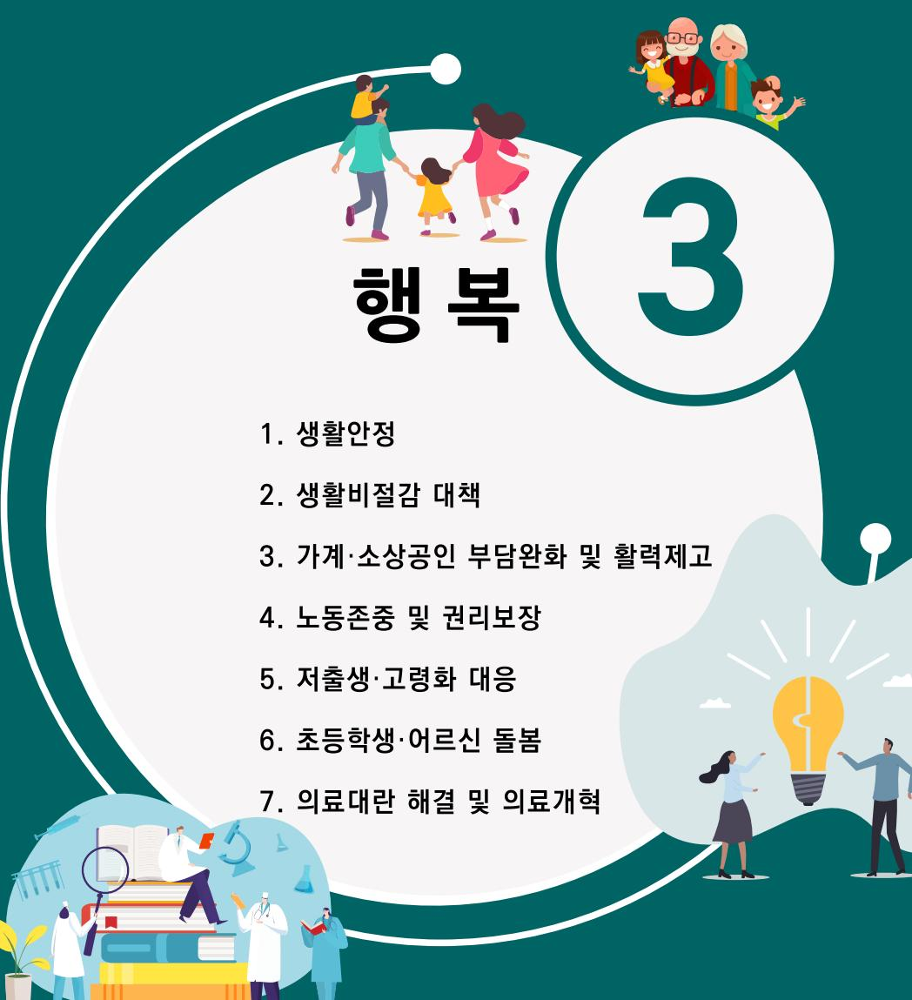

제21대 대통령선거 더불어민주당 정책공약집

# 이제부터 진짜 대한민국 회복·성장·행복으로 국민통합

#### 3대 비전별 정책공약 - 행복

## 3대 비전별 정책공약

### 1. 생활안정

1.  모든 국민의 기본적인 삶을 보장하는 사회를 만들겠습니다
2.  어르신이 행복한 대한민국을 만들겠습니다
3.  아동의 권리가 보장되는 사회를 만들겠습니다
4.  국민에게 신뢰받는 든든한 공적연금을 만들겠습니다
5.  최후의 생활안전망을 강화하여 '빈곤층 제로'사회를 만들겠습니다
6.  한부모가족과 청소년한부모가족에 대한 지원을 확대하겠습니다
7.  국가를 위한 헌신, 제대로 예우하겠습니다
8.  국민 통합을 위한 보훈문화 확산에 앞장서겠습니다
9.  국가유공자의 건강은 국가가 책임지겠습니다
10. 장병 복무여건을 개선하겠습니다
11. 문화예술인의 촘촘한 복지 환경을 구축하겠습니다
12. 스포츠 인재개발을 위한 국가지원체계를 구축하겠습니다
13. 쌀값 정상화 농산물 유통 개혁 및 공익직불금을 확대하겠습니다
14. 선진국형 농가소득망 및 농업재해 안전망을 도입하겠습니다
15. 농업인 퇴직연금제를 도입하고, 농지이양 은퇴직불금 및 공공비축농지를 확대하여 영농 세대교체를 이루겠습니다
16. 기후위기에 따른 수산업 육성 및 자원조성사업을 추진하겠습니다
17. 어민 소득증대로 삶의 질을 향상하여 어촌소멸에 대응하겠습니다
18. 배움에서 소외되는 아이가 없도록, 국가책임 공교육으로 사교육비 부담을 줄이겠습니다
19. 생각하는 힘, 질문하는 능력, 인간다운 상상력을 키우는 인문학 교육을 확대하겠습니다
20. 직업교육의 질을 높여, 누구나 일하면서 학습할 수 있는 열린 직업교육 체계를 만들겠습니다
21. 중산층과 서민을 위한 부동산 공급 정책에 집중하겠습니다
22. 편리하고 안전한 교통 물류환경을 만들겠습니다
23. 누구나 차별 없이 미디어를 누릴 수 있는 환경을 만들겠습니다
24. 사람과 동물이 더불어 행복한 사회를 만들겠습니다
25. 경영난에 처한 어린이집의 기능 전환으로 부족한 복지인프라를 확충하겠습니다

#### 생활안정 01

## 모든 국민의 기본적인 삶을 보장하는 사회를 만들겠습니다

#### - 국민의 다원적 욕구를 충족하는 보편적 기본서비스가 보장되는 사회 추진
- 노동·주거·보건의료·돌봄·여가문화·교육·교통·통신·에너지 등 보장

## 어르신이 행복한 대한민국을 만들겠습니다

- 임플란트 건강보험 적용 단계적 확대
- 불합리한 연금제도 개선
	- 일하는 노인에 대한 국민연금 감액 개선
	- 기초연금 부부 감액 단계적 축소
- 경로당 등 노인여가복지시설 지원 확대
- 안전통학지킴이, 안심귀가도우미 등 어르신 공공일자리 확대

#### 생활안정 03

## 아동의 권리가 보장되는 사회를 만들겠습니다

### - 아동수당 18세까지 점진적 확대

- 아동 건강 수준 향상 및 건강 불평등 해소
- 디지털 세상 속 아동 안전 및 권리 보장
- 위기 아동 발굴 및 학대피해 아동 보호
- 아동 보호 책임 강화
	- 공공후견인 제도 도입
	- 국가책임 입양체계 개편 안착 적극 지원
	- 영케어러, 수용자 자녀 등 복지제도 사각지대 아동 지원
	- 경계선지능인 지원 확대

## 국민에게 신뢰받는 든든한 공적연금을 만들겠습니다

#### 노후소득보장 강화 및 미래 연금불안 해소를 목표로 하는 공적연금 개혁 지속 추진

- 노후소득보장의 사각지대를 없애고 국가와 본인의 노력으로 국민 누구나 적정노후소득을 보장받을 수 있도록 공적연금제도 개혁
- 국민연금 재정 우려 해소를 위한 중장기 방안 마련

#### - 국민연금·기초연금 관계 재구조화, 퇴직연금 공적연금화, 공적연금에 대한 국가 역할 정립 등 방안 마려

- 다층노후소득보장체계 구축 목표
- 크레딧, 저소득층 보험료 지원 확대 등 공적연금 사각지대 해소 방안 마련
- 청년층의 연금 가입기간 확장 지원 방안 마련

### 생활안정 05

## 최후의 생활안전망을 강화하여 '빈곤층 제로'사회를 만들겠습니다

- 어떠한 상황에 처하더라도 빈곤선 이상의 삶이 보장되도록 최후의 생활안전망 강화하여 '빈곤층 제로' 사회 실현
	- 국민 기초생활보장 부양의무자 기준 완전 폐지 추진
	- 기초생활보장 생계급여 자격기준 및 보장수준 단계적 상향
- 근로장려금(EITC)과 자녀장려금(CTC)의 대상 및 지급액을 확대하여 근로 저소득층의 자립 기반 확대

#### 생활안정 06

## 한부모가족과 청소년한부모가족에 대한 지원을 확대하겠습니다

#### - 한부모가족 증명서 발급 대상 소득기준 폐지

- 한부모가족·청소년한부모가족에 대한 보편적 복지서비스 제고

#### - 한부모가족 복지금여 지금 강화

- 아동양육비 지원 소득기준 단계적 확대
- 아동양육비 지원금 상향
- 미혼 한부모가족 추가아동양육비 상향
- 한부모가족 아이돌봄서비스 추가 정부지원 상향
- 아이돌봄 서비스 이용 한부모가족에 대해 추가 정부지원금 인상
- 청소년한부모가족 양육비 지원 대상 및 지원금 확대
	- 아동양육비 지워 중위소득 기준 상향
	- 자녀 1인당 아동양육비 지원금 인상

#### - 다변화하는 가족정책 수요 대응을 위한 가족센터 기능 강화

- 지역 맞춤형 가족센터 운영과 전문성 강화 및 종사자 인건비 가이드라인 마련

### 생활안정 07

## 국가를 위한 헌신, 제대로 예우하겠습니다

- 지방자치단체별 보훈명예수당 차이 최소화를 위한 가이드라인 이행 강화책 마련
- 7급 재해부상군경 부양가족수당 지원 등 보훈대상자에 대한 지원이 합리적 기준 없이 차별적용되지 않도록 제도 개선

#### 저소득 보훈대상자에 대한 지원체계 강화로 보훈 사각지대 해소

- 참전유공자 사망 시 배우자에 대한 지원 단절로 생계곤란 문제가 발생하지 않도록, 80세 이상 저소득 배우자 생계지원금 지급 추진
- 조국 수호를 위해 희생한 시간에 대한 정당한 보상

- 국민 눈높이에 맞는 보훈 보상수준 확보
- 보훈급여금 보상체계 재정립
- 국가, 지자체, 공공기관이 호봉 결정 시 의무복무 제대군인의 군복무 기간을 포함토록 법적 근거 마련
- 제대군인의 권익구제를 위한 지원 창구 확대
- 국내·외 현충시설에 대한 체계적인 관리·운영, 재정비를 위한 법 제도 개선
- 소외되고 있는 국내 외 현충시설 관리체계 강화

## 국민 통합을 위한 보훈문화 확산에 앞장서겠습니다

#### - 역사를 바로 세울 수 있도록 '광복 80주년 기념행사'의 차질 없는 이행

#### - 국민통합형 보훈문화 확산 기반 조성을 위한 제도 개선

- 공공기관 임원추천위원회 중립성 확보로 이념논쟁 등 국민통합 방해 행위 방지
- 보훈에 관한 주요 정책 심의기구인 국가보훈위원회의 역할과 위상 강화로 자의적인 보훈정책 결정 집행 방지
- 보훈부·지자체간 시스템 연계 등 통합보훈정보시스템 개선, 보훈 공직자 전문성 강화로 보훈행정 기능 강화

세대별 보훈 행사를 세대 통합형으로 재구성하는 등 세대간 소통을 강화하는 보훈정책 확대

### 생활안정 09

## 국가유공자의 건강은 국가가 책임지겠습니다

- 국가유공자의 건강한 삶을 위해 사각지대 없는 보훈의료체계 구축
	- 보훈병원이 없는 지역에 지역내 공공병원을 활용한 준 보훈병원 도입으로 위탁병원에서 지원되지 않는 혜택 확대
	- 지역 연계 보훈 주치의제 도입
	- 보행이 곤란하거나 불가능한 분들을 위한 방문진료사업 확대
	- 인사, 조달체계의 공정성 확보와 전문인력 확충으로 보훈병원 혁신

#### - 국가유공자의 고령화에 따른 맞춤형 종합 대책 추진

- 휠체어 등 보조기구 대여사업 대상을 늘려 국가유공자의 삶의 질 향상
- 민간과의 협업을 통해 국가유공자 1인 가구에 대한 촘촘한 관리 체계 구축
- 정확한 실태조사와 관리체계 구축을 통해 유공자 고독사 예방을 위한 대책 마련

## 장병 복무여건을 개선하겠습니다

- 초급간부 급여 현실화 및 장기복무비율 대폭 확대
- 초급간부에 대한 전 월세 정책자금 연계 지원 확대
- 당직근무비를 일반공무원 수준으로 인상
- 장기근속자는 종합건강검진비 지원
- 군 복무 중 'e-러닝으로 원격강좌 대학' 과 '군 복무경험 학점 인증제 참여대학'을 의무화하여 학업단절을 최소화
	- 원격강좌 수강료 전액 지원
- 예비군 훈련기간 단축 및 예비군 훈련보상비 현실화
	- 동원예비군 훈련기간 4년→3년으로 1년 단축
	- 노후된 동원예비군 훈련장비 현대화

### 생활안정 11

## 문화예술인의 촘촘한 복지 환경을 구축하겠습니다

#### - 문화예술인 생활 보장 강화 - 예술인 복지금고 조성 추진

- 문화예술인 사회보험 보장 확대
- 건강보험료 지원 신설
- 국민연금·고용보험·산재보험 가입(자부담분) 지원 확대

#### - 문화예술인 복합지원공간 확대

- 예술인 자녀돌봄센터 확대(2개소→20개소) 및 야간 실행기관 확대
- 경력단절 예술인 지원 체계 구축(공공센터 구축)
- 문화예술인 공공임대주택 보급 확대
- '임금채권보장법 대지급금'에 준하는 예술인 체불수입 보장제도 실시

#### 생활안정 12

## 스포츠 인재개발을 위한 국가지원체계를 구축하겠습니다

#### - 전문체육인 복지 강화

- 고용보험 도입, 재교육사업, 생활안정자금 확대 등 체육복지 강화

#### - 전문체육인 출신의 일자리 창출

- 생활체육 지도자 체계적 양성 및 의무 배치, 처우개선 추진
- 협동조합 창업 등 경력단절 체육인 지원
- 민간기업의 스포츠 실업팀 창단 운영 지원 확대

#### - 체육단체 투명성·독립성·자율성 강화

- 선수에 불합리한 체육단체 협약 개선
- 임원임기, 권한분산, 재정투명성, 외부감시 등 체육단체 운영 개선

#### - 체육 영재 발굴을 위한 민·관 지원 환경 조성

- 학교 유청소년 클럽의 체육 영재 발굴 및 성장 프로그램 개발 지원

#### - 장애인체육단체 및 e스포츠 지원 강화를 위한 법·제도 개선

#### - 각종 스포츠단 훈련에 진천선수촌 개방

#### 생활안정 13

## 쌀값 정상화 · 농산물 유통 개혁 및 공익직불금을 확대하겠습니다

- 양곡관리법 개정으로 논 타작물재배를 확대하고 쌀 및 식량작물의 적정가격 유지
- 과감한 인센티브와 식량위기 시 비상대응 가능한 방식으로 선제적 쌀 생산조정 강화
- 쌀 수급안정을 위해 쌀 의무수입물량(TRO) 감축 추진

#### - 농업인과 소비자 모두를 위한 유통개혁 추진

- 농축산 디지털 유통 플랫폼, 산지경매 등 산지유통혁신, 도매시장의 공공성 평가관리 강화, 농협 등 품목별 생산자조직 역할 기능 강화
- 생산자단체에 농산물 수입쿼터 관리권 단계적 부여
- 공익직불금 확대
	- 기존 공익직불금 확대 개편: 전략작물직불(식량안보, 생산조정), 탄소중립직불, 친환경농업직불 등
	- 신규 공익직불금 도입: 가격안정, 청년농업인 지원, 기후변화적응 지원, 경축순환, 동물복지 등

#### 생활안정 14

## 선진국형 농가소득망 및 농업재해 안전망을 도입하겠습니다

#### - 주요농산물의 가격안정제 도입, 수입안정보험과 병행하여 농가 경영안정

- (가격안정제) 시장가격이 기준가격에 미치지 못할 경우 손실을 일부 보전하는 기초안전망
- (수입안정보험) 품목별 기준수입보다 하락시 손실 일부 보전하는 보험

#### - 농어업재해 국가책임제 도입 및 농업인안전보험을 산재보험수준으로 강화

- (재해대책) 피해복구 범위 확대 및 지워단가 실거래가로 상향, 비보험품목 피해보전
- (재해보험) 할증 최소화 및 국가지워 확대, 보상범위와 보상률 강화
- (기후재난지워금) 거대 재해 발생으로 심각한 피해 시 재난지워금 지급

#### 생산비 급등에 따른 필수 농자재 국가지원제도 도입

- 비료·사료값 상승, 유가·전기료 급등 등 농업생산비 급등에 대한 가격인상분 일부 지원
- 통합형 농자재구매 지원사업 추진(현금성 지원 방식, 농자재보조사업 통합)

#### 생활안정 15

## 농업인 퇴직연금제를 도입하고, 농지이양 은퇴직불금 및 공공비축농지를 확대하여 영농 세대교체를 이루겠습니다

- 농업인 퇴직연금제 도입으로 노후 대비 및 영농 세대교체

#### 고령농 농지이양 은퇴직불제를 확대하여 청년 등 영농 세대교체

- 고령농의 은퇴와 영농 세대교체를 위해 농지이양 은퇴직불사업의 단가 인상 등 개선
- 은퇴농의 농지는 인접 농업인·청년농·친환경농 등에 우선 제공

#### - 농생명용지 조기 개발 · 농지의 규모화 · 집적화 및 공공비축농지 확대로 농업 혁신

- 공공임대용 농지매입 규모를 확대하여 급격한 농지가격 하락 방지, 농지보전총량제 도입
- 주민참여형 농지 규모화·집적화, 임대차 허용 범위 확대 및 관리 강화 등 농지의 소유·이용·보전·전용을 체계적으로 관리하는 농지관리기구 설치
- 공공비축농지 확대로 식량안보·기후대응·수급조절·세대교체·재생에너지 등 농업혁신 추진

## 기후위기에 따른 수산업 육성 및 자원조성사업을 추진하겠습니다

#### 주요 어업재해인 이상수온 피해 예방을 위한 대응장비 및 대응연구 사업 확대

- 액화산소, 산소공급기, 차광막, 가두리양식장 어류 이동 선박 등 예산 확대 지원

#### - 저·고수온 기후변화 등에 따른 어장 및 조업여건 변화로 유연한 대응체계 구축

- 수산자워관리법 시행령을 재정비하여 어장변화의 신속한 대응책 마련

#### - 양식수산업 재해보험 보장범위 확대 및 보상규모 현실화

- 재해보험 적용 어종 확대 및 신규양식수산물에 대한 정부지워
- 재해피해 수산물에 대한 보상기준 세분화(치어-중어-성어)

#### 어선 폐업지원금 상향 및 폐업 수산물양식업 업종전환 지원

- 어선 자율감척 지원사업에 따라 폐업한 어선에 대한 폐업지원금 상향
- 폐업 수사물양식어가의 안정적 생계유지를 위한 업종 전환 지원
  \* 폐업으로 인한 채무조정 지원 및 민간·공공 등 협업 통한 기술특화, 전문 프로그램 등 취·재창업 프로그램 마련

#### - 스마트양식 및 육상양식 보급 및 지원 확대

- 스마트양식 및 육상양식업(김 육상양식 등) 지원과 기술개발 및 교육 지원 확대
- 양식수산물 다양화로 어종개발 가속화 지원 및 고수온 적합어종 전환 등 고부가가치 품목 전략적 연구 지원 확대

- 수산종자 및 양식어업 생산현장 장비, 기자재 스마트화 등 정부지원 추진
- 기초적인 현장 필수 수산양식기자재 보급사업 추진

#### 수산종자재해보험 도입과 자조금 사업 추진

#### - 고수온 피해 대비 우량종자 생산을 통한 우량품종 단계별 집중 방류 추진

- 우량종자 R&D 지원사업, 수산종자산업의 안정화 및 기술개발 지원
- 방류지워사업 구분 지워(소득증대용과 수산자원회복용)
- 양식수산물 수매 및 비축 추진으로 유통환경 조성
- 지역거점별 저장 비축창고 및 가공시설 설치 지워

#### - 전국 단위 콜드체인 기반 수산물 공급망 구축

- 산지 위판장, 수산물 산지 유통센터 등에 냉장·냉동 저장, 자동 분류, 냉장 운송 인프라 확대 구축
- IoT 기반 스마트 콜드체인 시스템(온도·위치 실시간 추적 등) 도입 추진

#### - 어업시설물 전력 효율을 위한 재생에너지(소수력/태양광) 자가발전 양식장 구축 지원

## 어민 소득증대로 삶의 질을 향상하여 어촌소멸에 대응하겠습니다

#### 어민소득 안정 목적 실현을 위한 수산공익직불금(소규모어가) 인상

- 수산공익직불금 지급 대상자 및 지급 수준 확대
- 바다정원과 에너지 자립마을을 통한 탄소중립 활동에 적극 참여하는 공동체에 안정적인 소득 기반 마련
	- 유휴어항 수역에 해조류 이식·관리를 통해 탄소흡수·저장, 중간육성, 바닷속 체험관광 등을 위한 블루카본 바다정원 조성
	- 공유수면과 유휴자원을 활용하여 적정규모의 신재생에너지 발전을 통해 사회혁신과 마을 현안해결을 위한 에너지 자립마을 조성

- 수산식품기업바우처 수산선도조직 육성사업의 예산확대로 우리 수산물의 수출경쟁력 강화
- K-Seafood 수출 확대를 위한 유망 품종(김 수출) 및 비품종 경쟁력 향상을 위해 육성 및 지원 확대
	- 수산식품산업 육성 가공설비 및 수산물자조금 지원 확대를 통해 어업인 소득안정 도모
- 해양바이오, 레저관광, 체험휴양마을 특화 조성, 창업투자 등 새로운 성장동력 창출로 지역경제 활성화
	- 동·서·남 권역별 복합 해양레저관광도시 확대 구축, 마리나 거점 및 레저선박 클러스터 조성
	- 어촌체험휴양마을 특화 조성사업 대상지 확대
- 어촌 고령화 심화에 따른 해양수산 어선원직 인력난 해소를 위한 외국인선원 장기근속 방안 마련

## 배움에서 소외되는 아이가 없도록, 국가책임 공교육으로 사교육비 부담을 줄이겠습니다

#### - 국가가 책임지는 기초학력 관리 체계 구축

- 기초학력 미달 비율이 높은 학교에 최우선으로 예산과 전문인력 지원
- 국가수준의 기초학력 진단도구 변경·재개발(인지, 정서, 건강을 포괄하는 학생진단 도구 개발)

#### - 기초학력 학습안전망 지워 확대

- 기초학력 전담교원 확충으로 학습결손을 조기에 발견하고, 개별지도 강화
- 교육청별 기초학력진단평가를 통해 학생의 성취수준 결과를 학생·학부모·교사에게 제공 (국가기초학력지워센터 협업)

#### - 초등 정서행동 학습지원 전문교사제 도입

- 특별한 교육적 지원이 필요한 학생을 위한 전문교사 배치
- ADHD, 우울·불안, 난독증, 난산증, 경계선지능, 다문화 배경 학생 등 대상별 맞춤형 정서행동·학습지원 강화

#### - EBS를 활용한 '자기주도학습센터' 운영

- EBS 콘텐츠와 플랫폼을 활용한 공공형 학습센터 운영
- AI 학습서비스와 연계된 1:1 맞춤형 온라인 학습지원 시스템 구축
- EBS 교재(e-Book) 초 중·고 전 학년 무상 제공

#### 생활안정 19

## 생각하는 힘, 질문하는 능력, 인간다운 상상력을 키우는 인문학 교육을 확대하겠습니다

#### - 학교 교육과정 내 인문학 교육 강화

- 문학·철학·역사·윤리를 융합한 프로젝트형 수업과 인문독서·토론 수업 활성화
- '질문 중심 수업' 확대 및 비판적 사고력 함양을 위한 교사연수 체계 마련

#### - 청소년 인문활동 활성화

- 전국 단위 청소년 인문학 캠프, 독서토론대회 프로그램 등 운영
- 청소년 스스로 주제와 방법을 설계하는 '청소년 인문연구 프로젝트' 지원

#### - 대학 인문 교양교육 강화

- 다양한 인문 교양과목 개설 및 교양과정 혁신 지원
- 인문+AI, 인문+환경, 인문+공공정책 등 융합형 인문 교양과목 확대

#### 인문학 전공 인재에 대한 국가 지원 확대

- 인문계 대학생 대상 국가장학금(인문100년장학금) 확대
- 인문계 대학원생의 연구·출판 등 학술 활동 지원 강화

#### 생활안정 20

## 직업교육의 질을 높여, 누구나 일하면서 학습할 수 있는 열린 직업교육 체계를 만들겠습니다

#### - 고교 직업교육 혁신 추진

- 지역 산업과 연계된 신산업 유망 분야로 직업계고 학과 개편
- 학생충원 미달 특성화고는 일반고로 전환 지원, 나머지 특성화고는 마이스터고로 일원화해 선택과 집중 추진
- 고교학점제를 통한 일반고 학생의 직업교육 확대

#### - 직업계고-전문대-대학 간 연계 강화

- 3+1 전문학사 활성화: 직업계고 3년 + 전문대 1년 과정을 통해 전문학사 취득
- 2+3 마이스터 학사 도입: 현장 경력 2년 이상은 유사 전공 1년 인정, 학사과정 3년 이수로 일·학습 병행형 학위 취득

#### - 전문대학을 개방형 대학(Open University)으로 재구조화

- 성인학습자, 직장인, 지역 주민 등을 대상으로 비학위 평생교육 확대
- 지역 평생·직업교육 거점으로 재편해 생애전환기 재교육과 역량강화 지원
- 고졸 후학습자 국가장학금(희망사다리 Ⅱ유형) 지원 확대

#### 생활안정 21

## 중산층과 서민을 위한 부동산 공급 정책에 집중하겠습니다

- 초고가 아파트 가격상승 억제 중심에서 중산층 저소득층을 위한 주택공급 중심의 주거 정책에 집중

#### - 신축수요에 방해되는 고분양가 문제 해소 위한 방안 마련

- 주택공급 시속인허가 제도 도입으로 인허가 기가을 단축하여 사업비를 절감하고 절감한 사업비를 분양가 인하로 유도
- 도시부쟁조정위원회의 심사대상에 공사비분쟁 조정 포함 등 공사비 투명성 담보

#### - 공공성 강화의 원칙하에 재개발재건축 절차 및 용적률 건폐율 등 완화 추진

#### - 가계부채 총량의 안정적 관리 기조 확립

- 부동산가격·금융시스템안정 정책이 서로 균형을 이루도록 관계기관회의 정례화

## 편리하고 안전한 교통·물류환경을 만들겠습니다

- 국민이 자유롭게 이동하고 편리하게 교통을 이용할 수 있도록 '교통기본법' 제정 추진

#### - 택시운전자 근무환경 개선

- 노동시간에 상응하는 생활임금 보장으로 인력대란 해결, 통합전자관리시스템 구축으로 택시운전자 편의 제공 등 운수종사자 처우개선

#### - 택시업계 발전 지원

- 택시 준대중교통 인정, 택시호출플랫폼 활성화·공정화 실현
- 수요맞춤형 공공형택시 시행지역 및 지원 확대
- 교통약자특별교통수단(장애인콜택시) 관련 규제 완화 및 지원 확대 추진
- 택시 고급화 및 낡은 택시의 교체사업 지원 확대

#### 화물자동차 안전운임제 재도입 등 화물운송업계 종사자 지원 확대

- 전세버스운송사업 표준운임제 도입
- '서민의 발' 필수 시외 고속버스 노선 지원 방안 마련 추진
- 대리운전자 권익 향상을 위한 관련법 제정
- 생활물류서비스 노동자 근무 환경 개선
	- 유상운송보험 의무화 등 이륜차 등 종사자 권익보호 '생활물류서비스산업발전법' 개정
	- 생활물류시설 첨단화 지원 통한 노동 환경 개선
- 중고차 및 튜닝업계 육성을 위한 '자동차관리법 개정' 검토
- 저가항공업계 육성 및 안전관리 기반 조성 등 항공산업 경쟁력 강화
- 농어촌 맞춤형 교통시스템의 도입 및 단계적 확대
- AI 지능형 교통관제시스템을 기반으로 농어촌 대형교통수단 및 택시 등 운송수단의 최적화
- 이원화된 고속철도 통합으로 운행횟수 증차 등 국민편의 확대 안전성 강화

#### 생활안정 23

## 누구나 차별 없이 미디어를 누릴 수 있는 환경을 만들겠습니다

#### - 취약계층을 위한 온라인 교육 프로그램 지원 확대

- 취약계층 아동·청소년·학생 대상 온라인 교육 프로그램 이용 지원 확대

- 어르신을 위한 미디어 문해력(리터러시) 교육 강화

#### - 장애인에 대한 방송접근권 보장 및 장애인 미디어 복지 강화

- 장애인용 미디어 단말 제공 보급, 자막방송, 수어방송, 화면해설방송 등 장애인의 방송 접근권 확대
- 장애인 미디어 창작자 스타트업 교육 및 인프라 지원, 제작 역량 지원

#### 장애인 및 취약계층 학생·청년에게 1인 미디어 제작장비 무상 임대

- 장애인 및 취약계층 학생이나 청년의 미디어 창작 지원 및 크리에이터 기회 제공을 위해 제작 관련 장비 무상 임대

## 사람과 동물이 더불어 행복한 사회를 만들겠습니다

- 반려동물 양육비 부담 완화 및 반려동물 의료 서비스 강화, 인프라 확충
- 반려동물 치료비 경감을 위한 표준수가제 도입 및 인프라 개선으로 보험 활성화
- 위탁서비스 및 취약계층 의료비 지원, 진료비에 부과되는 부가가치세 면제 확대
- 반려동물 진료소 확대 등 인프라 확충

#### - 동물 학대자의 동물 소유권 및 사육권 제한으로 동물학대 없는 대한민국

- 동물 학대 범위 확대, 학대 행위자로부터 피학대 동물 몰수 및 사육금지 명령제 도입
- 반려동물 양육 전 기본소양 교육제도를 점진적으로 도입하여 보호자 책임의식 강화

#### 강아지·고양이 생산공장 금지, 지자체 동물보호센터 확대 및 동물복지 개선

- 반려동물 대규모 생산 금지 및 관리 감독 강화, 반려동물관리 데이터베이스 구축
- 유사 동물보호시설 규제 및 보호소를 가장한 영리업체의 운영 홍보 제한
- 지자체 동물보호센터 확대 및 동물복지 기준 마련 예산 현실화

#### - 동물복지 축산농장 인증지원 확대 및 직불제 도입으로 농장동물의 복지 개선

- (축산농장 인증지원 확대) 인센티브 제공, 동물복지인증축산물 판로확보 등
- (농장동물복지직불) 동물복지 가이드라인을 실천하는 농가에 소득 감소분 지원

#### - 동물원의 동물복지를 개선하고, 생물다양성 보전기관으로서 역할을 강화

- 동물원 수족관 전시동물 서식환경 개선 및 지자체 관리 강화
- 공영동물원에 야생동물보호시설 설치 및 생물다양성 보전 연구·교육 기능 강화

#### - 실험동물 희생을 최소화하고, 국가 봉사동물과 레저동물 보호 및 관리체계일원화

- 동물대체시험 활성화법 제정으로 대체시험법 개발 및 표준화 적극 지원
- 국가봉사동물에 대한 관리체계 확립 및 민간입양 지원 확대
- 퇴역 경주마 등 레저동물의 복지관리체제 확립

#### 동물이 생명으로 존중받는 사회를 위해 '동물복지 기본법' 제정, '동물복지진흥원' 설립 추진

#### 생활안정 25

## 경영난에 처한 어린이집의 기능 전환으로 부족한 복지인프라를 확충하겠습니다

- 저출생고령화 추세를 고려하여 정부 주도 하에 지역별 중장기 아동·청소년·노인 관련 복지시설 구조조정 및 확충 종합계획 수립
	- 어린이집 등 과잉 복지시설의 기능 전환 등 구조조정 계획 수립
	- 노인요양원 등 확충 필요 시설의 신규 설치 및 기존 시설 기능 전환 수요조사를 통한 확충 계획 수립

#### - 어린이집 등 기능 전환 희망 복지시설을 재가서비스센터 등 노인 복지시설이나 마을도서관·키즈카페·돌봄센터·육아정보센터 등 아동·청소년 복지시설로의 전환 지원

- 실태조사를 통해 기능 전환 희망 시설 파악
- 지역별 신규 복지시설 확충 계획을 고려하여 과잉 시설의 기능 전환 유도
- 기능전환 규제 완화 및 비용 지원을 위한 법적 근거 마련

## 국민의 정보통신비 부담을 줄이겠습니다

- 글로벌 거대 플랫폼 기업 및 OTT 서비스 국내외 가격차별 해소 유도
- 단통법 폐지에 따른 알뜰폰 및 자금제폰 활성화 추진
- 전 국민 데이터 안심요금제(OoS) 도입
- 잔여 데이터 선물하기 또는 이월 선택으로 이용자 중심 데이터 활용제도 확립
- 병사 통신 요금 할인율 확대(20%→ 50%)
- 5G 백홀의 공공 와이파이를 광역 지하철(공항철도 포함) 전반에 설치
- TV 유휴대역 활용한 Super WiFi로 농산어촌 이용자 데이터 요금 경감
- 우체국 활용, 사각지대 없는 공공서비스 전달체계 구축

#### 생활비절감 대책 03

## 1인가구·청년을 위한 주택정책을 확대하겠습니다

- 1인가구·청년이 살고 싶은 '직주근접(직장과 주거가 근접)' '슬세권(슬리퍼+역세권)', 주거복합플랫폼주택 확대 조성
	- 도심공공주택 복합사업(역세권, 주거상업고밀지구) 확대
	- 철도차량기지·GTX환승역·공공청사 등 복합개발로 직주근접 가능한 주택 공급

#### - '생애 첫 독립' 1인가구 맞춤형 정보 제공 등 주거설계지원 사업 추진

- 지역별 수요-공급을 반영한 '주거지도' 작성 및 맞춤형 주거정보 제공
- 복잡한 전세·월세 계약 등 안정적으로 할 수 있도록 지원사업 추진
- 1인 가구 맞춤형 쉐어하우스, 여성안심주택 등 공급 확대

- 원룸·오피스텔 등 '깜깜이 관리비' 방지로 투명성 강화

- 청년패스, 국민패스, 무상 어르신패스 등 발행
- 정액권 구매 후 광역교통망을 거리병산 추가요금 없이 무제한 환승 가능
- 지역간 교통 이용권 격차 해소 및 국민 선택권 부여로 대중교통 활성화
- 지역마다 '상이한' 패스가 아닌 '내가 선택'하는 패스 도입으로 국민선택권 부여

## 의대 쏠림 완화를 위한 이공계장학금 확대

- 이공계장학금 신청요건 완화, 대학원까지 장학금 확대
- 인문학 전공 인재를 위한 국가장학금(인문100년장학금) 지원 확대
- 고졸 후학습자 국가장학금(희망사다리 Ⅱ유형) 지원 확대

#### 취업 후 상환 학자금대출 확대

- 누구나 취업 후 상환 학자금 대출(ICL)을 이용할 수 있도록 지원대상 확대
- 의무상환 개시 전 대출이자 면제 기준 확대(전문특수대학원생 포함)
- 일반 학자금대출과 병행 운영하여 가구 여건에 따라 선택 가능

#### 국가장학금 소득구간 산정방식 개편

- 국가장학금의 형평성 강화 및 불공정 요소 개선

#### 생활비절감 대책 06

## 대학생·청년의 주거 환경을 개선하고, 지역과 상생하는 복합주거 공간을 만들겠습니다

#### - 대학생·청년 주거안정과 지역 활력 회복을 위한 주거복합지원센터 공급

- 대학생 및 청년의 주거 기반 위에 교육, 취·창업, 지역주민 편의시설이 연계된 주거복합지원센터 단계적 공급

#### 초·중등 폐교 및 국·공립대 부지를 활용한 행복연합기숙사 공급 확대

- 폐교(이전) 또는 폐교예정 학교, 국·공립대 부지를 최대한 활용하여 연합형 행복기숙사 적극 추진
- 기존 노후 기숙사의 리모델링 및 증·개축 추진

#### - 지역 상생을 위한 주택 활용 기숙사형 청년주택 확대

- 공실 우려가 있는 소형 임대주택을 선정하여 시세보다 저렴한 보증금 및 월세 지원

- 부가가치세 면제 일몰 연장을 통한 기숙사비 인하

#### 생활비절감 대책 07

## 기후 농정으로 식량자급 확대하고 국민의 밥상을 책임지겠습니다

- 식량주권법 제정으로 국민의 먹거리 기본권 보장
- 식량자급 확대, 국가 먹거리 전략 및 식량계획 수립, 위기 경보시스템 구축 등
- 기후적응형 농업 추진
	- 품종개발, AI 관측·재해예측 고도화, 노지스마트농업 체계 구축, 정밀농업 확산, 스마트 관배수 시스템 도입

#### - 주요 농산물의 공급망 안정화 추진

- '기후취약 품목' 지정, 계약재배 비중 확대 및 이행지원제 도입, 비축역량 강화, 글로벌 공급처 다양화 등

#### - 지역푸드플랜 및 로컬푸드 활성화

- 지역 내 건강한 먹거리 보장 및 순환, 농촌지역 식품사각지대 해소

#### 생활비절감 대책 08

## GMO완전표시제 도입, 청년·근로자 천원의 아침밥 및 농식품바우처 확대 등 식생활 돌봄을 강화하겠습니다

- 유전자변형식품(GMO) 완전 표시제 도입(단계적 확대 추진)
- 청년, 산단 근로자의 건강 식생활 보장
	- 대학생 천원의 아침밥 확대, 미취업 청년 식품 바우처로 식생활 지원
	- 전국 산업단지 근로자를 위한 천원의 아침밥 사업 지원
- 임산부 친환경농산물꾸러미, 초등학생 과일간식사업 복원 및 확대
	- 임산부를 대상으로 친환경농산물을 월 1회 이상 공급
	- 초등학생에게 과일간식지워으로 식습관 개선, 국산과일 소비확대

#### - 학교급식 및 군급식 제도 개선

- 학교, 유치원 어린이집 지역별 급식비 격차 완화
- 장병의 건강 식단 보장 및 군급식의 지역산·친환경 농축산물 생산-소비 확대

#### 농식품 바우처 확대, 긴급끼니 돌봄제도 등 취약계층 맞춤형 식생활 지원 강화

- 생계급여가구 등 취약계층, 재난·사고·질병 등 위기상황이나 긴급한 빈곤 가구에 제공

#### 생활비절감 대책 09

## 국민 문화향유권 확대로 문화행복시대를 열겠습니다

- 소외계층 문화향유권 확대
- 저소득층 대상 문화누리카드 지원 확대
- 생애주기 3대 문화패스 신설 및 확대
- "청소년 문화패스" 신설 지원 추진
- "청년 문화패스" 지원 확대로 청년의 문화예술 접근성 강화
- "생애전환 문화패스" 도입
- 문화예술 교육 프로그램 강화
- 초중고 학교예술강사 인건비 국비지원
- 초중고 학교 단위(학년·학급)의 최소 연 1회 문화향유 지원
- 불우환경 예술영재 발굴을 위한 「한국판 엘 시스테마 사업 실시
- 대학 문화예술 동아리의 프로그램 및 작품 발표 지원
- 인문학 창작 및 프로그램 활성화 지원

#### - 문화 체육 상품 및 입장에 특화된 "문화형 온누리상품권" 발행 추진

### 생활비절감 대책 10

## 국민 누구나 즐기는 스포츠문화권을 확대하겠습니다

#### - 생활밀착형 체육시설 지속 확보 및 시설 개량 지원

- AR·VR 활용 지역별 스마트체육관 건립 및 '국민체력인증센터'확대
- 스포츠 청소년 체험시설 '스포츠가치센터'전국 확대
- 장애인 친화형 체육센터(반다비 체육센터) 지속 확충
- 개방적 파크골프장 운영 및 인프라 확충

#### - 어르신 건강권 확보 지원

- 어르신 스포츠 강좌 수강료 지원
- 어르시 전문스포츠센터 건립 및 스포츠강사 의무 배치 추진

#### - 학교체육 활성화 추진

- 초등학생 체육수업 확대 및 초등학교 스포츠 강사 인건비 국비지원
- 방과 후 체육프로그램 확대

#### - 지역중식의 체육활동 지원

- 종목별 생활체육 동아리(클럽) 장비·활동·체육지도자 교육 등 지워 확대
- 지역화폐 환급대상에 스포츠업 추가 및 환급규모 확대

### 3. 가계·소상공인 부담완화 및 활력제고

1.  소상공인의 금융부담을 대폭 낮추겠습니다
2.  소상공인의 경영부담을 덜어드리겠습니다
3.  소비촉진 정책으로 소상공인 자영업자를 살리겠습니다
4.  공정하고 지속가능한 소상공인 경제, 실패해도 재기할 수 있는 나라를 만들겠습니다
5.  소상공인·자영업자의 사회안전망을 확대하겠습니다
6.  대출원리금 상환부담을 대폭 줄이겠습니다
7.  포용금융을 확대하고 취약계층의 금융문턱을 낮추겠습니다
8.  선량한 채무자에 대한 금융 보호를 강화하겠습니다
9.  보험가입자의 권리를 충분히 보장하겠습니다
10. 주택 실수요자가 부담 없이 거주하도록 하겠습니다
11. 공공임대비율을 단계적으로 확대하겠습니다
12. 전세사기 걱정 없는 사회, 부담없는 전월세로 서민의 주거사다리를 복원하겠습니다

## 소상공인의 금융부담을 대폭 낮추겠습니다

#### 코로나 대출 종합대책 마련

- 채무조정부터 탕감까지 코로나 대출에 대한 특단의 대책을 단계적으로 시행
- 12.3 비상계엄으로 인한 피해 소상공인 지원방안 마련
- 저금리 대환대출 및 이차보전 지원사업 확대로 소상공인 이자부담 경감
- 새출발기금(채무조정) 이용 확대를 위한 지원 자격 완화 및 대상 확대. 패널티 축소
- 소상공인·자영업자 맞춤형 장기분할상환 프로그램 도입
- 소상공인의 원활한 금융지원을 위한 소상공인 정책금융 전문기관 설립 추진
	- 저신용·창업·청년 소상공인 지원 및 소상공인 생애주기별 맞춤형 프로그램 개발 등

## 소상공인의 경영부담을 덜어드리겠습니다

키오스크·테이블오더 등 무인주문기기 및 상품권, 간편결제 등 각종 수수료 부담 완화

#### 가계·소상공인 부담완화 및 활력제고 02

- 소상공인·자영업자의 전기·가스요금 등 에너지비용 지원 확대
- 키오스크·자동화기기 등 소상공인 디지털·스마트 지원 예산 대폭 확대
- 상가 관리비내역 공개의무화 등 투명성 강화로 관리비 꼼수 인상 방지
- 공공배달앱 예산 확대로 배달수수료 인하 및 위위하는 배달생태계 조성
- 스마트 공방 확대 등 소상공인의 디지털 전환 적극 추진
- 글로벌 시장 진출 가능성이 높은 소상공인(K-소상공인) 집중 육성
착한 임대인 세액공제를 상시화
광역형 소공인 도제교육센터 운영 추진

## 소비촉진 정책으로 소상공인·자영업자를 살리겠습니다

- 지역화폐(지역사랑상품권 등) 국고지원으로 발행규모 대폭 확대
- 온누리상품권 발행규모 및 가맹점 확대로 사용 편리성 확보
- 소상공인 사업장 신용카드 소득공제율 및 한도 확대 추진
- 농축사물 할인지워사업 시청요거 현실화로 중소형마트 참여 확대

#### 지역별 대표상권 및 소규모 골목상권 육성을 통한 상권르네상스 2.0 추진

- 골목형 상점가, 지역상생구역, 자율상권구역 확대로 골목상권 활성화 추진

#### 가계·소상공인 부담완화 및 활력제고 04

## 공정하고 지속가능한 소상공인 경제, 실패해도 재기할 수 있는 나라를 만들겠습니다

- 가맹사업법, 대리점법, 온라인플랫폼공정화법 입법 등 공정경제 생태계 구축
- '소상공인 내일채움공제' 도입으로 목돈 마련 기회 제공
	- '소상공인 내일채움공제'는 대출금 상환, 영업자금 등 용도 제한 및 압류금지

#### 소상공인 자영업자의 원활한 폐업 지원

- 폐업지원금 현실화
- 폐업 시 누구나 이용할 수 있도록 대출금 일시상환 유예 요건 완화

#### - 폐업 등 노란우산공제 해지시 부담 완화

- 건강보험료 산정 소득에 노란우산 해지일시금 제외 추진
- 노란우산 공제 해지시 기타소득세 완화 추진

#### - 소상공인 자영업자의 재도전 금융지원 확대

- 폐업 소상공인·자영업자 위한 직업훈련 교육 확대
- 재취업·재창업 교육·컨설팅 및 재도전 특례보증 등 금융지원 확대

#### - 채무조정부터 폐업, 취업까지 재기를 지원하는 통합시스템 구축

## 소상공인·자영업자의 사회안전망을 확대하겠습니다

- 전국 지방 경찰청과 연계한 안심콜 의무화로 여성 소상공인 안전 강화
- 소상공인·자영업자 육아휴직수당 확대
- 자영업자들의 '아프면 쉴 권리'를 위한 상병수당 확대
- 화재공제 대상 범위를 전통시장 주변 상점가, 화재 취약 골목상권까지 확대 및 화재공제 보상한도 현실화

#### 가계·소상공인 부담완화 및 활력제고 06

## 대출원리금 상환부담을 대폭 줄이겠습니다

- 가산금리 산정 시 각종 출연금 등의 법적비용이 금융소비자에게 부당전가되지 않도록 은행법을 개정하여 원리금 상환부담 경감
- 금융소비자 이자부담 완화를 위해 금융회사 교육세 부담구조 개편
- 소상공인 자영업자 대상 대환대출 활성화 방안 마련
- 정책모기지 및 정책금융기관부터 중도상환수수료 단계적 면제 검토

## 포용금융을 확대하고 취약계층의 금융문턱을 낮추겠습니다

#### - 서민·소상공인 등 금융 취약계층을 위한 중금리대출 전문 인터넷은행 설립 추진

- Al·핀테크 기법 등을 활용한 여신심사시스템(Credit Scoring System) 고도화
- 기존 인터넷은행의 중저신용자 의무대출 비중 상향조정 병행

- 가입대상 주택가격 요건 완화 등 6080 맞춤형 주택연금제도 확대 추진

#### - 소외지역 등 지역 특성에 맞는 다양한 금융 점포 운영

- 도시지역 특화점포(디지털라우지, 시니어라우지 등) 및 농촌·도서지역 찾아가는 이동 점포 운영

#### - 정책서민금융의 안정적 재원 마련을 위해 금융회사 출연금 등을 활용한 (가칭)서민금융안정기금 신설

#### - 금융거래이력 등이 상대적으로 부족한 취약계층의 비금융정보를 적극 반영

- 상환능력을 더욱 정교히 평가하여 맞춤형 금융지원을 받을 수 있도록 유도

### 가계·소상공인 부담완화 및 활력제고 08

## 선량한 채무자에 대한 금융 보호를 강화하겠습니다

#### - 장기소액연체채권 소각 등을 위한 배드뱅크 설치

- 민간 금융회사 보유 부실채권 소각 등을 목적으로 하는 한시적 대규모 펀드 설치
- 과잉추심 노출 가능성을 줄이고 소득 정도에 따라 적극적 채무조정 및 채권소각 지원
- 일정한 요건을 갖춘 소상공인 자영업자도 채권소각 대상에 포함

### 특별감면제·상환유예제 등 청산형 채무조정 적용 확대 추진

- 상환의지는 있으나 소득이 적어 사실상 채무조정이 어려운 취약채무자 사각지대 해소

#### - 채무자대리인 범위 확대 검토

- 일정금액 이하 채무(예: 3천만원)에 대해 변호사 외 일정한 요건을 갖춘 제3자 등으로 대리인 범위를 확대하는 방안 검토

## 보험가입자의 권리를 충분히 보장하겠습니다

#### - 본인부담상한제 '우선지급-사후정산'을 통한 보험가입자 부담 경감

- 보험가입자의 보험금 청구 시 보험사는 지급대상 보험금 전액을 우선 지급
- 차년도 환급액 발생 시 보험사가 건보공단으로부터 직접 정산받도록 개선

#### 실손보험 선택형 특약옵션 도입 등을 통한 보험료 부담 경감 추진

- 1·2세대 실손보험 계약을 보장하되, 보험가입자가 선택적으로 불필요한 진료항목을 보장에서 제외할 경우 그에 따라 보험료를 인하

#### 생명보험·손해보험·독립보험대리점(GA)을 아우르는 통합 상호협정 체결을 통한 시장 질서확립 유도

#### 가계·소상공인 부담완화 및 활력제고 10

## 주택 실수요자가 부담 없이 거주하도록 하겠습니다

#### - 주택 실수요자를 위한 주택 공급 확대
- 공공기관·기업 등이 보유한 유휴부지를 적극 활용하여 주택·일자리시설 공급 확대
- '공실폭탄' 방지 위해 과도한 업무상가 용지를 주택용지로 전환 등 추진
- 공공뿐 아니라 민간의 안정적 공급을 위한 '주택리츠' 확대
	- 리츠회사 주식을 계약금으로 활용, 월세 세액공제 적용 및 향후 리츠 주식 확보로 10년 후 소유권 100% 확보
- '안전하고 불편없는' 살고 싶은 주택 위해 층간소음 아파트 사전하자 문제 해소
- 공동주택 층간소음 기준 강화 및 소음저감시설 설치 등 확대
- 신축 공동주택 사전하자문제 해결

## 무주택자 등 실수요자의 내집마련 해소를 위한 핀셋형 금융지원 확대

- 서민·실수요자가 필요한 금융지원을 받을 수 있도록 다양한 정책모기지 프로그램 운용
- 생애최초 주택구입자 등 무주택 실수요자는 지역·면적·가격 등 고려한 금융정책 마련

### 공공임대비율을 단계적으로 확대하겠습니다

#### 고품질 공공임대주택 및 공공임대 비율 단계적 확대

#### 가계·소상공인 부담완화 및 활력제고 11

- 공공임대주택 확대를 위해 도심공공주택 복합사업 모델 활성화
- 민간주택 사업 시 공공주택 의무화 병행
- 청년·신혼부부·노년층까지 생애주기 맞춤형 공공임대 공급 확대(돌봄서비스 특화 주택)
- 공공임대 주택 공급로드맵 법정화 추진

#### - 다양한 형태의 맞춤형 공공분양, 부담가능주택(affordable housing) 확대

- 시세보다 저렴하고 투기우려 없는 다양한 공공분양 공급 확대
  \*토지임대부, 이익공유형(환매조건부), 지분적립형, 분양전환공공임대 주택 등
- 분양주택 공공주택리츠 설립으로 투명한 자금조달원 공개 및 개발이익 공유

#### - 쪽방촌 등 주거 취약 계층 해소 위한 대책 마련

- 주거수준 향상을 위한 '유도주거기준' 활성화
- 쪽방촌 주거환경 개선 위한 도심공공주택복합사업 활성화
- 영구·국민임대 주택 주거환경 개선

- 장기고정금리 주택담보대출 활성화 유도
- 중장기 금리변동 불확실성 등에 대한 차주의 위험부담 경감

- 미신고 특정건축물 양성화 조치로 주거안정 보장

## 전세사기 걱정 없는 사회, 부담없는 전월세로 서민의 주거사다리를 복원하겠습니다

- 전세사기를 사회적 재난으로 간주 및 전세사기특별법에 따른 피해자 지원 대상 확대
- 전세사기 예방 위한 관련법 재정비 및 가해자 처벌 강화
- 전세사기 걱정 없고 임차인에게 책임이 전가되지 않는 '보증제도' 개선
- 누구나 가입가능한 전세사기보증보험제도 마련 및 임차인에서 임대인가입으로 전환 유도
- 전세보증금을 주택가격 대비 일정수준 이하로 유지하는 임대인에게 인센티브 도입

#### - 청년 및 주거취약계층 전월세 부담 완화

- 전세자금 이차보전 등 전세 관련 부담 완화정책 확대
- 월세 세액공제 대상자 소득기준 완화 및 대상주택 범위 확대
- 무주택 청년 월세가구에 대한 월세지원 확대 추진
- 지자체별 1인가구 주거지원센터 운영 등 정보 취약계층에 대한 정보제공 강화

## 4. 노동존중 및 권리보장

1.  일하는 모든 사람들의 '일터 권리'를 보장하고, 일한 만큼 보상받는 공정한 노동환경을 만들겠습니다
2.  산업·업종·지역단위 단체교섭·협약모델을 활성화해 나가겠습니다
3.  직장내 민주주의, 노사자율 강화로 반드시 실현하겠습니다
4.  근로감독을 강화하고 체불임금 제로시대를 열겠습니다
5.  전국민 산재보험제와 산재보험 국가책임제를 실현하겠습니다
6.  '일하다 다치거나 죽지 않게' 일하는 모든 사람들을 위한 노동안전보건체계를 구축하겠습니다
7.  여성의 성·재생산권 보장과 건강 증진을 위해 노력하겠습니다
8.  여성차별 없는 일터를 만들겠습니다
9.  주 4.5일제 추진으로 노동시간을 줄여 나가겠습니다
10. 권리보장 강화로 장애인 사회참여를 실현하겠습니다
11. '팔길이 워칙'으로 문화예술인의 창작권을 보장하겠습니다
12. 단일임금체계를 도입하여 100만 사회복지인력의 처우를 근본적으로 개선하겠습니다
13. 공무원 처우개선 및 공직문화 개선을 통해 일할 맛 나는 공직 환경을 구현하겠습니다
14. 개인정보 보호를 강화하겠습니다

## 일하는 모든 사람들의 '일터 권리'를 보장하고, 일한 만큼 보상받는 공정한 노동환경을 만들겠습니다

#### 일하는 모든 사람들의 '일터 권리' 보장 강화

- 자영업자, 특수고용 및 플랫폼 노동자 등 계약의 명칭이나 형식과 관계없이 일하는 모든 사람들 (취업자)의 "일터 권리"보장을 위한 기본법 제정
- "일터 권리보장을 위한 기본법"은 취업자 누구나 일하는 과정에서 ▲차별이나 괴롭힘을 받지 않을 권 리 ▲사생활과 개인정보를 보호받을 권리 ▲안전하고 건강한 환경에서 노동할 권리 ▲수행한 노동에 대한 공정한 보상을 받을 권리 ▶임신·출산 등 일·가정 양립을 위한 보호 및 지원받을 권리 ▶고용보험 사재보험·건강보험·국민연금 등 사회보장을 받을 권리 ▶평생교육·직업능력개발 지원받을 권리 등을 규정하고, 각각의 개별 입법을 통한 권리보장에 대한 국가의 의무 부여

#### 「근로기준법 ،등 노동관계법 보호대상의 명확화 및 적용 범위 확대

- 기업 등이 근로자에 대한 고용(사용자)책임 회피 위해 가짜 3.3계약 등 무늬만 프리랜서로 만드는 위장 도급 및 오부류 방지 위해. "근로자 추정"제도로 노동관계법상 보호대상 명확화. 기업 등은 "근로자"가 아님을 입증할 수 있는 "반증권 제도화"
- 「근로기준법」 상시 5인미만 사업(장) 단계적 적용 확대 및 사업주 지원
- 공무원·교원 노동기본권 보장 및 업무시간외 직무와 무관한 정치활동 보장 추진
- 비정규직 노동자 등 고용노동행정 및 노동관계법에 따른 보호 실질화
	- 공공부문 상시·지속업무, 생명·안전업무 등 정규직 채용 및 고용원칙 확립 후 민간확산 추진
	- 해고나 비정규직 고용이 과다한 사업장의 사업주분 고용보험료를 탄력적으로 조정하는 '고용보험 경험요율제'를 도입하여 고용안정 및 정규직 전환 유도
	- 사용자가 자발적으로 비정규직 특수고용 등 노동자를 정규직 전환시 대폭 지원
	- 비정규직·특수고용·플랫폼·이주노동자 등 지원기구 확대 및 권익 보호 활성화
	- 저임금·소규모 사업(장) 사회보험료 지원(두루누리) 사업 산재보험료·건강보험료 추가 지원 추진
	- 퇴직연금제 의무화 및 1년 미만 근속 노동자(계속근로기간 3개월 이상) 퇴직금여 보장
	- 초단시간 노동자의 노동관계법상 권리를 노동시간에 비례하여 보장

## 산업·업종·지역단위 단체교섭·협약모델을 활성화해 나가겠습니다

#### - 초기업단위 교섭활성화 및 단체협약 효력 확장 추진

- 국가·지자체, 공공기관 등 공공부문이 모범적 사용자로서 노동관계법 준수하고 산업·업종 단체교섭협약 모델 구축함으로써 저임금 미조직노동자 보호
- 국가 등에 의한 예산 지원이나 공공조달 민간 기업 확산 추진
- 단체협약 자동효력확장 또는 행정명령에 의한 효력확장 등 제도개선을 추진하여 노동시장 내 양극화 불평등 완화
- 미조직 노동자들의 사회적 대화 및 노사관계 구축 지원

#### - 교섭권보장·중간착취 방지를 위해'진짜 사장'이 책임지는 고용조건 및 환경 조성

- 「노동조합법」 2·3조 개정으로 하청노동자 등이 노동조건에 대해서 실질적이고 구체적으로 지배 · 결정할 수 있는 원청사업자와의 교섭을 제도화
- 용역 등 하도급 노동관계에서 인건비 구분지급 및 확인제 도입
- 파견근로계약에 파견수수료 명시 및 상한 설정 도입
- 원청에 의한 동일업무 용역업체 변경시 간접고용 노동자 고용승계 의무화

#### - 공정한 노동환경 구축

- 기업규모(대-중소기업) 고용형태(정규직-비정규직), 성별(남-녀 임금) 격차 해소 방안을 마련
- 초기업(업종·산업·지역)교섭 지원 위한 임금정보 제공 및 격차 해소방안 마련
- 동일가치노동 동일임금(처우) 법제화 및 '일터' 적용 위한 법·제도개선
- 직무·직위·근속 등 동일노동 동일임금 기준지표 마련을 위한 임금분포제 도입
- 공공부문 종사 공무직근로자 권익보호 등을 위한 공무직위원회 법제화

### 노동존중 및 권리보장 03

## 직장내 민주주의, 노사자율 강화로 반드시 실현하겠습니다

- 공공부문 "노동이사제" 전면 도입 추진

#### - 사업(장)내 노사자율 혐의를 주도할 "근로자(노동자)대표 위원회" 상설 제도화

- 근로자(노동자)의 과반수를 대표하는 "근로자(노동자) 대표"의 선출·임기·역할·법적보호 등 제도적 기반마련
- 계약직, 파견직, 사내하청노동자의 경우 인원비례로 "근로자(노동자)대표 선출
- 근로자(노동자) 대표위원회에서 노·사 자율적 직장내 노동조건, 고충처리 등 논의

#### - 직장내 괴롭힘 근절을 위한 ILO 190호(일의 세계에서 폭력과 괴롭힘 근절에 관한 협약) 비주 추진

## 근로감독을 강화하고 체불임금 제로시대를 열겠습니다

#### 근로감독 인력 증원 및 지방공무원 특별사법경찰권 부여

- 중앙정부와 지방자치단체가 근로감독 활동을 병행하는 효과적인 협력 모델 구축

#### - 국가 대위권 강화로 노동자에 미지급된 체불임금 "Zero 시대" 추진

- 임금채권소멸시효(3년)내 체불임금을 국가가 대지급금\*으로 전액 지급
  \* (현행) 최종3개월분의 임금 및 최종 3년간의 퇴직급여 지급 [도산시] 최대 2,100만원 [간이 최대] 퇴직자 1.000만원, 재직자 700만원→ (개선) 최종 3년간 미지급 임금·퇴직금
- 체불임금 방지 및 대지급금 회수를 위해 ▲대지급금회수 전담기구 설립 ▲체불임금에 대한 사업주 처벌 양형기준 강화 ▲체불임금에 대한 원 하청 연대책임 부여 ▲대지급금회수 국세체납처분절차에 따른 처리 ▲모든 사업(장) 퇴직연금 의무가입으로 체불임금 발생 사전 방지

#### - 각종 고용·노동정책을 수립하는 정부위원회에 노·사의 실질적 참여 보장

- 고용정책심의회, 고용보험위원회, 고용보험심사위원회, 탄소중립위원회 등 부야별·대상별·정부부처별 고용정책심의시 노·사의 실질적 참여보장
- 노동법원의 설립과 노동위원회 실효성 강화
	- 노동분쟁을 전담할 노동법원 설립 추진(조직개편)
	- 특수고용·플랫폼노동 등 고용되어 일하는 모든 노동자의 ▶일하는 과정에서 불합리한 차별 ▶사생활과 개인정보를 보호 침해 ▶공정한 노무제공계약 미체결 ▶괴롭힘이나 성희롱 등에 대하여 노동위원회에 분쟁조정기능 부여 제도화

#### - 적정노동기준 보장을 위한 근로자(노동자)지원행정 강화

- 좋은 일자리 확산을 위한 '행복한 일터(일자리) 인증제 도입
  \* 각 산업 현황 및 지역 등의 (생활)임금, 노동조건과 고용창출 등과 관련된 지수를 압축하여 "일자리 평가지표" 개발 및 이를 통한 "행복한 일터" 인증제 도입
- 국가 및 지자체 발주·용역·위탁사업자의 입찰 및 선정과정에 있어 "일자리 평가지표" 적용 및 "행복한 일터(일자리) 인증" 기업 우대
- 중소·영세기업 노동자의 경우 공인노무사에 의한 진술조력권 보장

## 전국민 산재보험제와 산재보험 국가책임제를 실현하겠습니다

#### - 일하는 모든 사람을 위한 '전국민 산재보험제도' 단계적 추진

- '업무상 재해위험이 높은 자영업자\*'까지 산재보험 제도 도입
	- \* 자영업자 세부 특성 (근로자 고용 여부, 업종 등)에 따라 적용대상별 보험료 부담,
- 농업, 임업(벌목업제외), 어업 및 수렵업 중 비법인 상시근로자 5인 미만 사업(장)근로자 「산업재해보상보험법」 적용
- 임의가입 적용대상자의 당연가입으로의 전환

#### '산재 보험급여의 선 보장'으로 "산업재해 국가책임제" 실현

- 업무상 질병유형별 재해조사기간 구체적 법정화
- 재해조사기간을 초과하거나, 원인불명인 희귀질병의 경우 등 산재 보험급여의 우선 지급 (상병수당제도와 연계)
- 업무와 재해간의 상당인과관계를 규범적 관점에서 판단 명문화
- 특정 업무상 질병에 해당 여부 근로복지공단 입증책임으로 전환(업무상 질병 추정 적용 대상 질병 확대)\*
  \* 재해근로자가 업무수행과정에서 목록상 질병에 있는 유해·위험요인을 취급하거나 그에 노출된 경력이 있다는 사실을 증명하면 업무상 질병에 해당하는 것으로 추정, 주장된 질병과 업무 사이에 인과관계가 없다는 사실은 근로복지공단이 입증(국가인권위원회(2012.5) 권고)

- 신속하고 공정한 산재보상체계 구축
- 산재판정기구의 공정성과 독립성 강화
- 업무상 질병 등 산재입증에 어려움을 겪는 취약노동자 지원을 위한 산재판정기구에 국선대리인(노무사) 제도 도입
- 산재 판정 및 심사, 재심사 청구의 결정사항, 결정서와 재결서, 판정위 회의록 등 산재보상 관련 정보 공시 확대

## '일하다 다치거나 죽지 않게' 일하는 모든 사람들을 위한 노동안전보건체계를 구축하겠습니다

#### - 일하는 모든 사람들을 위한 노동안전보건체계 구축

- 현행 「산업안전보건법」을 모든 일하는 사람들을 보호하는 법체계로 개편하고, 정부내 노동안전보건 체계를 통합운영\*
  \* 노동안전분야 입법제안 및 예산, 행정조직 개편 등 전문성과 독립성 부여
- 모든 산업 업종에서 체계적인 안전관리기준과 절차를 마련하여 다양한 산업에서 발생하는 재해를 예방할 수 있는 체계 구축
- 산업재해 원인 조사 범위를 확대하여 중대재해 사고뿐만 아니라 새로운 유형의 산업재해에 대응하는 예방체계 구축
- 산업안전관리 기준 및 표준을 연구하고 관리, R&D 등 전담기구 확립으로 산업 전반 안전관리기준 일원화 및 산업현장에 실질적인 관련 기술 보급 등 추진
- 후진적 산재예방시스템 전면 개편
	- 하청노동자 보호를 위한 원·하청 통합 안전보건관리체계 구축
	- 기업 '안전보건공시제' 단계적 도입\*
	  \* 매년 ①사업장 안전보건관리체제, ②안전보건투자 규모, ③ 전년도 안전보건 활동실적 및 차년도 활동계획 ④사고사망 등 산재발생현황 ⑤재해 발생시 재발방지 대책 수립 및 이행계획 등을 공개
	- 사업장 위험성 평가 미실시 사업장에 대해 벌칙 도입으로 자율규율 예방체계 안착
	- 인공지능(AI)와 빅데이터를 활용한 사고 예측 모델 개발 및 안전관리 디지털 플랫폼 구축하여 모든 안전관리 활동 통합관리 및 실시간 정보 공유
	- 안전보건교육을 모든 사업장으로 확대 및 야간근로자 과로사 방지 및 감정노동 등 정신건강 장해 예방 방안 마련
	- 신재생·수소 에너지 등 관련 새로운 안전보건기준 마련

#### - 산업안전보건체계 노동자 및 노동조합의 실질적 참여 확대

- 작업현장내 유해·위험발생 농후시 노동자가 사용자에 작업중지 및 시정조치를 요구할 수 있는 권리 부여
- 일정 규모 이상 명예산업안전감독관 위촉 의무화 및 특별감독 참여 의무화
- 산업안전분야 등 원·하청 노사 공동 참여 보장

## 여성의 성·재생산권 보장과 건강 증진을 위해 노력하겠습니다

#### - 사람유두종바이러스(HPV) 국가예방접종 지원 사업 확대

- 현재 여성청소년에게 무료지원되는 접종 대상을 남성 청소년까지 확대
- 예방효과를 높일 수 있는 양질 백신 전환 검토
- 산후조리 지원정책 공공성 강화
- 공공산후조리원 전국 광역단위(17개 시도별) 확대 설치
- 공공사후조리원 운영 강화를 위한 국비 지원 근거 마련
- 공공산후조리원 확대 설치를 통해 이용 수요 제고 및 비용 절감
- 여성의 생애주기별 건강권 강화 및 의료 접근성 제고
- 지역 보건소를 활용한 피임과 임신중지 관련 상담서비스 지원
- '산부인과' 명칭을 '여성의학과'로 변경
- 여성 청소년 및 미혼 여성의 여성건강 관련 진료 장벽과 심리적 부담 해소
- 성·재생산 건강증진을 위한 공적 의료체계 구축

#### 노동존중 및 권리보장 08

## 여성차별 없는 일터를 만들겠습니다

'고용평등 임금공시제' 도입

- 성별임금격차 개선 위한 5개년 계획 수립
- 실태조사, 임금격차 해소 개선계획, 개선위원회 설치
- 공공기관 직종별·직급별 남녀 근로자 임금 현황 공개
- 공시 대상 의무화 민간사업장 단계적 확대 추진

#### - 공공기관 성평등 조직문화 제고를 위한 성별 평등 지표 적극 반영

- 성별 임금격차, 성별 근속연수, 승진 및 연수, 육아휴직 후 근속차별 등 차별 지표

#### - 경력보유여성 채용 기업에 대해 세제 지원 등 강화

- '경력보유여성', '경력이음여성' 등 권익제고 용어로 변경
- 여성의 경제활동 촉진 기여 기관·단체 등에 포상 규정 마련
- 경력보유여성 취업 지원 확대

## 주 4.5일제 추진으로 노동시간을 줄여 나가겠습니다

#### - 주 4.5일제 추진으로 노동시간 단축 지원 및 과로사 예방

- 범정부 차원 OECD 평균 이하 노동시간 실현을 위한 "실노동시간 단축 로드맵" 제시 및 주4.5일제 시범사업 실시 지원 등 실노동시간 단축 추진
- 국가 및 지자체에 과로사 등을 예방하기 위한 대책 수립 및 실노동시간 단축지원을 위한 법제도 개선
- 「근로기준법」의 근로시간 적용제외 및 특례업종 관련 규정 개선

#### - 포괄임금제 금지 등 「근로기준법」에 명문화

- 장시간노동과 '공짜 노동'을 근절하기 위해 포괄임금제 금지 규정
- 사용자의 실근로시간 측정 · 기록 의무화 및 기업지워
- 기존 임금 등 근로조건이 저하되지 않도록 보완방안 마련

#### - 연차휴가 일수와 소진율을 선진국 수준으로 확대하여 연차휴가 활성화

- 연차유급휴가 취득 요건을 6개월 이상 계속 근로로 완화
- 연차휴가 저축제도(예: 3년 이내 이월·적치) 도입 및 사용자 연차휴가 부여 의무 등 연차휴가 사용촉진제도 개선
- 연차휴가 청구 또는 사용을 이유로 하는 불리한 처우 금지

#### '저녁 있는 삶'을 위한 '연결되지 않을 권리' 보장

- 근무시간 외에 이메일, 전화, 무자메시지 등의 연락에 응답하는 것을 거부할 수 있는 권리 (연결되지 않을 권리)를 보호하여 근로자의 사생활 및 휴식권 보장
- 업무특성을 적극 감안하여 제도화 추진

## 권리보장 강화로 장애인 사회참여를 실현하겠습니다

#### - 장애인권리보장 법적 제도적 기반 강화

- 체계적 장애인 권리보장 기반 마련을 위한 '장애인권리보장법' 제정
- 장애인복지 확충 중장기 로드맵 '2035 국가장애전략' 수립
- 원스톱 통합 개인 맞춤 공적 장애서비스 지원 체계 구축

#### - 이동권 보장 환대

- 장애인 등 교통약자를 위한 교통수단 확대 및 단계적 발전 계획 마련
- 이동편의서비스 지워 근거 마련 및 서비스 품질 향상
- 교통약자 보행환경 개선

#### - 교육권 보장 확대

- 특수학교 및 특수학급 확대, 특수교사 적정 정원 확보
- 장애대학생 장학금 혜택 확대 및 대학별 장애학생지원센터 설치 확대
- 장애인평생교육법 제정 추진 및 장애인평생교육 기관 국비지원 확대

#### - 소득·고용 보장 환대

- 장애인연금 지급대상 확대(종전의 3급 장애인까지 수급 범위 확대) 추진
- 장애인의무고용 확대 및 고용활성화 제도 개선, 근로지원인 지원 확대
- 중증장애인 맞춤형 공공일자리 확대

#### - 건강권 보장 확대

- 장애인주치의 제도 확대
- 장애인 의료비 지원 확대, 보조기기 지원 확대 및 전달체계 개선

#### - 지역사회 자립 지원 확대

- 장애인활동지원제도 개선 및 지원주택 공급 확대
- 장애인자립생활센터 기능 강화 및 지원 확대
- 장애인 학대 예방 및 장애인 권익옹호 지원체계 강화

#### - 발달장애인 정신장애인 지원 확대

- 발달장애인 24시간 돌봄지원체계 구축 추진
- 발달장애인 자립 안정성 강화 및 가족 돌봄 부담 완화를 위한 주거·심리·휴식·교육 지원 확대
- 장애아동 조기개입 및 재활치료 지원 확대
- 정신장애인·정신질환자 지역사회 자립을 위한 시설·서비스 확충 및 제도 개선
- 여성장애인 다중 차별구조 개선을 위한 법적·제도적 기반 강화
- 경계선지능인 지원체계 구축
	- 경계선지능인 조기 발견 및 학업·노동·일상생활 등을 위한 지역사회 지워체계 구축

### 노동존중 및 권리보장 11

## '팔길이 원칙'으로 문화예술인의 창작권을 보장하겠습니다

- 문화예술의 활동을 지원하되 간섭하지 않는 '팔길이 원칙' 준수
	- 정부의 문화예술인 창작권 침해 금지
	- 문화예술계 블랙리스트 방지 대책 마련
- 예술인 창작권 보장을 위한 권리보장 강화
	- 국가·지자체 등과의 계약상 권리 강화(예술인 의사에 반하는 계약 불이행 금지)
	- 예술인 권리 침해행위 확대 및 벌칙 신설, 국가 등의 불공정행위 금지
	- 예술인보호관의 개방형 직위 전환 추진
- 창작자 보호를 위한 계약관계의 합리적 개선

#### - 청년 예술인 및 예술대학(원) 학생 지원

- 예술대학(원)의 공공 연계 프로젝트 및 산업화 지원 확대
  \* 창업지원에서 성장 단계별 지원(예비창업→창업→성장→도약)
- 청년 예술인의 공공 문화예술기관 인턴쉽 확대

## 단일임금체계를 도입하여 100만 사회복지인력의 처우를 근본적으로 개선하겠습니다

#### - 사회복지인력 임금 현실화를 위한 단일임금체계 단계적 추진

- (1단계) 사회복지인력 인건비 기준(사회복지전담공무원 수준) 100% 달성 추진
- (2단계) 모든 유형의 사회복지시설에 대해 단일임금체계 도입. 동일 사회복지시설 간 지역별 임금 격차도 해소

#### - 사회복지 거주시설 인력 3교대제 및 이용시설 인력 휴게시간 보장 등 근무환경 개선

- 사회복지시설 인력 추가 배치 및 지원 인력 확대
- 사회복지인력 비정규직 고용 최소화

사회복지인력의 안전 확보 및 전문성 향상을 위한 종사자 권익지원센터 및 연수원 설치 추진

### 노동존중 및 권리보장 13

## 공무원 처우개선 및 공직문화 개선을 통해 일할 맛 나는 공직 환경을 구현하겠습니다

- 7~9급 저연차 공무원의 보수를 지속적으로 인상하여 격무에 맞는 급여 지급
	- '27년까지 9급 초임보수의 실질적 인상 추진
- 경찰·소방·재난담당 공무원 위험근무수당 인상
- '간부 모시는 날' 불합리한 업무 지시 등 잘못된 공직관행 타파
- 공무원 전문성을 살릴 수 있는 '전문직위제' 등 도입 추진

## 개인정보 보호를 강화하겠습니다

#### - 개인정보보호위원회의 역할 재정립 및 위상 강화

- 산업 진흥과 개인정보 보호기능의 이해상충 해소 및 개인정보 보호 역할 강화

#### - 인공지능 시대에 맞는 개인정보보호 평가·관리 체계 구축

- 공공기관과 민간기업의 개인정보 보호조치 이행 강화를 위한 가이드라인 마련
- 개인정보를 합성·변조한 생성물 등으로 인해 발생한 침해에 대해 적극 대응할 수 있도록 삭제요구권 신설

### 5. 저출생·고령화 대응

1.  결혼·출생 지원을 확대하여 미래에 대한 부담과 걱정을 덜겠습니다
2.  100세 시대, 청년으로 살아갈 권리를 확대하겠습니다
3.  소득세 체계를 가족친화 방식으로 개선하겠습니다
4.  자녀양육을 위한 세제혜택을 강화하겠습니다
5.  결혼·출생의 가장 큰 고민! 주택 문제 해결하겠습니다
6.  일과 가정이 조화로운 환경을 조성하겠습니다
7.  난임부부의 어려움을 보듬겠습니다
8.  고령자 친화주택· 은퇴자도시 통해 어르신 주거 문제를 해결하겠습니다
9.  공공신탁제도를 도입하여 어르신의 재산을 지키고 안전한 노후생활을 보장하겠습니다
10. 법정 정년을 65세로 단계적으로 연장하고, 노후소득 보장 대책을 강화하겠습니다
11. 생애주기별 외로움(고독) 정책으로 삶의 질을 개선하겠습니다

## 결혼·출생 지원을 확대하여 미래에 대한 부담과 걱정을 덜겠습니다

#### 저출생·고령화 대응 02

## 100세 시대, 청년으로 살아갈 권리를 확대하겠습니다

#### - 우리아이자립펀드 단계적 도입

- 정부가 어린이에게 펀드를 가입해주고 정기 입금하는 방식
- 부모도 매칭 허용, 성인 전 인출 금지, 학비·창업비용 등의 용도 활용
- 펀드에서 발생한 금융소득에 세제혜택 부여
- 학교 금융·경제교육 프로그램과 연계하여 교육효과 제고

#### - 신혼부부 결혼·출생 지원 확대

- 신혼부부 결혼·출생 지원금 대출, 출생자녀 수에 따라 원리금 차등감면

#### - 사회 진출 연령대 상승을 감안, 법적 청년 기준 현실화

- 각 부처별, 지자체, 단체별로 상이한 청년 기준을 일원화 하여 정책 대상자 혼선을 방지

## 소득세 체계를 가족친화 방식으로 개선하겠습니다

#### - 혼인한 부부가 연말정산을 쉽게 할 수 있도록 '부부단위 과세표준' 신설 추진

- 부양가족에 대한 기본공제, 가계생활을 위한 신용카드 사용액 공제, 교육비·의료비 공제 등 각종 공제항목을 부부 중 누구 소득에서 공제받도록 하는 것이 유리한지 고민할 필요가 없도록 하여 국민 편익 증진
- 부부합산에 따른 누진과세가 발생하지 않도록 설계
- 납세의무자가 개인단위와 부부단위를 선택할 수 있도록 기회 부여

#### - 가족 친화적 소득세체계로의 개편방안 마련

- 부부의 소득과 자녀수를 종합적으로 고려하는 과세체계로의 전환방안 마련
- 과세체계 전환과 연계한 각종 비과세·공제항목 정비계획 수립
- 자녀양육에 따라 늘어나는 생활비를 고려, 자녀수에 따라 신용카드 소득 공제율과 공제한도를 상향
	- 자녀 1명당 신용카드 공제율 5%p(최대 20%), 공제한도 100만원 상향
- 자녀세액공제를 추가 확대

#### - 초등학생 자녀의 예체능학원·체육시설 이용료를 교육비 세액공제대상에 추가

- 자녀 돌봄이 어려운 맞벌이 부모가 방과 후 체육시설 등 예체능시설에 초등학생 자녀를 보내는 경우가 많은 점을 고려

## 자녀양육을 위한 세제혜택을 강화하겠습니다

## 결혼·출생의 가장 큰 고민! 주택 문제 해결하겠습니다

#### - 공공임대주택 공급시 신혼부부에게 우선 공급

- 6년 분양전환 공공임대주택 9세 이하 자녀가 있거나 혼인기간 10년 이내 사람에게 우선 공급 (소득·자산 등 고려)
- 자녀수에 따라 분양권환급감면 추진

#### - 신혼부부 특별공급 분양 물량 확대

- 특별공급(민간, 공공분양) 신혼부부 기간 요건 기존 7년에서 확대(10년까지)
- 신혼부부 소득요건 완화로 대상 확대 추진
- 민영주택 건설공급 시 9세 이하 자녀 있거나 혼인기간 10년 이내인 사람에게 우선 공급 (소득·자산 고려)

## 일과 가정이 조화로운 환경을 조성하겠습니다

- 자동육아휴직제도 도입
- 사업주의 명시적 허가표시 없이 신청만으로 육아휴직제도 허용
- 고지방식 전환으로 자유로운 제도사용 환경 마련
- 육아 돌봄 기간에 대한 사회적 공감 제고, 긍정적 인식 확산
- 육아휴직 명칭을 '육아집중기간' 등 으로 개선

#### - 저소득 근로자 '출산·육아 워라밸 프리미엄' 급여 추진

- 출산전후휴가급여 및 육아휴직급여에 프리미엄 급여 추가 지원
- 육아휴직자 국민연금 추납 보험료 지원 추진
	- 육아휴직 기간 근로자가 전액 부담하는 추후납부 제도에 대해 보험료 국가 지원 검토
- 한부모 가족, 저소득 가구 대상 우선 사업 추진, 육아휴직 기간 발생하는 국민연금 납입 공백 사각지대 보완

## 난임부부의 어려움을 보듬겠습니다

#### - 난임부부를 위한 지원제도 강화

- 난임치료 유급휴가일 단계적 확대(현행 최초 2일만 지원)
- 난임부부 시술비 지원결정통지서 유효기간 확대 및 중복회차 사용 가능하도록 제도 개선
- 난임 조기 예방을 위한 남녀 기초검사를 국가건강검진 항목에 포함
  \* 난소기능검사, 부인과 초음파 검사, 정액검사 등

#### - 난임부부의 심리적 안정 지원

- 난임·우울증 상담센터 전국 광역단위 확충
- 정서적 지원을 위한 프로그램 및 자조모임 등 지원, 유산·사산 부부도 지원
- 난임치료 부부의 건강과 심리적 안정 증진을 위한 '부부 동행휴가제' 확산

#### 저출생·고령화 대응 08

## 고령자 친화주택·은퇴자도시 통해 어르신 주거 문제를 해결하겠습니다

- 고령자 복지주택 확대 추진
- 은퇴자들이 모여 살 수 있는 대규모 거주시설 구현으로 고령자 거주 · 규형발전 기반 조성
- 미끄럼방지 바닥재, 주택 내 응급비상벨, 화장실·욕실 지지대 손잡이 등 6080세대 친화형 녹색건축 및 개조 지원 유니버설 디자인 등 고령자친화형 건축 활성화

## 공공신탁제도를 도입하여 어르신의 재산을 지키고 안전한 노후생활을 보장하겠습니다

- 치매·장애 등으로 재산 관리에 어려움을 겪는 노인의 재산을 공공기관이 맡아 관리하는 공공신탁제도 도입
	- 신탁 신청 및 이용에 드는 비용은 무료
- 준고령자 및 고령자가 공공기관과 신탁계약을 체결하되. 치매·장애 등이 발생할 경우 공공기관이 신청인의 재산을 관리
	- 치매 등 문제 상황이 발생하기 전에는 신청자 본인이 재산 관리
	- 신탁계약을 체결할 때, 신청자가 재산의 세부 관리 사용 방법을 지정
- 공공기관은 신청자의 의사에 따라 신탁재산을 관리할 뿐만 아니라, 신청자의 욕구 및 환경을 고려한 맞춤형 생활지원 서비스도 제공
	- 생활지원서비스를 통해 신청자에게 필요한 의료 돌봄 서비스 및 생활 편의, 사회참여 활동 등을 종합 설계하고 신탁 재산이 해당 내용에 사용되도록 지원

## 법정 정년을 65세로 단계적으로 연장하고, 노후소득 보장 대책을 강화하겠습니다

- 법정 정년 65세 단계적 연장 2025년내 입법 및 범정부 지원방안 마련
	- "회복과 성장을 위한 정년연장 TF"를 구성해, 이해당사자인 노·사 및 시민사회 논의 진행 및 2025년내 입법 추진
	- 국민연금 수급개시 연령 상향과 연계한 점진적 단계적 법정 정년연장시 범정부 지원체계 및 임금체계, 근로시간 개선 등에 대한 '노사자율합의' 지원체계 구축
	- 고령자 고용지원금 샹향 등 정부의 물적 인적 지원 강화

#### - 중소기업 영세기업 노동자 퇴직연금 등 지원 강화

- 중소기업 퇴직연금기금제도('푸른 씨앗') 가입대상 사업장을 현행 30인 이하 → 100인 이하로 확대 및 가입 사용자, 가입자 수수료 100% 지워(~'30년 까지)
- 재취업지원서비스 의무화대상 기준을 현행 기업규모 1,000명 이상→300명 이상으로 확대하고, 중소·영세기업 업종·지역(산단) 기업체 공동으로 신청시(신청노동자 100인 이상) 추가 지원

#### 비정규직 특수고용·플랫폼 등 비전형 노동자 고용 및 노후소득 보장방안 마련

- 기간제법 및 파견법상 정규직 전환 예외 연령을 현행 55세 이상→60세 이상으로 상향
- 법정 정년연장 논의에서 소외되는 비정규직·특수고용·플랫폼노동자의 고용안정화 및 노후소득 보장 방안 마련
- 중소기업 퇴직연금기금제도('푸른 씨앗') 가입대상을 특수고용·플랫폼 등 모든 일하는 노동자 (취업자)로 확대
  \* 노동자 부담금의 일정비율 정부매칭 지원

#### 3대 비전별 정책공약 - 행복

#### 저출생·고령화 대응 11

## 생애주기별 외로움(고독) 정책으로 삶의 질을 개선하겠습니다

#### - 외로움 정책 전담 차관 지정

- 외로움 인구 실태 파악 및 원인 분석, 대응 정책 수립 등 담당, '뉴노멀(New Normal)'현상 대응 정책 컨트롤타워 기능 수행

#### - 청(소)년, 중장년, 노인, 1인가구 등 주요 집단별 외로움 대응 정책 개발

- 사회적 고립 해소 정책: 중장년 및 노년층의 사회적 지지관계망 형성, 사회활동 참여, 식생활 등 일상생활 지원 확대
- 정신건강 지원 정책: 청소년 및 노년층의 우울, 분노, 스트레스 상담 및 검진, 건강관리 프로그램, 여가 및 취미활동 등 지워 확대, 치유목적 원예활동 등 체험장 조성
- 안전관리 강화 정책: 화재, 사고와 같은 응급상황 감지 및 범죄 예방을 위한 기기·장비 보급 및 지역사회 신속지원체계 구축
- 노인·장애인·1인가구 생활 인프라 확충: 자립생활을 위한 지워주택 및 공유주거(share house) 보금 환대
  \* 공유주거: 공동주택으로서 주방, 창고 등 자주 사용하지 않는 공간을 여러 가구가 공유함으로써 주거비용 절감

### 6. 초등학생·어르신 돌봄

1.  살던 곳에 계속 거주하면서 의료와 돌봄 서비스를 마음껏 누릴 수 있는 지역사회통합돌봄체계를 구축하겠습니다
2.  간호 간병 통합서비스 확대와 간병비 건강보험 적용으로 간병부담을 덜겠습니다
3.  무능과 불통을 걷어내고, 교육·보육의 질을 높이는 '정부책임형 유보통합'을 추진하겠습니다
4.  믿고 맡길 수 있는 아이돌봄 시스템을 만들겠습니다
5.  국가가 책임지는 지자체 협력형 온동네 초등돌봄을 추진하겠습니다
6.  방과후학교에 대한 지원은 확대하고 교육의 질은 높이겠습니다
7.  통합·특수교육 강화로 모두의 학습권을 보장하는 교실을 만들겠습니다
8.  무너지고 있는 아이들의 마음 건강, 국가가 책임지고 지키겠습니다
9.  청소년이 자기 삶의 주인으로 성장할 수 있는 나라를 만들겠습니다

## 살던 곳에 계속 거주하면서 의료와 돌봄 서비스를 마음껏 누릴 수 있는 지역사회통합돌봄체계를 구축하겠습니다

- 노인·장애인·병약자 등이 시설에 입소(입원)하지 않고도 살던 곳에서 필요한 서비스를 이용할 수 있는 지역사회통합돌봄체계 구축
- 서비스 전문가가 이용자를 찾아가 제공하는 방문진료, 방문재활, 방문요양, 방문가사, 주간·야간·단기 보호, 영양식 식사 지원 등 재가서비스 대폭 확충
	- 치료 따로, 돌봄 따로 분절적 서비스가 아닌 건강상태에 적절한 의료와 돌봄 서비스를 통합하여 연계 지원
	- 국가와 지자체가 서비스 제공 기관을 적극 확충 지원하며 기관 종사자의 처우 개선 및 인권 보호 강화 추진
- 병원 또는 시설에서 퇴원(퇴소)한 어르신들이 가정과 같은 편안한 환경에서 머물며 생활할 수 있는 지원주택(supportive housing)을 도심지역에 촘촘히 확충
	- \* 지원주택 : 가정과 같은 환경의 주거공간을 독거 또는 부부 어르신에게 저렴하게 임대하고, 주택 단지에 공동식당, 빨래방 등을 운영하여 일상생활을 지원, 복지관, 물리치료실, 경로당, 요양보호실 등도 설치하여 복지 및 돌봄서비스 제공
- 지역사회통합돌봄 대상을 노인뿐만 아니라, 중증장애인, 정신질환자 등으로 확대하고, 지자체에 돌봄전담부서 신설 및 전담인력 확충
	- 지역사회 의료·돌봄 서비스 One-Stop 신청·연계·공급체계 구축

#### - 정부 유관부처 및 선도 지자체 관계자, 학계 현장 전문가 등이 참여하는 정책추진단을 설치하여 통합돌봄 세부 추진 방안 마련

- 통합돌봄 수행 모델, 재가서비스 및 인프라 단계적 확충 계획, 관련 법·제도개혁 방안 등 마련

## 간호·간병 통합서비스 확대와 간병비 건강보험 적용으로 간병부담을 덜겠습니다

#### - 간호·간병 통합서비스 확대 및 질 향상

- 공공 의료기관 및 지역 거점병원 전면 확대로 의료서비스 격차 해소
- 300병상 이상 급성기병원 단계적 확대로 수술 중증환자 간병부담 완화
- 서비스 질적 수준 향상을 위한 인력배치 및 평가 기준 개선

#### - 요양병원 입원환자에 대한 간병비 건강보험 적용

- 요양병원 간병비 급여화로 사적 간병 부담 완화 및 간병 서비스 질 향상
- 요양병원 입원 등급 결정의 신뢰성 확보 및 부적절한 장기입원 방지대책 마련
- 요양병원형 간호 간병 통합서비스 인력배치 기준 확립

#### - 간병인 양성체계 마련하여 간병 질 관리 제고

- 회복기 및 만성기 환자에 적합한 맞춤형 간병서비스 제공
- 간병인 교육과정 수립, 의료기관 직접고용으로 서비스 질 향상 및 환자안전 강화

### - 요양병원과 장기요양시설에 대한 기능 재정립 지원

- 장기요양시설 인력기준 및 시설기준 강화
- 장기요양기관 관리우영비 현실화 및 종사자 처우 개선

### 초등학생·어르신 돌봄 03

## 무능과 불통을 걷어내고, 교육·보육의 질을 높이는 '정부책임형 유보통합'을 추진하겠습니다

실현 가능한 국가책임형 '영유아교육 개혁안' 마련

- 교사 대 아동 비율 개선 및 영유아 교육 · 보육비 지원 단계적 확대
- 틈새돌봄 확대 등으로 돌봄공백이 없도록 이용시간과 이용일수 확대
- 재정지원체계 마련 전까지 현행 유아교육지원특별회계 유지

#### 놀이 중심의 영어 및 다언어 방과후 특성화 교육 강화

- 방과후 프로그램과 강사 지원을 확대해 사교육비 절감 유도
- 다문화·문화다양성 교육과 연계하여 공교육 내 언어 경험 기회를 확대

#### '7세 고시' 등 과도한 유아 사교육 대응 방안 마련

- 국가교육위원회 주도로 조기 사교육 실태에 대한 폭넓은 의견 수렴 실시
- 사회적 합의를 바탕으로 실효성 있는 영유아 사교육 가이드라인 마련

## 믿고 맡길 수 있는 아이돌봄 시스템을 만들겠습니다

#### - 공공 아이돌봄 서비스 지원 강화 및 지원체계 전면 재설계

- 아이돌봄서비스 지원대상 소득기준 폐지
- 자녀 취학 전후 차등지원 체계 폐지
- 정부지원 비율 확대로 이용가구 자부담 단계적 축소
- 공공 서비스제공기관 지정 확대

#### - 아이돌보미의 안정적 일자리 환경 개선

- 주단위 최소근로시간(15시간) 보장 추진
- 아이돌보미 처우개선과 안정적 공급 확대를 위한 돌봄수당 확대

#### - 민간 아이돌봄 서비스 관리체계 구축

- 정부·지자체 관리기능 강화 및 민간 아이돌봄 책임운영을 위한 등록제 관리·감독 시스템 마련
- 민간 아이돌봄 서비스 안전망 강화를 위한 시설·인력 등 기준 마련
- 체계적인 실태조사 실시, 보수교육 및 컨설팅 지원

### 초등학생·어르신 돌봄 05

## 국가가 책임지는 지자체 협력형 온동네 초등돌봄을 추진하겠습니다

- 국가가 책임지고 지자체가 직접 운영하는 '온동네 초등돌봄' 도입
	- 과밀학급·과대학교 등 돌봄수요가 많은 지역에서 '온동네 초등돌봄' 시범운영 후 전국 확대
	- 아침 7시30분~9시, 방과후 오후 8시까지(방학 중 오전 8시~오후 8시) 운영
	- 학교 또는 지자체 유휴공간을 돌봄교실로 리모델링, 지자체가 돌봄교사 확충 및 운영 전반 전담 (기존 돌봄교사는 교육청이 인건비 지원 및 관리 유지)
	- 돌봄전담사 교실당 2명 배치(전일제 1명, 시간제 1명), 보호자 인솔도우미·통학안전지킴이 및 돌봄보안관 배치(어르신 공공일자리 활용)
	- 학교 울타리를 벗어나 체계적이고 질 높은 돌봄교육 제공, 아이들의 재능을 발견할 수 있는 다양한 맞춤형 학습 프로그램 구성
	- 돌봄교실 전용 출입구 설치, 출입시 학부모 문자 알림 서비스, 돌봄 중 학원 이용 가능
	- 친환경 급식 및 간식 제공(방학 중 점심 포함), 지역연계 우수 급식업체 활용

## 방과후학교에 대한 지원은 확대하고 교육의 질은 높이겠습니다

#### - 초등학교부터 방과후학교 지원 확대 추진

- 초등학교부터 단계적으로 방과후학교 수업료 지원 확대
- 다양한 특기적성 예체능 기초학력 프로그램 마련으로 학생 학부모 선택권 보장

#### - 방과후학교 지원센터 체계적 우영

- 다양한 프로그램과 강사풀 제공, 방과후학교 모니터링·컨설팅 등 질 관리 체제 마련으로 학교 부담 최소화
- 학교별·지역별 특색 프로그램 지원 및 공유 시스템 구축

#### 지자체·공공기관 협력체제 마련

- 지자체나 공공기관과 함께 방과후학교 프로그램 개설 추진

#### - 방과후학교 법적 근거 마련

- 명실상부한 공교육 제도로서 방과후학교 위상 및 역할 강화
- 기초학력보장, 예체능교육 강화 등 방과후학교 목표 명시

### 초등학생·어르신 돌봄 07

## 통합·특수교육 강화로 모두의 학습권을 보장하는 교실을 만들겠습니다

#### - 특수교육 교실의 안전 강화

- 특수학교 및 특수학급 확대
- 특수교사 및 보조 인력(특수교육 보조원 및 치료사) 확충
- 장애 학생의 도전 행동 대응 매뉴얼 개선(폭력 방지 및 교사 보호 조치 마련)

#### - 특수교사의 업무경감 및 지원 강화

- 행정지원 확대로 특수교사의 업무 부담 완화
- 교원지원청 내 특수교육 갈등조정 지원팀 운영
- 특수교육 교사 대상 심리상담 및 정신건강 지원 프로그램 도입

#### - 통합교육 내실화

- 비장애 학생과 학부모를 대상으로 장애 인식 개선 교육 강화
- 교원양성과정에서 특수교육 관련 과목 이수 및 복수 전공 확대
- 지속적인 연수와 전문성 강화 지원

#### - 장애인 평생교육지원 제도화

- 장애인의 평생교육 기회를 보장하고 자립과 사회참여를 지원

## 무너지고 있는 아이들의 마음 건강, 국가가 책임지고 지키겠습니다

#### - 정서·행동 위기 학생을 위한 다층적 지원체계 구축

- 교육부 및 보건복지부, 여성가족부, 교육청 등 범부처 차원 비상대책 마련
- 향후 5년간 초·중등 전 학년 학생들을 대상으로「학생정서·행동특성검사」실시
- 검사 결과 관심군 및 자살위험군 학생에 대해 100% 전문기관 연계, 검진·치료 시행
- 학교응급심리 지원교육, 교직원 심리회복 프로그램 등 학교위기 개입 지원 확대
- 모든 학교에 전문상담교사 1인 이상 의무화로 현장 대응력 강화

#### - 디지털 스트레스 및 중독 예방 지원

- SNS, 게임 등 디지털 과의존 청소년을 위한 디지털 디톡스·회복 프로그램 운영
- 자가진단형 디지털 스트레스 평가 도구 개발 및 상담 연계 시스템 구축

#### - 학교 체육교육 활성화

- 학교 스포츠클럽 운영 내실화 및 학생 참여 기회 확대
- 초·중·고 체육(전담)교사 증원 및 체육교육 전문성 강화를 위한 연수 프로그램 확대

#### - 아동·청소년 건강체험활동비 지원

- 8세~18세 취약계층 아동·청소년에게 신체·정서활동비 지원

### 초등학생·어르신 돌봄 09

## 청소년이 자기 삶의 주인으로 성장할 수 있는 나라를 만들겠습니다

### - 청소년 활동 및 청소년정책 참여지원 강화

- 청소년 정책·예산 복원으로 청소년의 역량 향상과 건강한 성장을 위한 정책 지속 추진

#### - 청소년방과후활동 지원 강화

- 청소년방과후 아카데미를 통한 체험·역량 강화 및 내실 있는 학습 프로그램 구성을 위한 예산 확보
- 청소년 건강 증진과 균형 잡힌 식단을 위한 급식비 단가 현실화
- 인구감소지역 청소년 균형 성장지원 기반 마련

#### - 정서 행동 문제, 경계선 지능 등 고위험 청소년 정책 강화

- 고위험군 청소년 맞춤지워을 위한 장기 상담지워과 야간 및 긴급 상황, 의료지워 등 대응 강화
- 고위험군 청소년 지원 특화 전문시설 확충

#### - 청소년 상담 1388 통합 콜센터 설치

- 중앙 대표 콜센터 설치 및 24시간 전화상담 운영으로 전문적 지원 강화

#### 안심하고 진료할 수 있도록 필수의료 분야 의료사고에 대한 국가책임 강화

- 불가항력 의료사고에 대한 국가보상 확대 및 필수의료 부야 중심의 제도 개선
- 의료인 공제조합 및 공제보험 제도 활성화 지원
- 의료부쟁조정중재원 기능 강화 및 조정·중재 실효성 제고

#### - 진료권 중심 공공의료 인프라 확충

- 공공병원 없는 곳은 신축 및 공공인수 · 공공적 전환 추진
- 공공병원 있는 곳은 적정 규모 증축 · 기능 보강

#### 의료대란 해결 및 의료개혁 02

## 국민과 함께하는 '진짜 의료개혁'을 추진하고, 보건의료 전문 직역들의 상호협력체계를 강화하겠습니다

- 국민 모두가 참여하는 '국민중심 의료개혁 공론화위원회' 신설
- 공정성·투명성·전문성이 확보되는 의료정책 거버넌스 체계 구축
- 의료인, 전문가, 환자 및 시민대표 모두가 참여하여 사회적 논의 합의 추진
- 국민 모두가 지지하는 '지속가능한 의료개혁 로드맵' 제시
- 의료인력추계위원회 설치·운영, 수련환경평가위원회 등 관련 조직 합리적 개편
- 국민과 의료인 모두 수용 가능한 의료개혁 방안 논의·확정·추진

#### - 공급자 중심에서 환자 중심으로 의료개혁 추진 방향 설정

- 환자의 권리를 체계적으로 보장하기 위한 법적 근거 마련
- 환자의 건강권 보호, 투병 및 권익 증진을 위한 체계적 정책 확립

#### - 보건의료 전문직역들의 상호협력체계 강화 및 적정인력 확보

- 전문성과 업무환경을 고려한 보건의료 직역별 업무범위 합리적 설정
- 각 전문 직역의 특수성과 전문성을 기반으로 갈등해소 및 상호협력 체계 구축
- 양질의 의료서비스 제공을 위한 적정인력 기준과 지워체계 마련

## 맞춤형 주치의제를 활성화하고, 방문·재택 진료를 확대하겠습니다

#### - 주치의 중심 맞춤형 일차 의료체계 구축

- 환자·질환별 특성을 고려한 주치의 서비스 제공체계 마련
- 의료기관별로 대면진료-비대면진료-방문진료 융합형 서비스체계 도입
- 공동수련 프로그램을 통해 일차 의료 전문의 육성체계 확립
- 단골의워-단골약국 중심의 우리동네 일차의료체계 구축
- 노인층 수요도를 고려한 어르신 대상 한의사 주치의제 도입

#### 주치의제 운영 및 방문·재택 진료에 대한 보상체계 강화

- 노인질환 소아질환 중심 단계별 주치의 등록 활성화로 전국민 주치의제 추진
- 주치의제 활성화를 위한 맞춤형 보상체계 마련 및 방문·재택 진료 수가 현실화
- 등록환자 수와 성과지표 등에 따른 합리적 보상과 인센티브 부여

#### 재택 진료 서비스 및 통합 재가 서비스 제공기관 확대

- 전국적 방문진료 서비스 제공체계 마련, 격오지 집중 지워 모델 수립
- 장기요양 재가·방문 진료 확대를 위한 재택의료기관과 통합재가기관 지정·운영
- 재활·한방 등 특화된 진료과목을 추가하여 재택진료 서비스 다양화 추진
- 편의성·접근성 고려한 방문진료-비대면 모니터링 연계 노인질환 관리체계 구축

## 진료권 중심 응급의료체계로 응급실 뺑뺑이 문제 해결하겠습니다

#### - 환자 중증도 맞춤형 응급의료기관 종별 기능 설정 및 보상 강화

- 응급의료기관 종별 기능 차별화 및 단계별 보상체계 구축
- 응급의료기관별 환자 중증도에 따른 역할 구분 및 기능가산 수가 신설
- 질환·시술별 응급의료 기준 수가 마련 및 성과기반 가산 수가체계 마련

#### - 응급환자 신속 이송-수용-전원체계 확립

- 응급환자 이송 전원 조정을 위한 중앙-권역 센터 설치
- 응급의료기관의 환자 수용 불가사항 사전공지 원칙 도입
- 응급환자 거부 시 사유 보고 의무화 및 단계별 대응책 마련

#### - 중증-응급 24시간 전문의 대응체계 구축

- 중증·응급의료 수가 현실화 및 의사·간호사 등 별도 인건비 기준 명확화
- 응급의료기금의 인건비 사용 근거 마련 및 운영 효율성 평가제 도입
- 중증·응급질환 대응 전문과목별 24시간 당직 전문의 비상 진료체계 구축
- 응급의료 전담전문의 2인 1조 근무체계 확립을 위한 정부 지원 확대

## 국고 지원으로 건강보험 재정을 안정시키고, 보장성의 지속적인 확대로 의료비 부담을 완화하겠습니다

#### - 건강보험 재정의 효율성과 지속가능성 확보

- 건강보험에 대한 안정적인 국고지원 확보
- 대안적 지불제도 마련 및 수가보상체계의 합리적 개편
- 과도한 의료이용 억제와 비금여 의료행위 가격관리체계 강화
- 공정한 보험료 부과기준 확립 및 소득중심 부과체계 개편 지속 추진

#### - 건강보험 재정 악화 요인 억제 및 사전예방 강화

- 대리수술, 과잉진료, 부당청구 등을 유발하는 불법 사무장병원 척결
- 자진신고와 내부고발에 대한 면책 및 신고포상 확대
- 의료기관 불법 개설자에 대한 처벌 및 부당이득 환수조치 강화
- 노인·어린이 질병 예방과 부담 완화를 위한 다양한 보장 확대
	- 어르시 임플란트 건강보험 단계적 적용 확대
	- 노인 중증호흡기질환 조기 진단 및 예방적 치료 강화
	- 영유아 RSV(호흡기세포융합 바이러스) 예방항체 건강보험 적용 추진
	- 청소년 무료 독감 예방접종 대상 중·고생까지 확대

#### - 질환별 특성을 고려한 보장성 확대로 의료비 절감

- C형 간염 등 완치 가능한 질병에 대한 국가검진 및 관리체계 개선
- 전립선암 등 치료 효과가 명확한 질환에 대한 로봇수술 건강보험 적용 추진

## 희귀난치질환에 대한 지원을 확대하고, 소아비만·소아당뇨에 대한 국가 책임을 강화하겠습니다

#### - 희귀·난치성 질환에 대한 부담 완화

- 희귀·중증난치성 질환에 적용되는 산정특례 본인부담률 인하
- 희귀·난치질환 치료제 등에 대한 건강보험 급여등재 제도개선
- 대상 의약품의 정부 직접공급 확대 및 국내생산 제약기업에 대한 지원 강화

#### 희귀질환자 복지서비스 지원 확대

- 보건복지부·질병관리청 업무체계 이워화로 인한 정책 공백 해소
- 희귀질환자 보건의료 복지 미충족 수요 발굴 및 적극 대응
- 등록·통계관리 고도화, 실태조사 확대 등 관련 예산 확보

#### - 1형당뇨병 환자에 대한 지원 확대

- 1형당뇨병에 대한 중증난치질환(산정특례) 지정
- 의료비 본인부담률 인하 추진
- 소아비만 소아당뇨에 대한 국가책임 강화
	- 국가비만관리 종합대책 수립 및 비만예방관리위원회 설치
	- 소아비만을 질병으로 분류하고, 학교·공공의료기관에서 상담·관리 등 지원
	- 소아청소년 당뇨병 환자 관련 학교 지역사회 인식향상 교육 홍보 확대

### 의료대란 해결 및 의료개혁 07

## 비대면진료 제도화와 공적 전자처방 전송시스템 구축으로 환자의 안전성과 편의성을 모두 강화하겠습니다

#### 의료의 질과 안전성을 고려한 비대면 진료 제도화

- 보완적 수단으로서 비대면진료의 의료법적 근거 확립 및 무분별한 시범사업 중단
- 비대면진료의 합리적 범위와 기준 설정으로 의료의 질과 안전성 보장
- 비대면진료 전담 의료기관 금지 및 플랫폼 사업자에 대한 관리체계 강화

#### - 공적 전자처방 전송시스템 구축 및 활용

- 공적 전자처방전 도입을 통해 국민안심형 처방 조제 시스템 구축
- 처방전 위·변조와 부정사용 방지
- 처방정보 입력오류 사전차단으로 환자안전 강화

#### 민감 의료정보 보호체계 강화 및 공적 활용

- DUR(의약품안전사용서비스) 및 PHR(개인건강기록) 등 공적정보 관리 강화
- 공공 빅데이터 플랫폼 구축 및 공적 활용 기여

---

**자동 변환 문서 유의사항:**

이 문서는 PDF에서 자동으로 변환된 마크다운 파일입니다. 변환 과정에서 다음과 같은 한계점이 있을 수 있습니다:

*   **내용 누락 또는 오류**: 원본 PDF의 복잡한 레이아웃, 이미지 내 텍스트, 특수 서식 등은 정확하게 변환되지 않거나 누락될 수 있습니다.
*   **서식 불일치**: 글꼴, 색상, 정확한 위치 등 시각적인 요소는 원본과 다를 수 있습니다.
*   **표 및 목록 변환 오류**: 복잡한 표나 다단계 목록의 구조가 깨지거나 내용이 부정확할 수 있습니다.

따라서 이 문서는 참고용으로 활용하시되, 중요한 내용은 원본 PDF 문서를 반드시 함께 확인하시기 바랍니다.

