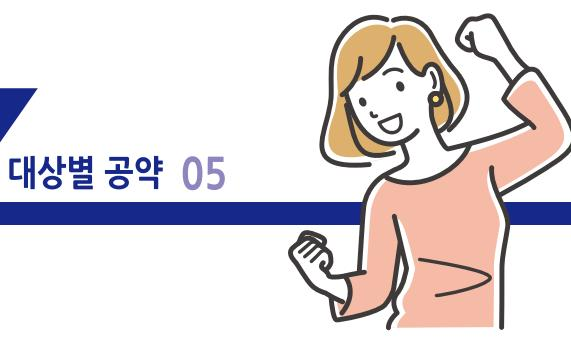
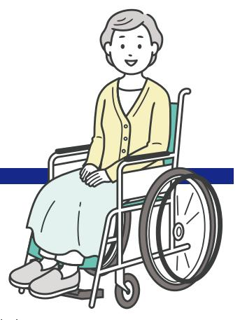
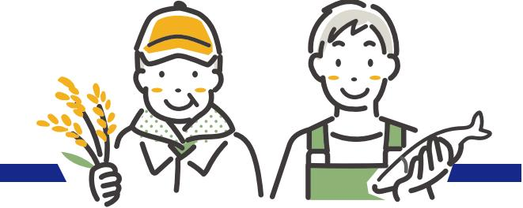

제21대 대통령선거 더불어민주당 정책공약집

# 이제부터 진짜 대한민국 회복·성장·행복으로 국민통합

| 1. 아동·청소년 | 8. 소상공인·자영업자 |
|---|---|
| 2. 청년 | 9. 중소·벤처기업 |
| 3. 중장년 | 10. 농어업인 |
| 4. 어르신 | 11. 가족돌봄 |
| 5. 여성 | 12. 저출생 |
| 6. 장애인 | 13. 동물반려인 |
| 7. 직장인 |  |

대상별 공약 01

## 아동·청소년

- 국가가 책임지는 기초학력 관리 체계 구축
- EBS를 활용한 '자기주도학습센터' 운영
- 초등 정서행동·학습지원 전문교사제 도입
- 고교 직업교육 혁신 추진
- 디지털 문해력 강화를 위한 초·중·고 교육혁신
- 딥페이크 범죄 등 디지털 세상 속 아동·청소년 안전 및 권리 보장
- 디지털 스트레스 및 중독 예방 지원
- 청소년 상담 1388 통합 콜센터 설치
- 정서·행동위기, 고위험 아동 · 청소년을 위한 다층적 지원체계 구축
- 학교폭력 어린이보호구역 등 아동 · 청소년 안전 강화
- 학교 유치원 어린이집 급식 제도 개선
- 소아비만 소아당뇨에 대한 국가책임 강화
- 아동·청소년 무료 예방접종 확대로 건강 수준 향상 및 건강 불평등 해소
- 위기 아동 발굴 및 아동 보호 책임 강화
- 공공 아이돌봄서비스 지원 강화 및 지원체계 재설계
- 우리아이자립펀드 단계적 도입
- 아동수당 18세까지 점진적 확대
- 취약계층 학생을 위한 온라인교육·미디어제작 지원 프로그램 확대
- 청소년 방과후활동 지원 강화
- 청소년 인문학 교육 강화
- 아동·청소년 체험활동 지원
- 초 중 고 문화예술 교육 프로그램 강화
- 생활밀착형 체육시설 지속 확보 및 시설 개선 지원
- 체육 영재 발굴을 위한 민·관 지원 환경 조성
- 학교 체육 및 스포츠클럽 활성화 추진

대상별 공약 02

## 청년

- 청년 맞춤형 공공분양과 고품질 공공임대 대폭 확대
- 무주택 청년 가구의 월세지워 대상 확대 및 월세 세액공제 확대
- 지자체별 1인가구 주거지워센터 운영 등 정보 취약계층에 대한 정보제공 강화
- 대학생 및 청년의 주거 기반 위에 교육, 취·창업, 지역주민 편의시설이 연계된 주거복합지원센터 단계적 공급
- 상생형 공공기숙사 공급 대폭 확대 및 부가가치세 면제 일몰 연장을 통한 기숙사비 인하
- 전세사기 피해자 구제 확대, 가해자 처벌강화
- '생애 첫 독립' 1인가구 맞춤형 정보 제공 등 주거설계지원 사업 추진
- 원룸·오피스텔 등 '깜깜이 관리비' 방지로 투명성 강화
- 여성 1인가구 등 청년의 안전한 정주환경 위해, 범죄예방시스템과 긴급대응 체계 강화
- 청년내일채움공제 시즌2(가칭 '청년미래적금') 도입
- 군복무 경력 호봉 반영 모든 공공기관으로 의무화
- 구직활동지원금 확대
- 자발적 이직 청년에게 생애 1회 구직급여지급 추진
- 글로벌 기업이 운영 중인'채용 연계형 직업교육 프로그램' 확산 지원
- 청년 맞춤형 재무상담 프로그램 도입
- 가상자산 현물 ETF 도입추진, 안전한 가상자산 투자환경조성, 거래 수수료 인하 유도
- 취업 후 상환 학자금 대출 소득요건 완화. 이자면제 대상 확대, 이공계·인문계 장학금 확대
- 대학생 천원의 아침밥 확대. 미취업 청년 식품 바우처로 식생활 지원, 군급식 제도 개선
- 청년 무화패스 지원 확대 및 거리병산 추가 요금 없이 무제한 환승이 가능한 청년패스 (정액권) 발행
- 청년을 위한 미디어 창업 허브 조성(Startup Station) 및 한류의 강점을 살린 청년 글로벌 시장 진출 도약 지원, AI 등 기술 중심 청년 창업기업 세제지원 강화
- 불법리딩방 등 지능화·복잡화되는 미등록영업·유사수신행위 등에 대한 규율 강화
- 은둔, 자립준비, 가족돌봄 청년지원 체계 강화
- 병사 통신 요금 할인율 확대(20%→ 50%)
- 법적 청년기준 현실화, 청년으로 살아갈 권리 확대
- 국민연금 '군복무 크레딧' 군 복무기간 전체로 확대
- 청년 맞벌이 부부 위한 맞춤형 돌봄지원 확대

## 중장년

- 근로자 본인, 자녀, 65세 이상 노부모 통신비 세액공제 신설
- 월세 세액공제 대상자 소득기준을 상향하고, 대상주택 범위를 확대
- 자녀수에 따라 신용카드 소득공제율(자녀 1인당 +5%)과 공제한도(자녀 1인당 +100만원)를 상향
- 자녀세액공제를 추가 확대
- 부부소득과 자녀수를 고려하는 가족치화적 소득세 체계로의 개편 방안 마련
- 초등학생 자녀의 예체능학원 체육시설 이용료를 교육비 세액공제 대상에 추가
- 거리병산 추가 요금 없이 무제한 환승이 가능한 국민패스(정액권) 발행
- 금융소비자 이자부담 완화를 위해 금융회사 교육세 부담구조 개편
- 정책모기지 및 정책금융기관부터 중도상환수수료 단계적 면제
- 가산금리 산정 시 각종 출연금 등의 법적비용이 금융소비자에게 부당전가되지 않도록 은행법을 개정하여 원리금 상환부담 경감
- 전문대학을 성인 대상 평생·직업교육 거점이 되는 개방형 대학으로 재구조화하여 생애전환기 재교육과 역량강화를 지원하고 장학금도 확대
- 간호·간병 통합서비스 공공 의료기관 및 지역 거점병원 전면 확대로 의료서비스 격차 해소
- 요양병원 간병비 금여화로 사적 간병 부담 완화 및 간병 서비스 질 향상, 요양병원형 간호·간병 통합서비스 인력배치 기준 확립
- 간병인 교육과정 수립 등으로 양성체계를 마련하고, 의료기관 직접고용 등으로 간병의 질을 제고
- 치매·장애 등으로 재산 관리에 어려움을 겪는 노인의 재산을 공공기관이 맡아 관리하는 공공신탁제도 도입

## 어르신

- **노후소득 보장 강화**
    - 일하는 어르신에 대한 국민연금 감액 개선 및 기초연금 부부 감액 단계적 축소
    - 가입대상 주택가격 요건의 완화 등 6080 맞춤형 주택연금제도 확대 추진
- **건강권 보장 확대**
    - 임플란트 건강보험 적용 단계적 확대
    - 노인 중증호흡기질환 조기 진단 및 예방적 치료 강화
    - 수요도를 고려한 노인 대상 한의사 주치의제 도입
    - 편의성·접근성 고려한 방문진료-비대면 모니터링 연계 노인질환 관리체계 구축
    - 장기요양 재가 방문 진료 확대를 위한 재택의료기관과 통합재가기관 지정·운영
    - 전국적 방문진료 서비스 제공체계 마련, 격오지 집중 지원 모델 수립
- **사회활동 참여 지원 확대**
    - 안전통학지킴이, 안심귀가도우미 등 어르신 공공일자리 확대
    - 경로당 등 노인여가복지시설 지원 확대
    - 생애주기 3대 문화패스 신설 및 확대('생애전환 문화패스' 도입)
    - 무상 어르시패스 발행
- **주거 지원 확대**
    - 청년·신혼부부·노년층까지 생애주기 맞춤형 공공임대 공급 확대(돌봄서비스 특화 주택)
    - 고령자 복지주택 확대 추진
    - 6080세대 친화형 녹색건축 및 개조 지원 및 유니버설 디자인 등 고령자친화형 건축 활성화
    - 은퇴자들이 모여 살 수 있는 대규모 거주시설 구현으로 고령자 거주 · 규형발전 기반 조성
    - 대학+평생교육+헬스케어가 결합된 한국형 '대학 연계 은퇴자 공동체' 도입
- **생활 안전 지원**
    - 치매·장애 어르신의 재산을 공공기관이 맡아 관리하는 공공신탁제도 도입
    - 노인대학, 노인복지관 등과 연계하여 금융기관의 시니어 디지털 금융 교육 활성화
    - 주말, 연휴 등 취약 시간 기간 피해 방지 및 실시간 대응체계 구축 등 피싱, 스미싱 디지털 민생안전 대응 강화
    - 피싱·다중사기범죄 등 서민다중피해범죄에 대한 처벌 강화 및 범죄이익 몰수 의무화
    - 노약자·어린이 등 화재 취약대상을 위한 경량 소화기 및 피난유도선 설치 지원
    - 보행자 안전 우선의 교통체계 구축으로 어린이, 장애인, 어르신 등 보호의무 확대
    - 고령운전자 페달 오조작 방지 장치 구매시 지원 확대 등 고령운전자 운전 안전 대책 마련
- **고령 국가유공자 지원**
    - 참전유공자 사망 시 80세 이상 저소득 배우자 생계지원금 지급 추진
    - 보조기구 대여사업 대상 확대. 고독사 예방 장기 대책 마련 등 국가유공자의 고령화에 따른 맞춤형 종합 대책 추진
- **맞춤형 관광 프로그램 제공** (지자체, 민간 매칭 연계한 어르신 '실버여행'지원)
- **생활밀착형 체육시설 지속 확보 및 시설 개량 지원**, 파크골프장 운영 및 인프라 확충
- **노인 스포츠 강좌 수강료 지원**, 노인 전문스포츠센터 건립 및 스포츠강사 의무 배치 추진
- **은퇴 고경력 연구자의 풍부한 지식과 경험을 활용할 수 있도록 정책 지원 확대**

## 여성

- 여성가족부를 성평등가족부로 확대 강화
- 친밀한 관계 내에서 발생하는 여성폭력 범죄 대응체계 강화
- 디지털성범죄 예방 및 대응 강화
- 국가 차원의 교제폭력 공식 통계 작성
- 여성안심주택, 안전한 공중화장실 조성 등 여성안전 사회 구축
- 여성과학기술인의 일·가정 양립 지원
- 여성벤처기업 투자활성화를 위한 벤처펀드 예산 확대
- 여성농업인의 사회경제적 지위 향상을 위한 제도개선
- 여성차별 없는 일터, '고용평등 임금공시제' 도입
- 공공기관 성평등 조직문화 제고를 위한 성별 평등 지표 적극 반영
- 경력보유여성 취업 지원 확대 및 채용 기업 세제 지원 강화
- 여성의 생애주기별 건강권 강화 및 의료 접근성 제고
- 성·재생산 건강증진을 위한 공적 의료체계 구축
- 사람유두종바이러스(HPV) 국가예방접종 지원 사업 확대
- 산후조리 공공지원 강화
- 여성장애인 다중 차별구조 개선을 위한 법적 제도적 기반 강화
- 일본군 '위안부' 문제 해결을 위한 '(가칭)여성인권과 평화재단' 설립 추진

## 장애인

- **장애인권리보장 법적·제도적 기반 강화**
    - 체계적 장애인 권리보장 기반 마련을 위한 '장애인권리보장법' 제정
    - 장애인복지 확충 중장기 로드맵 '2035 국가장애전략' 수립
    - 원스톰 통합 개인 맞춤 공적 장애서비스 지원 체계 구축
- **이동권 보장 확대**
    - 장애인 등 교통약자를 위한 교통수단 확대 및 단계적 발전 계획 마련
    - 이동편의서비스 지원 근거 마련 및 서비스 품질 향상
    - 교통약자특별교통수단(장애인콜택시) 관련 규제 완화 및 지원 확대 추진
    - 장애인 노인 임산부 등 이동약자를 위한 보행환경 개선 및 무장애도시 조성사업 확대
    - 보행자 안전 우선의 교통체계 구축으로 어린이. 장애인. 어르신 등 보호의무 확대
- **교육권 보장 확대**
    - 특수학교 및 특수학급 확대, 특수교사 적정 정원 확보 및 보조 인력 확충
    - 비장애 학생과 학부모 대상 장애인식 개선 교육 강화 등으로 통합교육 내실화
    - 장애대학생 장학금 혜택 확대 및 대학별 장애학생지원센터 설치 확대
    - 장애인평생교육법 제정 추진 및 장애인평생교육 기관 국비지원 확대
- **소득·고용 보장 확대**
    - 장애인연금 지급대상 확대(종전의 3급 장애인까지 수급 범위 확대) 추진
    - 장애인의무고용 확대 및 고용활성화 제도 개선, 근로지원인 지원 확대
    - 중증장애인 맞춤형 공공일자리 확대
- **건강권 보장 확대**
    - 장애인주치의 제도 확대
    - 장애인 의료비 지원 확대. 보조기기 지원 확대 및 전달체계 개선
    - 노인·장애인·병약자 등을 위한 지역사회통합돌봄체계 구축
    - 생활밀착형 체육시설 지속 확보 및 시설 개량 지원, 장애인 치화형 체육센터 지속 확충
    - 장애인체육단체 및 e스포츠 지원 강화를 위한 법·제도 개선
- **지역사회 자립 지원 확대**
    - 장애인활동지원제도 개선 및 지원주택 공급 확대
    - 장애인자립생활센터 기능 강화 및 지원 확대
    - 장애인 학대 예방 및 장애인권익옹호 지원체계 강화
- **발달장애인 정신장애인 지원 확대**
    - 발달장애인 24시간 돌봄지워체계 구축 추진
    - 발달장애인 자립 안정성 강화 및 가족 돌봄 부담 완화를 위한 지원 확대
    - 장애아동 조기개입 및 재활치료 지원 확대
    - 정신장애인·정신질환자 지역사회 자립을 위한 시설·서비스 확충 및 제도 개선
- **여성장애인 차별 개선**
    - 여성장애인 다중 차별구조 개선을 위한 법적·제도적 기반 강화
- **경계선지능인 지원**
    - 경계선지능인 조기 발견 및 학업·노동·일상생활 등을 위한 지역사회체계 구축 지원
- **정보접근권 보장 강화**
    - 장애인에 대한 방송접근권 보장 및 장애인 미디어 복지 강화
    - 장애인용 미디어 단말 제공·보급, 자막방송, 수어방송, 화면해설방송 등 확대
    - 장애인 및 취약계층 학생·청년에게 미디어 창작 지원 및 크리에이터 기회 제공

## 직장인

- **노동시간 단축**
    - 주 4.5일제 추진으로 노동시간 단축 지원 및 과로사 예방
    - 포괄임금제 금지 규정 명문화 및 근로조건 저하 방지방안 마련
    - 연차휴가 일수와 소진율을 선진국 수준으로 확대
- **휴식·재충전 보장**
    - '저녁 있는 삶'을 위해 근무시간 외에 이메일, 전화, 무자메시지 등의 연락에 응답하는 것을 거부할 수 있는 '연결되지 않을 권리' 보장
    - 근로자 휴가지워제도 수혜대상 및 지워규모 확대
    - 지역사랑 휴가지워제 신설
    - '1박2일' 기한의 짧은 여행을 지원하는 '숏컷여행' 신설
    - 국민 맞춤형 관광 프로그램 제공
    - 워케이션(Workcation) 관광 활성화
- **일·가정 양립 지원**
    - 사업주의 명시적 허가표시 없이 신청만으로 육아휴직을 시작할 수 있는 '자동육아휴직제도' 도입
    - 육아휴직 명칭을 '육아집중기간' 등으로 개선하여 육아 돌봄 기간에 대한 사회적 공감 제고. 긍정적 인식 확산
    - 저소득 근로자 '출산·육아 워라밸 프리미엄' 급여 추진
    - 육아휴직자 국민연금 추납 보험료 지원 추진
- **생활비 부담 완화**
    - 부부소득과 자녀수를 고려하는 가족치화적 소득세 체계로의 개편 방안 마련
    - 초등학생 자녀의 예체능학원 체육시설 이용료를 교육비 세액공제 대상에 추가
    - 정액권 구매 후 광역교통망을 거리병산 추가요금 없이 무제한 환승할 수 있는 국민패스 발행
    - 자녀수에 따라 신용카드 소득공제율 공제한도 상향 및 자녀세액공제 추가 확대 추진
    - 정책모기지 및 정책금융기관부터 중도상환수수료 단계적 면제
    - 금융소비자 이자부담 완화를 위해 금융회사 교육세 부담구조 개편
    - 가산금리 산정 시 각종 출연금 등의 법적비용이 금융소비자에게 부당전가되지 않도록 은행법을 개정하여 원리금 상환부담 경감
    - 월세 세액공제 대상자 소득기준 상향 및 대상주택 범위 확대
    - 근로자 본인, 자녀, 65세 이상 노부모 대상 통신비 세액공제 신설
    - 전국 산업단지 근로자를 위한 '천원의 아침밥' 사업
- **부당관행 개선**
    - '간부 모시는 날', 불합리한 업무 지시 등 잘못된 공직관행 타파
- **정년연장 및 노후소득 보장**
    - 법정 정년 65세 단계적 연장 2025년 내 입법 및 범정부 지원방안 마련
    - 중소기업 퇴직연금기금제도 가입대상 확대 및 가입자 수수료 지원 등 중소기업·영세기업 노동자 퇴직연금 지원 강화
    - 비정규직 특수고용·플랫폼 등 비전형 노동자 고용 및 노후소득 보장방안 마련
    - 근로장려금(EITC)과 자녀장려금(CTC)의 대상 및 지급액을 확대하여 근로 저소득층의 자립 기반 확대
- **안전망 강화**
    - 일하는 모든 사람을 위한 '전국민 산재보험제도' 단계적 추진
    - '산재 보험금여의 선 보장'으로 "산업재해 국가책임제" 실현
    - 신속하고 공정한 산재보상체계 구축
    - 일하는 모든 사람들을 위한 노동안전보건체계 구축
    - 하청노동자 보호를 위한 원·하청 통합 안전보건관리체계 구축 등 후진적 산재예방시스템 전면 개편

## 소상공인·자영업자

- **소상공인 자영업자 금융부담 완화**
    - 코로나 대출 종합대책 마련
    - 12.3 비상계엄으로 인한 피해 소상공인 지원방안 마련
    - 저금리 대화대출 및 이차보전 지워사업 확대로 소상공인 이자부담 경감
    - 새출발기금(채무조정) 이용 확대를 위한 지원 자격 완화 및 대상 확대. 패널티 축소
    - 소상공인·자영업자 맞춤형 장기분할상환 프로그램 도입
    - 소상공인의 원활한 금융지원을 위한 소상공인 정책금융 전문기관 설립 추진
    - '소상공인 내일채움공제' 도입으로 목돈 마련 기회 제공
    - 서민·소상공인 등 금융 취약계층에 대한 중금리대출 전문 인터넷은행 설립 추진
    - 장기소액연체채권 소각 등을 위한 배드뱅크 설치
- **소상공인 자영업자 경영부담 완화**
    - 소상공인·자영업자의 전기·가스요금 등 에너지비용 지원 확대
    - 키오스크·자동화기기 등 소상공인 디지털·스마트 지원 예산 대폭 확대
    - 상가 관리비내역 공개의무화 등 투명성 강화로 관리비 꼼수 인상 방지
    - 공공배달앱 예산 확대로 배달수수료 인하 및 윈윈하는 배달생태계 조성
    - 키오스크·테이블오더 등 무인주문기기 및 상품권, 간편결제 등 각종 수수료 부담 완화
- **소비촉진 및 민생경제 활성화**
    - 지역화폐(지역사랑상품권 등) 국고지원으로 발행규모 대폭 확대
    - 온누리상품권 발행규모 및 가맹점 확대로 사용 편리성 확보
    - 소상공인 사업장 신용카드 소득공제율 및 한도 확대 추진
    - 농축산물 할인지원사업 신청요건 현실화로 중소형마트 참여 확대
    - 지역별 대표상권 및 소규모 골목상권 육성을 통한 상권르네상스 2.0 추진
- **소상공인·자영업자 공정경제 확립**
    - 가맹점주·대리점주·수탁사업자·온라인플랫폼 입점사업자의 협상력 강화
    - 온라인플랫폼 특성을 반영한 시장 규율 법제 구축으로 입점업체 보호·상생협력 강화
    - 수수료 상한제 도입 등 배달시장 공정질서 확립
- **소상공인 자영업자 폐업 및 재도전 지원**
    - 폐업지원금 현실화 등 소상공인 자영업자의 원활한 폐업 지원
    - 폐업 등 노란우산공제 해지시 부담 완화
    - 소상공인·자영업자의 재도전 금융지원 확대
    - 채무조정부터 폐업, 취업까지 재기를 지원하는 통합시스템 구축
- **소상공인 자영업자 사회안전망 강화**
    - 전국 지방 경찰청과 연계한 안심콜 의무화로 여성 소상공인 안전 강화
    - 소상공인·자영업자 육아휴직수당 확대
    - 자영업자들의 '아프면 쉴 권리'를 위한 상병수당 확대
    - 화재공제 대상 범위 확대 및 보상한도 현실화
- **기타 지원**
    - 착한 임대인 세액공제를 상시화
    - 스마트 공방 확대 등 소상공인의 디지털 전환 적극 추진
    - 글로벌 시장 진출 가능성이 높은 소상공인(K-소상공인) 집중 육성
    - 광역형 소공인 도제교육센터 운영 추진

## 중소·벤처기업

- **글로벌 역량 강화**
    - 글로벌 통상환경 변화에 따른 중소기업 지원 강화
    - 신기술 상품 수출 레퍼런스 확보를 위한 중소·벤처 혁신제품 국내 공공구매 확대
    - K컨테츠를 활용한 중소기업 수출 참여 프로그램 확대 및 경쟁력 확보 주력
    - 「중소기업 글로벌화 지원법」 제정
    - 반도체 소부장 중소기업과 수요 대기업과의 협력 강화
- **벤처투자시장 활성화**
    - 모태펀드 예산 대폭 확대 및 중소기업 AI 스케일업 펀드 조성
    - 퇴직연금의 벤처투자 허용 및 기업성장집합투자기구(BDC) 도입
    - 연기금 및 연기금투자풀 등의 벤처펀드 출자 확대 유도 방안 마련
- **중소기업 경쟁력 강화 및 근로환경 개선**
    - 중소기업협동조합에 단체협상권 부여 및 공동사업에 대한 공정거래법 적용 예외 법제화
    - 중소유통업 혁신 촉진법 제정
    - 중소기업 상생금융지수 도입 추진
    - 납품대금연동제 안착 위해 미연동 합의 강요. 쪼개기 계약 등 탈법행위 근절
    - 남품대금 연동 대상에 에너지요금 등 경비 포함하여 수탁 중소기업의 부담 완화
    - 지역 중소기업 정책에 지역 중소기업협동조합 참여 확대
    - 중소기업 복지플랫폼 예산 확대로 대기업 수주의 복지혜택 제공
    - 중소기업 노동자 주택특별공금 지원 확대
    - 중소기업 우수 청년인력 유입과 장기재직을 위한 '청년미래적금' 추진
    - 산업단지 중소기업 청년재직자 교통비 지급 및 통근버스 임차 지원 사업 재추진
    - 중소기업 산재예방 및 작업장 안전을 위한 투자 세제지원 확대
- **중소기업 디지털 전환 적극 추진**
    - 중소기업 스마트공장 예산 대폭 확대로 중소기업의 디지털전환 확산 추진
    - 탄소중립 팩토리, 안전한 휴먼팩토리 등 스마트공장 3.0 추진
    - 금형 열처리 주조 등 국가핵심 제조뿌리사업 지원 강화
    - 「중소기업 탄소중립 지원법」 및 「기후테크 산업 육성 특별법」 제정 추진
    - 중소기업 에너지 저소비 및 고효율기기 교체 지원 사업 확대
- **판로지원 및 지속성장 지원**
    - 중소기업·소상공인 판로 확대 위한 전용 T-커머스 채널 신설 추진
    - 중소·벤처기업의 공공조달시장 혁신제품구매 비중 확대
    - 중소기업 M&A 활성화를 위한 법적 근거 마련으로 중소기업 지속성장 기반 마련
- **중소·벤처스타트업 R&D 지원**
    - 중소·벤처 R&D 예산 확대 및 성공적 사업화 위한 R&D 지원체계 개편
    - 기술사업화 전용 R&D 예산 확대 및 소셜벤처 예산 반영 추진
    - 여성벤처기업 투자활성화를 위한 벤처펀드 예산 확대
    - 대학과 지식산업센터 등을 지역 R&D 거점으로 집중 육성
    - 스타트업 지방 비중 대폭 확대로 지역발전 및 지방소멸 대응
    - 지역 특색 및 산업 여건을 고려한 스타트업파크 조성 및 팁스(Tips) 프로그램 확대
- **중소·벤처기업의 기술보호**
    - "기술을 탈취한 기업은 망한다"는 대원칙으로 입법과 정책 집행 및 사회부위기 조성
    - 한국형 디스커버리제도(특허침해 입증을 위한 증거수집제도) 도입
    - 손해배상 소송 시 법원의 공정위, 중기부에 대한 자료제출 명령권 신설
    - 불공정거래 피해구제기금 조성
    - 불공정거래 피해구제지원 강화로 중소기업의 기술보호 실효성 강화
    - 기술보호 전문가의 단계별 맞춤형 지원으로 기술보호 선도기업 육성
    - 지역 스타트업 자치제도 운영
- **규제혁신**
    - 규제혁신 컨트롤타워 역할 강화 및 규제의 불확실성 해소
    - 규제샌드박스 제도 운영 효율화 및 실효성 강화
    - AI를 활용한 규제정보 접근성 제고 및 수요자 중심 규제 발굴 시스템 개선
    - 신산업 발굴과 혁신의 기회 확장을 위한 규제 합리화
    - 스타트업과 기존 산업 간의 갈등 해결과 사회적 합의 도출
- **기타 투자 및 육성**
    - 글로벌 모태펀드 설립을 통한 글로벌 투자자의 국내 벤처투자 참여 촉진
    - (창업단계) 공공기관·기금 여유자금을 활용하여 혁신벤처기업에 대한 투자 확대
    - (성장단계) 기술사업성·역량 등에 기반한 정책보증 지원 강화
    - (상장단계) 혁신벤처기업 맞춤형 기술특례상장제도 마련
    - (지역투자) 지역 벤처생태계 활성화를 위한 (가칭)지역성장펀드 조성
    - 인공지능 기술 중심의 스타트업 활성화 및 인공지능 활용 격차 해소
    - AI 등 기술 중심 청년 창업기업 세제지원 강화
    - 법인투자자가 민간 벤처모펀드 출자 시 세액공제 확대
    - M&A 촉진 등을 통한 벤처투자의 회수시장 활성화
    - 비수도권 지역의 엔젤투자허브 구축 확대 등을 통해 지역 혁신 스타트업에 대한 투자 확대
    - 성장잠재력이 높은 기술기반 스타트업에 대한 벤처지분투자 형식으로 인큐베이팅

## 농어업인

- **기후위기 시대 국민의 먹거리는 국가가 책임**
    - 식량주권법 제정으로 국민의 먹거리 기본권 보장
    - 기후적응형 농업으로 품종개발, AI 관측·재해예측 고도화 등
    - 친환경직불제 확대, 친환경농업지원센터 설립 및 생산관리자 제도 개선
    - 환경과 조화되는 지속가능한 축산 발전
    - 과학적인 예방 방역체계 구축 및 살처부 보상 기주 개선, 국가책임방역 강화
    - 유전자변형식품(GMO) 완전 표시제 도입(단계적 확대)
    - 농촌지역 식품사각지대 해소
    - 임산부 친환경농산물꾸러미, 초등학생 과일간식사업 재개
- **안심하고 농사지을 수 있도록 선진국형 농가소득망과 재해안전망 도입**
    - 양곡관리법 개정으로 논 타작물재배를 확대하고 쌀 및 식량작물의 적정가격 유지
    - 기존 직불금 확대 개편, 신규 직불금 도입(청년농, 기후변화적응, 경축순환, 동물복지 등)
    - 주요농산물의 가격안정제 도입, 수입안정보험과 병행하여 농가 경영안정
    - 농어업재해 국가책임제 도입 및 농업인안전보험을 산재보험수준으로 강화
    - 생산비 급등에 따른 필수 농자재 국가지원제도 도입
    - 농어촌주민수당 지급 및 농림수산식품분야 예산 확대
- **누구나 살고 싶은 농산촌 조성**
    - 농가 주택 태양광 설치 지원, 햇빛 연금 지급 및 난방·복지·영농 에너지 사용
    - 의료, 돌봄, 생활, 교통 등 필수 서비스 제공(찾아가는 마을 주치의 등)
    - 농촌 빈집 재생 프로젝트 확대. 체류형 복합단지 조성 확대
    - 농촌지역 산업폐기물 공공관리체계 구축으로 생태환경 보전 및 쾌적한 농산촌 조성
    - 임업직불제 확대. 산림공익가치 보전지불제 및 산지은행 도입
- **노후를 보장하고, 세대를 잇는 농업**
    - 농업인 퇴직연금제 도입, 고령농 농지이양 은퇴직불제 확대
    - 외국인 공공형계절근로 확대, 근로환경 개선 및 업무지원
    - 청년농업인 예비농업인제도 및 연수제 도입, 창업농·겸업농·고용농 맞춤형 지원
    - 공동영농 조직 육성 및 농업법인 취업 지원제도 도입
    - 여성농업인의 사회경제적 지위 향상을 위한 제도개선
- **농식품산업을 미래 전략산업으로 육성**
    - 스마트 데이터농업 확산, 푸드테크·그린바이오 산업 육성
    - K-푸드 혁신성장, 5대 유망식품 집중 육성 및 전통식품산업 활성화
    - 스마트팜, 농기계(자율주행, AI), 동물용의약품, 반려동물연관산업 등 육성 및 수출 확대
- **기후위기 대응 지속가능한 수사업 육성**
    - 주요 어업재해인 이상수온 피해 예방을 위한 대응장비 및 대응연구 사업 확대
    - 어선 폐업지원금 상향 및 폐업 수산물양식업 업종전환 지원
    - 스마트양식 및 육상양식 보급 및 지원 확대
    - 수산종자 및 양식어업 생산현장 장비, 기자재 스마트화 등 정부지원 추진
    - 수산종자재해보험 도입과 자조금 사업 추진
    - 청년어업인 귀어 정착자금 지원 및 청년 어선임대사업 확대
    - 청년어업인 어구구입비, 역량강화(어선어업교육, 멘토링, 보험료 지원 등) 지원
    - 어민소득 안정 목적 실현을 위한 수산공익직불금(소규모어가) 인상
    - K-Seafood 수출 확대를 위한 유망 품종(김 수출) 및 비품종 경쟁력 향상 지원 확대
    - 해양수산 어선원직 인력난 해소를 위한 외국인선원 장기근속 방안 마련
    - 여객선 공영제 도입 등 섬 주민 교통권 확보로 정주여건 개선
    - 폐어구 수거 어구보상금 상향 추진 및 재활용 체계 구축, 인양쓰레기 수매사업 확대
    - 중국어선 불법조업에 따른 직접 피해어업인 보호대책 마련

## 가족돌봄

- **초등학생 돌봄 확대 및 질 제고**
    - 국가가 책임지고 지자체가 직접 운영하는 '온동네 초등돌봄' 도입
    - 다양한 특기적성·예체능·기초학력 프로그램 마련 등 초등학생 방과후학교 지원 확대
- **12세 이하 아동 돌봄 지원 확대 및 관리 강화**
    - 아이돌봄서비스 지원대상 확대, 자부담 단계적 축소 등 공공 아이돌봄 서비스 지원 강화 및 지원체계 전면 재설계
    - 처우개선 및 돌봄수당 확대 등 아이돌보미의 안정적 일자리 환경 개선
    - 정부·지자체 관리기능 강화 및 등록제 관리·감독 시스템 마련
- **간호 · 간병 지원 확대**
    - 간호 간병 통합서비스 공공 의료기관 및 지역 거점병원 전면 확대로 의료서비스 격차 해소
    - 요양병원 간병비 급여화로 사적 간병 부담 완화 및 간병 서비스 질 향상, 요양병원형 간호 간병 통합서비스 인력배치 기주 확립
    - 간병인 교육과정 수립 등으로 양성체계를 마련하고, 의료기관 직접고용 등으로 간병의 질을 제고
    - 병원 또는 시설에서 퇴원(퇴소)한 어르시들이 가정과 같은 편안한 환경에서 머물며 생활할 수 있는 지원주택(supportive housing)을 도심지역에 촘촘히 확충
    - 지역사회통합돌봄 대상을 노인뿐만 아니라, 중증장애인, 정신질환자 등으로 확대하고, 지자체에 돌봄전담부서 신설 및 전담인력 확충
    - (노인·장애인·병약자 등을 위한 지역사회통합돌봄체계 구축)
        - 서비스 전문가가 이용자를 찾아가 제공하는 방문진료, 방문재활, 방문요양, 방문가사, 주간·야간·단기 보호, 영양식 식사 지원 등 재가서비스 대폭 확충
        - 재택 진료 서비스 및 통합 재가 서비스 제공기관 확대. 방문진료-비대면 모니터링 연계 노인 질환 관리체계 구축, 전국적 방문진료 서비스 제공체계 및 격오지 집중 지원 모델 수립
- **저출생 · 고령화 대응 복지시설 확충**
    - 저출생 · 고령화 추세를 고려하여 정부 주도 하에 지역별 중장기 아동·청소년·노인 관련 복지시설 구조조정 및 확충 종합계획 수립

## 저출생

- **자녀양육 지원 확대**
    - 아동수당 18세까지 점진적 확대
    - 정부의 정기 입금 및 부모의 매칭 입금으로 성인기 학업·창업 비용을 마련하는 우리아이자립펀드 단계적 도입
    - 신혼부부 결혼·출산지원금 대출 및 출생자녀 수에 따라 원리금 차등 감면
- **자녀양육비용 부담 경감**
    - 자녀양육에 따라 늘어나는 생활비를 고려. 자녀수에 따라 신용카드 소득 공제율과 공제한도 상향
    - 자녀세액공제 추가 확대
    - 초등학생 자녀의 예체능학원 체육시설 이용료를 교육비 세액공제대상에 추가
    - 영유아 RSV(호흡기세포융합 바이러스) 예방항체 건강보험 적용 추진
    - 혼인한 부부가 연말정산을 쉽게 할 수 있도록 '부부단위 과세표준' 신설 추진
    - 부부의 소득과 자녀수를 종합적으로 고려하는 가족치화 과세체계로의 전환방안 마련
- **신혼부부 등 주거 지원 확대**
    - 공공임대주택 공급 시 신혼부부에게 우선 공급
    - 청년·신혼부부·노년층까지 생애주기 맞춤형 공공임대 공급 확대(돌봄서비스 특화 주택)
    - 공공택지 신혼부부 특별공급 분양 물량 확대
    - 6년 분양전환 공공임대주택 9세 이하 자녀가 있거나 혼인 기간 10년 이내인 사람에게 우선 공급 물량 확대
    - 민영주택 건설공급 시 9세 이하 자녀 있거나 혼인기간 10년 이내인 사람에게 우선 공급 확대
    - 월세 세액공제 대상자 소득기준을 상향하고, 대상주택 범위를 확대
- **임산부 및 난임 부부 지원 확대**
    - 임산부 친환경농산물꾸러미, 초등학생 과일간식사업 복원 및 확대
    - 난임치료 유급휴가일 단계적 확대(현행 최초 2일만 지워)
    - 난임시술 지워결정 유효기간 확대 및 중복회차 사용 가능하도록 개선
    - 난임 조기 예방 남녀 기초검사 건강검진 확대, 국가건강검진 항목 포함
    - 난임·우울증 상담센터 전국 광역단위 확충, 정서 안정 프로그램 및 자조모임 지원, 난임치료 부부 '부부 동행휴가제' 확산 등 난임부부의 심리적 안정 지원

## 동물반려인

- 반려동물 치료비 경감을 위한 표준수가제 도입 및 인프라 개선으로 보험 활성화
- 위탁서비스 및 취약계층 의료비 지원, 진료비에 부과되는 부가가치세 면제 확대
- 반려동물 진료소 등 인프라 확충
- 동물 학대 범위 확대, 학대 행위자로부터 피학대 동물 몰수 및 사육금지 명령제 도입
- 반려동물 양육 전 기본소양 교육제도를 점진적으로 도입하여 보호자 책임의식 강화
- 반려동물 대규모 생산 금지 및 관리 감독 강화, 반려동물관리 데이터베이스 구축
- 유사 동물보호시설 규제 및 보호소를 가장한 영리업체의 운영·홍보 제한
- 지자체 동물보호센터 확대 및 동물복지 기준 마련·예산 현실화
- 동물복지 축산농장 인증지원 확대 및 직불제 도입으로 농장동물의 복지 개선
- 동물원 수족관 전시동물 서식환경 개선 및 지자체 관리 강화
- 공영동물원에 야생동물보호시설 설치 및 생물다양성 보전 연구·교육 기능 강화
- 동물대체시험 활성화법 제정으로 동물대체시험법 개발 및 표준화 적극 지원
- 국가봉사동물에 대한 관리체계 확립 및 민간 입양 지원 확대
- 퇴역경주마 등 레저동물의 복지관리체계 확립
- 동물이 생명으로 존중받는 사회를 위해 '동물복지 기본법' 제정, '동물복지 진흥원' 설립 추진

---

**자동 변환 문서 유의사항:**

이 문서는 PDF에서 자동으로 변환된 마크다운 파일입니다. 변환 과정에서 다음과 같은 한계점이 있을 수 있습니다:

*   **내용 누락 또는 오류**: 원본 PDF의 복잡한 레이아웃, 이미지 내 텍스트, 특수 서식 등은 정확하게 변환되지 않거나 누락될 수 있습니다.
*   **서식 불일치**: 글꼴, 색상, 정확한 위치 등 시각적인 요소는 원본과 다를 수 있습니다.
*   **표 및 목록 변환 오류**: 복잡한 표나 다단계 목록의 구조가 깨지거나 내용이 부정확할 수 있습니다.

따라서 이 문서는 참고용으로 활용하시되, 중요한 내용은 원본 PDF 문서를 반드시 함께 확인하시기 바랍니다.

