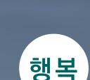

제21대 대통령선거 더불어민주당 정책공약집

# 이제부터 진짜 대한민국 회복·성장·행복으로 국민통합

# 1. 회복·성장·행복 비전

- 3대 비전과 15대 정책과제

## 3대 비전으로 '진짜 대한민국'을 만들겠습니다.

민주당은 '회복 · 성장 · 행복' 3대 비전을 바탕으로 15대 핵심과제를 추진하겠습니다. 내란위기 극복을 통해 헌정질서를 '회복'하고, 급변하는 대외환경, 저출생, 저성장을 극복하기 위한 경제 '성장'에 집중하여, 국민 모두가 '행복'한 삶을 살아갈 수 있는, '이제부터 진짜 대한민국'을 만들겠습니다.

윤석열 정부가 무너뜨린 민주주의를 회복하겠습니다. 불법계엄과 같은 헌정질서 파괴행위가 다시는 반복되지 않도록 계엄권한에 대한 민주적 통제를 강화하겠습니다. 검찰개혁과 사법 개혁을 완성하고 방송의 공공성을 회복하겠습니다. 튼튼한 경제안보를 구축하고, 지속가능한 한반도 평화를 실현하겠습니다. 국민 일상의 안전을 지키고 재난 대응을 강화하겠습니다.

대한민국을 세계 5대 경제강국으로 만들겠습니다. 민생위기를 극복하고, 혁신을 통한 경제 대도약으로 '진짜 성장'의 시대를 열겠습니다. AI, 바이오, 콘텐츠, 방위사업, 에너지, 제조업 성장 등 신산업을 집중 육성하고 새로운 성장기반을 구축하겠습니다. 공정한 경제구조를 만들고 미래세대를 위한 기후위기에 적극 대응하겠습니다. 국가규형발전으로 지역경제를 살리겠습니다. 세종 행정수도를 완성하고, 5대 초광역권과 3대 특별자치도를 추진하겠습니다.

국민 모두가 존중받고 서로 화합하는 행복한 나라를 만들겠습니다. 생활비 절감과 생활안정 지원으로 빈틈없이 기본이 보장되는 사회를 만들겠습니다. 가계와 소상공인의 부담을 덜고 내수경제를 살리겠습니다. 공정한 노동환경과 안전한 일터를 조성하겠습니다. 과감한 지원 과 혁신적인 정책으로 저출생을 극복하고 인구고령화에 대응하겠습니다. 아이부터 어르신까지 생애주기별 촘촘하고 탄탄한 돌봄체계를 구축하겠습니다. 의료대란을 해결하고 의료개혁을 추진해 국민의 건강권을 보장하겠습니다.

## 2. 5대 강국 비전
3대 비전과 15대 정책과제 실현으로 '5대 강국'을 만들겠습니다.

### K-이니셔티브 세계를 선도하는 '경제 강국'

AI 세계 3대 강국 진입을 목표로 정부와 민간의 투자를 확대하고, AI 국가인재를 양성하겠습니다. 국가 AI 데이터 집적 클러스터를 조성하고, 고성능 GPU를 확보하겠습니다. ABCDEF(AI, 바이오 · 헬스케어, 콘텐츠·문화, 방위산업·우주항공, 에너지, 제조업) 글로벌 기업 육성 프로젝트를 추진하겠습니다. 주가 지수 5,000 시대를 개막하겠습니다. 경제성장과 기후위기 대응의 대동맥, 에너지고속도로를 건설하겠습니다.

#### 세계질서 변화에 실용적으로 대처하는 '외교안보 강국'

굳건한 한미동맹 기반의 국익 중심 실용외교를 추진하고, 경제 · 통상 위기 극복을 위한 경제외교를 강화하 겠습니다. AI · 첨단기술 기반 스마트 강군을 육성하고 군장병 복무여건을 개선하겠습니다. 범정부적 지원을 강화해 방위산업 4대 강국을 달성하겠습니다. 북한의 핵과 미사일 위협 등 지정학적 안보리스크를 해소하 겠습니다.

#### 세계문명을 선도하는 소프트파워 '문화 강국'

K-컬쳐 시장 300조 원 시대 개막하겠습니다. K-팝, K-드라마, K-웹툰, K-게임, K-푸드, K-뷰티 등 세계 진출 지원을 확대하겠습니다. 문화예술 인재를 양성하고, 창작공간과 비용 등 지원을 강화하겠습니다. 인문학 지원을 확대하고, 전 국민 인문교육 활성화를 추진하겠습니다. 콘텐츠 불법 유통 단속을 강화하겠습니다.

#### 통합과 상생의 가치를 실현하는 '민주주의 강국'

통합하는 정치로 K-민주주의 위상을 회복하겠습니다. 정치보복 관행을 타파하고 탕평인사로 국민 대통합을 이루겠습니다. 국민의 정책 참여 확대를 위한 디지털 플랫폼을 활성화하고, 불법 계엄 재발방지 대책을 수립 하겠습니다. 세종 행정수도와 '5극 3특' 중심 국토규형발전 실현을 추진하겠습니다.

#### 기본이 튼튼한 '복지 강국'

빈틈없는 사회 안전망을 구축하겠습니다. 돌봄 국가 책임제를 도입하고, 국민의 기본적인 삶을 보장하는 기본 사회를 추진하겠습니다. 의료공공성을 강화하겠습니다. 사람과 노동이 존중 받는 사회를 실현하겠습니다. 사회적 합의를 통한 주4.5일제를 단계적으로 도입하고 정년 연장을 추진하겠습니다. 일하는 모든 사람 권리 보장을 추진하고 지방정부 근로감독 권한을 강화하겠습니다.

---

**자동 변환 문서 유의사항:**

이 문서는 PDF에서 자동으로 변환된 마크다운 파일입니다. 변환 과정에서 다음과 같은 한계점이 있을 수 있습니다:

*   **내용 누락 또는 오류**: 원본 PDF의 복잡한 레이아웃, 이미지 내 텍스트, 특수 서식 등은 정확하게 변환되지 않거나 누락될 수 있습니다.
*   **서식 불일치**: 글꼴, 색상, 정확한 위치 등 시각적인 요소는 원본과 다를 수 있습니다.
*   **표 및 목록 변환 오류**: 복잡한 표나 다단계 목록의 구조가 깨지거나 내용이 부정확할 수 있습니다.

따라서 이 문서는 참고용으로 활용하시되, 중요한 내용은 원본 PDF 문서를 반드시 함께 확인하시기 바랍니다.

